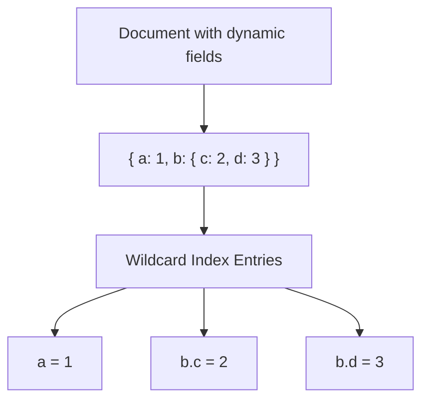

# How to Create a Wildcard Index in MongoDB

Author: [nawazdhandala](https://www.github.com/nawazdhandala)

Tags: MongoDB, Index, Wildcard Index, Schema Flexibility, Query Optimization

Description: Learn how to create wildcard indexes in MongoDB to efficiently query documents with dynamic or unknown field structures without creating an index per field.

---

## How Wildcard Indexes Work

Wildcard indexes index all fields or all sub-fields of a document automatically. They are designed for collections with polymorphic or dynamic schemas where different documents have different field names.

Instead of creating a separate index for every possible field, a wildcard index covers all of them with a single index definition. MongoDB generates index entries for every leaf field in each document.



Wildcard indexes were introduced in MongoDB 4.2.

## Syntax

Index all fields in the collection:

```javascript
db.collection.createIndex({ "$**": 1 })
```

Index all sub-fields of a specific field:

```javascript
db.collection.createIndex({ "attributes.$**": 1 })
```

Include or exclude specific paths using `wildcardProjection`:

```javascript
db.collection.createIndex(
  { "$**": 1 },
  { wildcardProjection: { title: 1, price: 1 } }  // include only these paths
)

db.collection.createIndex(
  { "$**": 1 },
  { wildcardProjection: { internalMetadata: 0 } }  // exclude this path
)
```

## Examples

### Indexing a Dynamic Attributes Object

A product catalog where products have different attribute keys depending on category:

```javascript
// Electronics might have: { attributes: { voltage: "220V", wattage: 60 } }
// Clothing might have:     { attributes: { size: "M", material: "cotton" } }

db.products.createIndex({ "attributes.$**": 1 })
```

Now queries on any attribute field use the wildcard index:

```javascript
db.products.find({ "attributes.voltage": "220V" })
db.products.find({ "attributes.size": "M" })
db.products.find({ "attributes.wattage": { $gt: 50 } })
```

### Indexing All Document Fields

```javascript
db.events.createIndex({ "$**": 1 })
```

This supports queries on any field:

```javascript
db.events.find({ "metadata.source": "api" })
db.events.find({ "payload.userId": "user_123" })
db.events.find({ "context.environment": "production" })
```

### Wildcard Index with Projection (Include)

Only index the `name` and `specs` sub-tree, saving space compared to indexing everything:

```javascript
db.products.createIndex(
  { "$**": 1 },
  { wildcardProjection: { name: 1, specs: 1 } }
)
```

### Wildcard Index with Projection (Exclude)

Index everything except fields you know will never be queried:

```javascript
db.products.createIndex(
  { "$**": 1 },
  { wildcardProjection: { auditLog: 0, rawBlob: 0 } }
)
```

### Checking the Index with explain()

```javascript
db.products.find({ "attributes.voltage": "220V" }).explain("executionStats")
```

The winning plan should show `"stage": "IXSCAN"` with the wildcard index name.

### Node.js Example

```javascript
const { MongoClient } = require("mongodb");

async function main() {
  const client = new MongoClient("mongodb://localhost:27017");
  await client.connect();
  const products = client.db("catalog").collection("products");

  // Create wildcard index on attributes sub-document
  await products.createIndex(
    { "attributes.$**": 1 },
    { name: "idx_attributes_wildcard" }
  );

  // Insert polymorphic documents
  await products.insertMany([
    { name: "LED Bulb", attributes: { wattage: 9, voltage: "220V", dimmable: true } },
    { name: "T-Shirt", attributes: { size: "M", color: "blue", material: "cotton" } },
    { name: "Laptop", attributes: { ram: "16GB", storage: "512GB", os: "Linux" } }
  ]);

  // Query any attribute without a dedicated index
  const bulbs = await products.find({ "attributes.voltage": "220V" }).toArray();
  console.log("Bulbs:", bulbs.map(p => p.name));

  const mediums = await products.find({ "attributes.size": "M" }).toArray();
  console.log("Medium items:", mediums.map(p => p.name));

  await client.close();
}

main().catch(console.error);
```

## Limitations

Wildcard indexes have several important limitations to be aware of:

- They cannot be used as shard keys.
- They do not support covered queries (they always require a document fetch).
- They cannot index arrays that contain sub-documents (only scalar values and arrays of scalars are indexed).
- They do not support `$expr` queries.
- They are not a replacement for compound indexes on frequently queried, known field patterns.

## Best Practices

- **Use wildcard indexes for truly dynamic schemas.** If your schema is well-known and stable, prefer specific compound indexes for better performance.
- **Use `wildcardProjection` to limit scope.** Indexing only the fields you actually query reduces index size and write overhead.
- **Combine with other indexes.** A wildcard index on `attributes.$**` and a separate index on `status` can both be used by the query planner.
- **Monitor index size.** Wildcard indexes on large collections with many fields can grow very large.
- **Validate with `explain()`** to confirm the query planner chooses the wildcard index.

## Summary

Wildcard indexes let MongoDB index all fields or a dynamic sub-document without listing each field name explicitly. Create them with `{ "$**": 1 }` or `{ "field.$**": 1 }` syntax. They are ideal for polymorphic collections where different documents have different field names. Use `wildcardProjection` to include or exclude specific paths, and always validate index usage with `explain()`.
