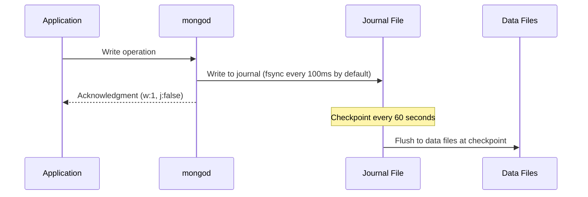

# How to Configure MongoDB WiredTiger Journal Settings

Author: [OneUptime](https://www.github.com/oneuptime)

Tags: MongoDB, WiredTiger, Journal, Storage, Durability

Description: Learn how to configure MongoDB WiredTiger journaling settings including commit interval, journal compression, and when to enable or disable journaling for your workload.

---

## Introduction

MongoDB's WiredTiger storage engine uses a write-ahead journal to ensure durability. When a write is committed to the journal, it can be recovered even if the process crashes before flushing to the main data files. Understanding and tuning journal settings helps you balance between write performance and data durability.

## How WiredTiger Journaling Works



With `j: true` in the write concern, the driver waits until the journal is synced to disk before acknowledgment.

## Default Journal Configuration

MongoDB enables journaling by default for WiredTiger. Check current settings:

```javascript
db.adminCommand({ serverStatus: 1 }).wiredTiger.log
```

## Configuring Journal Settings in mongod.conf

```yaml
storage:
  dbPath: /var/lib/mongodb
  journal:
    enabled: true           # Enable journaling (always recommended in production)
    commitIntervalMs: 100   # How often the journal is flushed to disk (default: 100ms)

  wiredTiger:
    engineConfig:
      journalCompressor: snappy   # Options: none, snappy, zlib (default: snappy)
      cacheSizeGB: 4

    collectionConfig:
      blockCompressor: snappy

    indexConfig:
      prefixCompression: true
```

Restart mongod after changes:

```bash
sudo systemctl restart mongod
```

## Tuning commitIntervalMs

The `commitIntervalMs` controls how often the journal is flushed to disk. Lower values increase durability but add write latency. Higher values improve throughput at the cost of potentially losing up to `commitIntervalMs` milliseconds of writes on a crash.

```yaml
storage:
  journal:
    commitIntervalMs: 50    # More durable, more I/O
    # commitIntervalMs: 300 # Higher throughput, less frequent flushes
    # commitIntervalMs: 500 # Maximum value (0.5 seconds)
```

For a replica set, the minimum data loss is bounded by the replication lag rather than the journal interval, since the primary waits for secondaries to acknowledge.

## Journal Compression

Reduce journal file size with compression:

```yaml
storage:
  wiredTiger:
    engineConfig:
      journalCompressor: snappy   # Fastest compression (default)
      # journalCompressor: zlib   # Better ratio, slightly slower
      # journalCompressor: zstd   # Best ratio (MongoDB 4.2+)
      # journalCompressor: none   # No compression, maximum write speed
```

## Checking Journal Status at Runtime

```javascript
// Journal write statistics
var wt = db.adminCommand({ serverStatus: 1 }).wiredTiger
printjson({
  journalFilesInFlight: wt.log["log files in use"],
  journalBytesWritten: wt.log["log bytes written to disk"],
  journalSyncs: wt.log["log sync operations"],
  checkpointTime: wt.transaction["transaction checkpoint most recent time (msecs)"]
})

// Check durability
db.adminCommand({ serverStatus: 1 }).dur
```

## Write Concern and Journaling

The `j: true` option in write concern forces the client to wait for the journal flush:

```javascript
// Wait for journal sync before acknowledging (most durable single-node write)
db.orders.insertOne(
  { orderId: "ORD-5001", amount: 750 },
  { writeConcern: { w: 1, j: true } }
)

// For replica sets, w:majority implies j:true in MongoDB 5.0+
db.orders.insertOne(
  { orderId: "ORD-5002", amount: 250 },
  { writeConcern: { w: "majority", j: true, wtimeout: 5000 } }
)
```

## Disabling Journaling (Development Only)

Journaling can be disabled on standalone development instances to improve write speed. Never do this in production.

```yaml
# FOR DEVELOPMENT ONLY
storage:
  journal:
    enabled: false
```

Journaling cannot be disabled on replica set members.

## Journal File Management

WiredTiger writes journal files to `<dbPath>/journal/`. Each file is 100 MB by default. Old journal files are removed after successful checkpoints:

```bash
ls -lh /var/lib/mongodb/journal/
# WiredTigerLog.0000000001
# WiredTigerLog.0000000002
# WiredTigerPreplog.0000000001
```

If the journal directory grows unexpectedly:

```javascript
// Force a checkpoint to flush data and allow journal cleanup
db.adminCommand({ fsync: 1 })
```

## Monitoring Journal Impact on Write Latency

```javascript
// Check write latency affected by journaling
db.setProfilingLevel(1, { slowms: 50 })

// After some writes, review
db.system.profile.find(
  { ns: "mydb.orders", millis: { $gt: 50 } },
  { command: 1, millis: 1, ts: 1 }
).sort({ ts: -1 }).limit(10)
```

## Summary

WiredTiger journaling in MongoDB provides crash recovery by writing operations to a journal before the main data files. The key tunable is `commitIntervalMs` (default 100ms), which controls journal flush frequency. Use `snappy` or `zstd` journal compression to reduce I/O with minimal CPU overhead. Set `j: true` in your write concern for writes that must survive a crash, and always keep journaling enabled on production replica set members.
