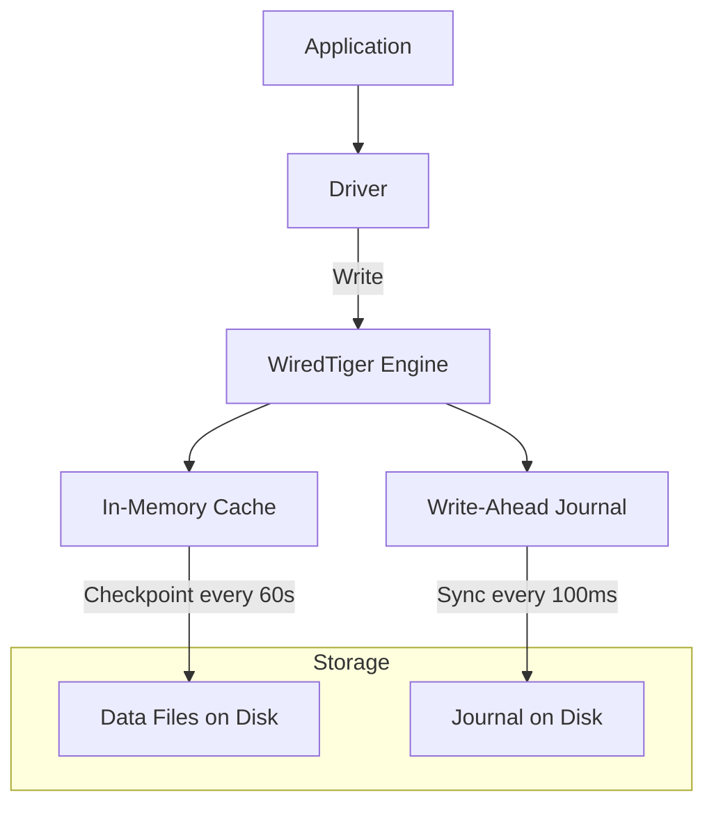

# How to Configure WiredTiger Storage Engine in MongoDB

Author: [nawazdhandala](https://www.github.com/nawazdhandala)

Tags: MongoDB, WiredTiger, Storage Engine, Performance, Configuration

Description: Learn how to configure MongoDB's WiredTiger storage engine settings including cache size, compression, checkpoints, and concurrent read/write settings for optimal performance.

---

## WiredTiger Overview

WiredTiger has been MongoDB's default storage engine since MongoDB 3.2. It provides document-level concurrency control, compression, and a configurable in-memory cache. Understanding its key settings helps you tune MongoDB for your specific workload.



## How WiredTiger Cache Works

WiredTiger maintains a cache of frequently accessed data in memory. Reads check the cache first; on a cache miss, WiredTiger reads from disk. Writes go to the cache and to the journal. The cache is periodically flushed to disk during checkpoints.

The cache uses a Least Recently Used (LRU) eviction policy. When the cache fills up, WiredTiger evicts clean (unmodified) pages first. If there are too many dirty pages, eviction becomes more aggressive and can impact write performance.

## Key Configuration Settings

All WiredTiger settings go in the `storage.wiredTiger` section of `mongod.conf`.

### cacheSizeGB

The most important setting. Defaults to the larger of 50% of RAM minus 1GB, or 256MB.

```yaml
storage:
  wiredTiger:
    engineConfig:
      cacheSizeGB: 4    # 4GB cache
```

Rules of thumb:
- Set to ~50% of available RAM on a dedicated MongoDB server.
- Leave enough RAM for the OS filesystem cache (which also speeds up disk reads).
- On a server with 16GB RAM: set `cacheSizeGB: 6` to `cacheSizeGB: 8`.
- On a Docker container or VM with limited RAM: set explicitly to avoid MongoDB claiming too much.

### journalCompressor

Compression algorithm for the write-ahead journal:

```yaml
storage:
  wiredTiger:
    engineConfig:
      journalCompressor: snappy    # snappy, zlib, zstd, or none
```

`snappy` is the default and provides a good balance of speed and compression.

### Collection Block Compression

Controls how collection data is compressed on disk:

```yaml
storage:
  wiredTiger:
    collectionConfig:
      blockCompressor: snappy    # snappy, zlib, zstd, or none
```

Compression levels:
- `snappy` (default) - fast, moderate compression ratio (typically 2-3x)
- `zstd` - better ratio than snappy with similar speed (recommended for new deployments)
- `zlib` - highest ratio, slowest (suitable for cold data or archives)
- `none` - no compression (maximum speed, maximum disk usage)

### Index Prefix Compression

Reduces index storage size by compressing common prefixes in index keys:

```yaml
storage:
  wiredTiger:
    indexConfig:
      prefixCompression: true    # default: true
```

Leave this enabled unless you have a specific reason to disable it.

### directoryPerDB

Store each database's data files in its own subdirectory:

```yaml
storage:
  directoryPerDB: true
```

Useful for placing different databases on different storage volumes.

## Complete WiredTiger Configuration Example

```yaml
# /etc/mongod.conf

storage:
  dbPath: /var/lib/mongodb
  journal:
    enabled: true
    commitIntervalMs: 100    # journal sync interval in ms
  directoryPerDB: false
  engine: wiredTiger
  wiredTiger:
    engineConfig:
      cacheSizeGB: 8
      journalCompressor: snappy
      directoryForIndexes: false    # store indexes with collections (default)
    collectionConfig:
      blockCompressor: zstd
    indexConfig:
      prefixCompression: true
```

## Viewing Runtime WiredTiger Stats

Check the WiredTiger cache from mongosh:

```javascript
const wt = db.serverStatus().wiredTiger;

// Cache usage
const cacheUsedBytes = wt.cache["bytes currently in the cache"];
const cacheMaxBytes = wt.cache["maximum bytes configured"];
const usePct = (cacheUsedBytes / cacheMaxBytes * 100).toFixed(1);
print(`Cache used: ${(cacheUsedBytes / 1e9).toFixed(2)} GB / ${(cacheMaxBytes / 1e9).toFixed(2)} GB (${usePct}%)`);

// Dirty pages
const dirtyBytes = wt.cache["tracked dirty bytes in the cache"];
const dirtyPct = (dirtyBytes / cacheMaxBytes * 100).toFixed(1);
print(`Dirty bytes: ${(dirtyBytes / 1e6).toFixed(0)} MB (${dirtyPct}% of cache)`);

// Cache hit ratio
const pagesRequested = wt.cache["pages requested from the cache"];
const pagesRead = wt.cache["pages read into cache"];
const hitRatio = ((pagesRequested - pagesRead) / pagesRequested * 100).toFixed(2);
print(`Cache hit ratio: ${hitRatio}%`);

// Evictions
const modifiedEvictions = wt.cache["modified pages evicted"];
const cleanEvictions = wt.cache["unmodified pages evicted"];
print(`Modified (dirty) page evictions: ${modifiedEvictions}`);
print(`Clean page evictions: ${cleanEvictions}`);
```

## Interpreting Cache Metrics

| Metric | Healthy | Warning |
|--------|---------|---------|
| Cache used % | < 80% | > 90% |
| Dirty % of cache | < 5% | > 20% |
| Cache hit ratio | > 95% | < 90% |
| Modified page evictions | Low | High (indicates memory pressure) |

High dirty % combined with high modified page evictions indicates that WiredTiger is struggling to flush dirty pages fast enough. Solutions:
- Increase `cacheSizeGB`.
- Reduce write throughput if possible.
- Use faster storage (NVMe instead of spinning disk).

## Checkpoint Configuration

WiredTiger writes a checkpoint to disk every 60 seconds by default. During a checkpoint, all dirty pages in the cache are written to disk.

Check when the last checkpoint occurred:

```javascript
db.serverStatus().wiredTiger.transaction["transaction checkpoint most recent time (msecs)"]
```

The checkpoint interval is not directly configurable in `mongod.conf` for WiredTiger, but the journal sync interval is:

```yaml
storage:
  journal:
    commitIntervalMs: 100   # sync journal every 100ms (default)
```

## Concurrent Read/Write Tickets

WiredTiger uses a ticket system to limit concurrent operations. By default, 128 read tickets and 128 write tickets are available.

Check current ticket usage:

```javascript
db.serverStatus().wiredTiger.concurrentTransactions
```

Output:

```text
{
  write: { out: 5, available: 123, totalTickets: 128 },
  read: { out: 12, available: 116, totalTickets: 128 }
}
```

If `available` regularly drops below 10, increase the ticket count:

```javascript
db.adminCommand({ setParameter: 1, wiredTigerConcurrentReadTransactions: 256 })
db.adminCommand({ setParameter: 1, wiredTigerConcurrentWriteTransactions: 256 })
```

## Resizing the Cache at Runtime

From MongoDB 3.2+, you can change the cache size without restarting:

```javascript
db.adminCommand({
  setParameter: 1,
  wiredTigerEngineRuntimeConfig: "cache_size=6G"
})
```

Verify the change:

```javascript
db.serverStatus().wiredTiger.cache["maximum bytes configured"]
```

## Best Practices

- Set `cacheSizeGB` explicitly on every instance; never rely on the auto-calculated default in production.
- Use `zstd` for `blockCompressor` on new deployments for the best compression ratio without significant CPU overhead.
- Monitor cache hit ratio and dirty page percentage continuously.
- Use NVMe SSDs for WiredTiger's data directory to reduce checkpoint and eviction latency.
- Do not set `cacheSizeGB` above 80% of available RAM; leave headroom for the OS and other processes.
- Monitor `wiredTiger.concurrentTransactions` and increase tickets if throughput is limited.

## Summary

WiredTiger is MongoDB's storage engine and its most critical configuration parameter is `cacheSizeGB`. Set it to 50-60% of available RAM on a dedicated server. Use `zstd` for collection compression on MongoDB 4.2+ for the best size-to-speed ratio. Monitor the cache hit ratio, dirty page percentage, and concurrent transaction tickets via `db.serverStatus().wiredTiger` to identify performance bottlenecks and tune accordingly.
