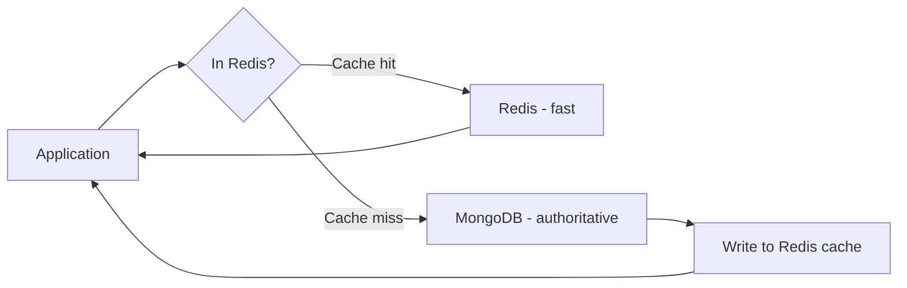

# How to Use MongoDB with Redis for Caching

Author: [nawazdhandala](https://www.github.com/nawazdhandala)

Tags: MongoDB, Redis, Caching, Performance, Integration

Description: Learn how to use Redis as a caching layer in front of MongoDB to reduce database load, improve response times, and implement cache invalidation strategies.

---

## Why Use Redis with MongoDB

MongoDB is optimized for persistence and rich queries, but repeated reads of the same data add latency and load. Redis is an in-memory data store with sub-millisecond reads, making it ideal as a caching layer for frequently read MongoDB documents.



## Cache-Aside Pattern

The cache-aside (lazy loading) pattern is the most common approach: the application checks Redis first, and only queries MongoDB on a cache miss:

```javascript
const { MongoClient } = require("mongodb");
const { createClient } = require("redis");

const mongoClient = new MongoClient(process.env.MONGODB_URI);
await mongoClient.connect();
const db = mongoClient.db("myapp");

const redisClient = createClient({ url: process.env.REDIS_URI });
await redisClient.connect();

const CACHE_TTL = 300; // 5 minutes

async function getProductById(productId) {
  const cacheKey = `product:${productId}`;

  // 1. Check Redis cache
  const cached = await redisClient.get(cacheKey);
  if (cached) {
    return JSON.parse(cached);
  }

  // 2. Cache miss - query MongoDB
  const product = await db.collection("products").findOne({ productId });
  if (!product) return null;

  // 3. Write to Redis with TTL
  await redisClient.setEx(cacheKey, CACHE_TTL, JSON.stringify(product));

  return product;
}
```

## Write-Through Pattern

Update both MongoDB and Redis on every write to keep the cache in sync:

```javascript
async function updateProductPrice(productId, newPrice) {
  // 1. Update MongoDB (authoritative store)
  const result = await db.collection("products").findOneAndUpdate(
    { productId },
    {
      $set: { price: newPrice, updatedAt: new Date() }
    },
    { returnDocument: "after" }
  );

  if (!result) throw new Error("Product not found");

  // 2. Update Redis cache with the new value
  const cacheKey = `product:${productId}`;
  await redisClient.setEx(cacheKey, CACHE_TTL, JSON.stringify(result));

  return result;
}
```

## Cache Invalidation on Delete

```javascript
async function deleteProduct(productId) {
  // 1. Delete from MongoDB
  await db.collection("products").deleteOne({ productId });

  // 2. Remove from Redis cache
  const cacheKey = `product:${productId}`;
  await redisClient.del(cacheKey);

  // 3. Also invalidate any list/query caches that might include this product
  await invalidateListCaches("products");
}

async function invalidateListCaches(prefix) {
  // Use SCAN to find and delete all keys matching the prefix
  const keys = await redisClient.keys(`${prefix}:list:*`);
  if (keys.length > 0) {
    await redisClient.del(keys);
  }
}
```

## Caching Query Results

Cache the results of complex MongoDB aggregation queries:

```javascript
async function getTopProducts(category, limit = 10) {
  const cacheKey = `top_products:${category}:${limit}`;

  const cached = await redisClient.get(cacheKey);
  if (cached) {
    return JSON.parse(cached);
  }

  const products = await db.collection("products").aggregate([
    { $match: { "category.slug": category, status: "active" } },
    { $sort: { ratingAverage: -1, ratingCount: -1 } },
    { $limit: limit },
    { $project: { name: 1, price: 1, ratingAverage: 1, "images": { $first: "$images" } } }
  ]).toArray();

  // Cache for 10 minutes - longer TTL for expensive queries
  await redisClient.setEx(cacheKey, 600, JSON.stringify(products));

  return products;
}
```

## Caching with Change Streams for Automatic Invalidation

Use MongoDB Change Streams to automatically invalidate Redis cache when data changes:

```javascript
async function startCacheInvalidationService() {
  const db = mongoClient.db("myapp");
  const changeStream = db.collection("products").watch([
    { $match: { operationType: { $in: ["update", "replace", "delete"] } } }
  ]);

  changeStream.on("change", async (change) => {
    const productId = change.documentKey._id.toString();

    // Invalidate the specific product cache
    await redisClient.del(`product:${productId}`);

    // Invalidate relevant list caches
    if (change.fullDocument) {
      const category = change.fullDocument.category?.slug;
      if (category) {
        await redisClient.del(`top_products:${category}:*`);
        const keys = await redisClient.keys(`top_products:${category}:*`);
        if (keys.length > 0) await redisClient.del(keys);
      }
    }

    console.log(`Cache invalidated for product: ${productId}`);
  });

  console.log("Cache invalidation service running");
}

startCacheInvalidationService();
```

## Session Storage in Redis

Store MongoDB-backed user sessions in Redis for fast access:

```javascript
async function createSession(userId) {
  // Fetch user from MongoDB
  const user = await db.collection("users").findOne(
    { userId },
    { projection: { password: 0 } }
  );

  if (!user) throw new Error("User not found");

  // Create session token
  const token = require("crypto").randomBytes(32).toString("hex");

  // Store session in Redis with 24-hour TTL
  await redisClient.setEx(
    `session:${token}`,
    86400,
    JSON.stringify({
      userId: user.userId,
      username: user.username,
      roles: user.roles,
      createdAt: new Date().toISOString()
    })
  );

  return token;
}

async function validateSession(token) {
  const sessionData = await redisClient.get(`session:${token}`);
  if (!sessionData) return null;

  return JSON.parse(sessionData);
}

async function invalidateSession(token) {
  await redisClient.del(`session:${token}`);
}
```

## Rate Limiting with Redis

Use Redis counters to rate-limit MongoDB write operations:

```javascript
async function rateLimitedInsert(collectionName, document, userId, maxPerMinute = 60) {
  const rateLimitKey = `ratelimit:${userId}:${collectionName}`;

  const current = await redisClient.incr(rateLimitKey);

  if (current === 1) {
    // Set expiry on first increment
    await redisClient.expire(rateLimitKey, 60);
  }

  if (current > maxPerMinute) {
    throw new Error(`Rate limit exceeded: max ${maxPerMinute} per minute`);
  }

  return await db.collection(collectionName).insertOne(document);
}
```

## Cache Warming

Pre-populate the cache after a Redis restart:

```javascript
async function warmCacheForTopProducts() {
  const categories = await db.collection("categories")
    .find({ isLeaf: true })
    .project({ slug: 1 })
    .toArray();

  for (const category of categories) {
    await getTopProducts(category.slug, 10);  // This caches on first call
    console.log(`Cache warmed for category: ${category.slug}`);
  }

  console.log(`Cache warmed for ${categories.length} categories`);
}
```

## Choosing Cache TTL Values

| Data type | Recommended TTL | Reason |
|---|---|---|
| User profile | 5 minutes | Changes infrequently |
| Product details | 5-10 minutes | Prices and stock change |
| Category list | 30-60 minutes | Rarely changes |
| Aggregation results | 10-15 minutes | Expensive to compute |
| Session | 24 hours | Security-bounded |
| Rate limit counter | 60 seconds | Rolling window |

## Summary

Redis caches frequently read MongoDB documents to reduce database load and response latency. Use the cache-aside pattern for reads and write-through for updates. Invalidate caches on delete and on write. For automatic invalidation without application changes, use MongoDB Change Streams to watch for updates and delete affected cache keys. Store user sessions in Redis rather than MongoDB for sub-millisecond session validation. Warm the cache after Redis restarts to avoid thundering herd load on MongoDB from simultaneous cache misses.
