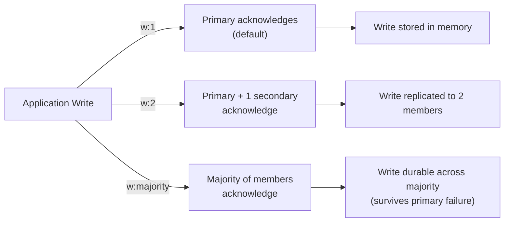

# How to Use Write Concern in MongoDB for Durability

Author: [nawazdhandala](https://www.github.com/nawazdhandala)

Tags: MongoDB, Write Concern, Durability, Replica Set, Data Safety

Description: Learn how to use MongoDB write concern to control durability guarantees for write operations, balance performance with data safety, and choose the right w and j settings.

---

## What is Write Concern

Write concern specifies the level of acknowledgment MongoDB requires before reporting a write operation as successful. It controls the trade-off between write durability and write performance.

The main parameters are:
- `w` - how many replica set members must acknowledge the write.
- `j` - whether the write must be recorded to the on-disk journal before acknowledgment.
- `wtimeout` - maximum time to wait for the specified `w` acknowledgments.



## Write Concern Parameters

```text
Parameter   Values                 Description
--------------------------------------------------------------------
w           0, 1, n, "majority"    Number of members that must acknowledge
            "majority"             Majority of voting members
j           true / false           Journal write required before ack
wtimeout    milliseconds           Max wait time for w acknowledgments
```

## w Values Explained

```text
w: 0          Fire and forget - no acknowledgment (fastest, least safe)
w: 1          Primary acknowledges (default)
w: 2          Primary + 1 secondary acknowledge
w: n          n members acknowledge
w: majority   Majority of voting members acknowledge (most durable)
```

## Examples

### Default Write Concern (w: 1)

```javascript
const { MongoClient } = require("mongodb");
const client = new MongoClient("mongodb://localhost:27017/?replicaSet=rs0");
await client.connect();

const orders = client.db("shop").collection("orders");

// Default write concern: primary acknowledges
const result = await orders.insertOne(
  { customerId: "cust_001", amount: 250, status: "pending" }
);
console.log("Inserted:", result.insertedId);
```

### Majority Write Concern

Wait for the majority of voting members to acknowledge before returning:

```javascript
const result = await orders.insertOne(
  { customerId: "cust_002", amount: 500, status: "confirmed" },
  { writeConcern: { w: "majority", j: true, wtimeout: 5000 } }
);
```

With `w: "majority"` and `j: true`, the write is durable even if the primary fails immediately after the write returns.

### Write Concern at Connection Level

Set a default write concern for all operations on the client:

```javascript
const client = new MongoClient(
  "mongodb://host1:27017,host2:27018,host3:27019/?replicaSet=rs0",
  {
    writeConcern: { w: "majority", j: true, wtimeout: 10000 }
  }
);
```

### Journal Write (j: true)

Require writes to be journaled on disk before acknowledgment:

```javascript
await orders.insertOne(
  { customerId: "cust_003", amount: 100 },
  { writeConcern: { w: 1, j: true } }
)
```

With `j: true`, if the mongod process crashes after acknowledgment, the write is recovered from the journal on restart.

### Fire and Forget (w: 0)

Acknowledge immediately without waiting for any confirmation. Useful for high-throughput, low-criticality writes like analytics events:

```javascript
await db.collection("analytics").insertOne(
  { event: "page_view", url: "/home", timestamp: new Date() },
  { writeConcern: { w: 0 } }
)
// Returns immediately, no durability guarantee
```

### Per-Collection Write Concern

```javascript
const { MongoClient, WriteConcern } = require("mongodb");

async function main() {
  const client = new MongoClient("mongodb://localhost:27017/?replicaSet=rs0");
  await client.connect();

  const db = client.db("myapp");

  // Payments - highest durability
  const payments = db.collection("payments", {
    writeConcern: new WriteConcern("majority", 10000, true)
  });

  // Logs - performance over durability
  const logs = db.collection("logs", {
    writeConcern: new WriteConcern(1, undefined, false)
  });

  // Insert a payment with majority write concern
  await payments.insertOne({
    userId: "user_001",
    amount: 99.99,
    currency: "USD",
    status: "completed"
  });
  console.log("Payment recorded with majority write concern");

  // Insert log with w:1 (faster)
  await logs.insertOne({
    level: "info",
    message: "Payment processed",
    timestamp: new Date()
  });

  await client.close();
}

main().catch(console.error);
```

## Write Concern and Transactions

For multi-document transactions, specify write concern at the transaction level:

```javascript
const session = client.startSession();

try {
  await session.withTransaction(async () => {
    await accounts.updateOne(
      { userId: "user_A" },
      { $inc: { balance: -100 } },
      { session }
    );
    await accounts.updateOne(
      { userId: "user_B" },
      { $inc: { balance: 100 } },
      { session }
    );
  }, {
    writeConcern: { w: "majority" }
  });
} finally {
  await session.endSession();
}
```

## Write Concern Durability Matrix

```text
Write Concern             Durability Guarantee
----------------------------------------------------------
w:0, j:false             None - write may be lost
w:1, j:false             Survives primary restart (in memory)
w:1, j:true              Survives primary crash (journaled)
w:2, j:false             Survives primary failure if secondary has data
w:majority, j:false      Durable across majority, may lose on crash
w:majority, j:true       Strongest - survives crashes on majority members
```

## wtimeout Handling

If `w` acknowledgments are not received within `wtimeout` milliseconds, the operation returns an error but the write may still be applied:

```javascript
try {
  await orders.insertOne(
    { customerId: "cust_004", amount: 300 },
    { writeConcern: { w: "majority", wtimeout: 2000 } }  // 2 second timeout
  );
} catch (err) {
  if (err.writeConcernError) {
    // Timeout - write may have been applied but not fully acknowledged
    console.log("Write concern timeout:", err.writeConcernError.errmsg);
    // Check if the write actually succeeded before retrying
  }
}
```

## Best Practices

- **Use `w: majority` for financial transactions and critical user data** to prevent data loss if the primary fails.
- **Use `j: true` with important writes** so data survives a crash, not just a restart.
- **Use `w: 1` with `j: false` for high-throughput non-critical writes** (analytics events, logs).
- **Set `wtimeout`** to avoid writes hanging indefinitely when secondaries are unavailable.
- **Do not use `w: 0`** in production for user-facing data.
- **Match write concern to read concern** - using `w: majority` with `readConcern: majority` gives you linearizable read-after-write guarantees.

## Summary

Write concern in MongoDB controls how many replica set members must acknowledge a write before it is considered successful. Use `w: 1` for default performance, `w: majority` for critical data durability, and add `j: true` to require journal writes before acknowledgment. Set `wtimeout` to bound wait time. Match write concern to the criticality of the data: majority + journal for financial data, w:1 for operational data, w:0 only for non-critical high-throughput writes.
