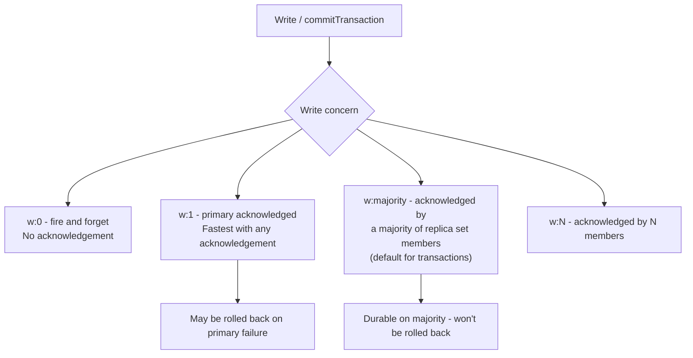

# How to Configure Write Concern in MongoDB Transactions

Author: [nawazdhandala](https://www.github.com/nawazdhandala)

Tags: MongoDB, Transaction, Write concern, Durability, Replica set

Description: Learn how to configure write concern in MongoDB transactions to control durability guarantees, from fast unacknowledged writes to majority-replicated durable commits.

---

## What Is Write Concern

Write concern specifies the level of acknowledgement requested from MongoDB when a write operation completes. Higher write concern = stronger durability guarantee but higher latency. Lower write concern = faster writes but risk of data loss on crash.



## Write Concern in Transactions vs. Individual Operations

For individual operations outside a transaction you can set write concern per-operation. Inside a transaction, **write concern applies only to `commitTransaction` and `abortTransaction`**, not to individual write operations. Writes within the transaction are buffered and only applied at commit time.

```javascript
const { MongoClient } = require("mongodb");

const client = new MongoClient(process.env.MONGO_URI);
await client.connect();
const db = client.db("myapp");

const session = client.startSession();

// Write concern set on startTransaction applies to commit/abort only
session.startTransaction({
  writeConcern: { w: "majority", j: true, wtimeout: 5000 }
});

// Individual writes inside the transaction do NOT use a per-operation writeConcern
await db.collection("accounts").updateOne(
  { _id: "acc-1" },
  { $inc: { balance: -100 } },
  { session }
  // writeConcern here is ignored inside a transaction
);

await session.commitTransaction();  // w: majority applied here
await session.endSession();
```

## Write Concern Options

| Option | Values | Description |
|---|---|---|
| `w` | `0`, `1`, integer N, `"majority"`, tag | Number of nodes that must acknowledge |
| `j` | `true` / `false` | Whether write must be written to the on-disk journal |
| `wtimeout` | milliseconds | How long to wait before returning a timeout error |

## w: majority - Recommended for Transactions

`w: "majority"` means the commit is acknowledged only after a majority of the replica set has applied the write. This is the default for transactions and ensures the data survives a primary failover.

```javascript
async function durableTransfer(fromId, toId, amount) {
  const session = client.startSession();

  try {
    session.startTransaction({
      readConcern:  { level: "snapshot" },
      writeConcern: { w: "majority", j: true }  // journal + majority replication
    });

    await db.collection("accounts").updateOne(
      { _id: fromId },
      { $inc: { balance: -amount } },
      { session }
    );

    await db.collection("accounts").updateOne(
      { _id: toId },
      { $inc: { balance: amount } },
      { session }
    );

    await session.commitTransaction();
  } catch (err) {
    await session.abortTransaction().catch(() => {});
    throw err;
  } finally {
    await session.endSession();
  }
}
```

## w: 1 - Primary Acknowledged (Lower Latency)

`w: 1` returns as soon as the primary acknowledges the write. This is faster than `w: majority` but the write could be lost if the primary fails before replicating.

```javascript
async function fastTransaction(db, client) {
  const session = client.startSession();

  try {
    session.startTransaction({
      writeConcern: { w: 1, j: false }  // fast; no journal flush, no replication wait
    });

    await db.collection("counters").updateOne(
      { _id: "pageviews" },
      { $inc: { count: 1 } },
      { session }
    );

    await session.commitTransaction();
  } catch (err) {
    await session.abortTransaction().catch(() => {});
    throw err;
  } finally {
    await session.endSession();
  }
}
```

## j: true - Journal Acknowledgement

When `j: true` MongoDB waits for the write to be flushed to the on-disk journal (WAL) before acknowledging. This survives a process crash but is slower than `j: false`.

```javascript
// Maximum durability: majority + journal flush
session.startTransaction({
  writeConcern: {
    w: "majority",
    j: true,
    wtimeout: 10000  // fail if not acknowledged within 10 seconds
  }
});
```

## wtimeout - Preventing Indefinite Hangs

If replication is slow or a secondary is down, a `w: majority` commit can hang. Set `wtimeout` to return a `WriteConcernError` after the timeout.

```javascript
async function timedTransaction(db, client) {
  const session = client.startSession();

  try {
    session.startTransaction({
      writeConcern: {
        w: "majority",
        wtimeout: 3000  // abort if not majority-acknowledged within 3 seconds
      }
    });

    await db.collection("inventory").updateOne(
      { sku: "WIDGET-1" },
      { $inc: { stock: -1 } },
      { session }
    );

    await session.commitTransaction();
  } catch (err) {
    await session.abortTransaction().catch(() => {});

    if (err.code === 64 || err.codeName === "WriteConcernFailed") {
      console.error("Write concern timeout - data may or may not be committed");
      // This is UnknownTransactionCommitResult territory - see retry guide
    }

    throw err;
  } finally {
    await session.endSession();
  }
}
```

## Custom Write Concern Tags

For multi-datacenter deployments, use replica set tags to require acknowledgement from specific data centres.

```javascript
// Replica set configured with { dc: "east" } and { dc: "west" } tags
// Require acknowledgement from at least one node in each data centre
session.startTransaction({
  writeConcern: {
    w: "crossDC"  // custom tag name configured in replica set config
  }
});

// Replica set config with custom write concern modes
// rs.conf() -> settings.getLastErrorModes = { crossDC: { "dc": 2 } }
// This means: acknowledged by at least 1 node in each of 2 distinct "dc" tag values
```

## Choosing Write Concern for Transactions

| Use case | Recommended write concern |
|---|---|
| Financial transactions | `{ w: "majority", j: true }` |
| Order management | `{ w: "majority" }` |
| Analytics counters | `{ w: 1 }` |
| Session state | `{ w: 1, j: false }` |
| Multi-region durability | Custom tag |

## Summary

MongoDB transaction write concern applies to `commitTransaction` and `abortTransaction` only, not to individual writes within the transaction. Use `w: "majority"` for durable transactions that survive replica set failover, add `j: true` to require an on-disk journal flush, and set `wtimeout` to prevent indefinite hangs when replication is degraded. Use `w: 1` for high-throughput workloads where occasional write loss on primary failure is acceptable.
