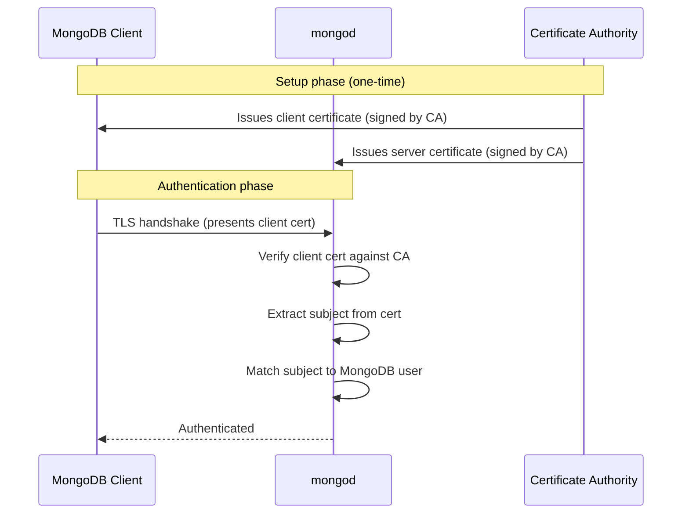

# How to Configure MongoDB x.509 Certificate Authentication

Author: [OneUptime](https://www.github.com/oneuptime)

Tags: MongoDB, x509, Authentication, Security, TLS

Description: Learn how to configure MongoDB x.509 certificate authentication for clients and replica set members to replace password-based authentication with certificates.

---

## Introduction

x.509 certificate authentication allows MongoDB clients and replica set members to authenticate using TLS certificates instead of passwords. The client presents its certificate, and MongoDB verifies it against the CA. The Subject field of the certificate maps to a MongoDB username or role. This is the most secure authentication method for internal services and automated systems.

## How x.509 Auth Works



## Step 1: Generate Certificates

Create a CA, server cert, and client cert:

```bash
# 1. Create CA
openssl genrsa -out ca.key 4096
openssl req -new -x509 -days 3650 -key ca.key -out ca.crt \
  -subj "/CN=MongoDB-CA/O=MyOrg/C=US"

# 2. Create server certificate
openssl genrsa -out server.key 4096
openssl req -new -key server.key -out server.csr \
  -subj "/CN=mongodb.example.com/O=MyOrg/OU=Servers/C=US"
openssl x509 -req -days 365 -in server.csr \
  -CA ca.crt -CAkey ca.key -CAcreateserial -out server.crt
cat server.crt server.key > server.pem

# 3. Create client certificate for a user
openssl genrsa -out client-alice.key 4096
openssl req -new -key client-alice.key -out client-alice.csr \
  -subj "/CN=alice/O=MyOrg/OU=Clients/C=US"
openssl x509 -req -days 365 -in client-alice.csr \
  -CA ca.crt -CAkey ca.key -CAcreateserial -out client-alice.crt
cat client-alice.crt client-alice.key > client-alice.pem
```

## Step 2: Configure mongod for x.509 Authentication

```yaml
# /etc/mongod.conf
net:
  tls:
    mode: requireTLS
    certificateKeyFile: /etc/ssl/mongodb/server.pem
    CAFile: /etc/ssl/mongodb/ca.crt
    allowConnectionsWithoutCertificates: false  # Require client certs

security:
  authorization: enabled
  clusterAuthMode: x509   # For replica set member auth
```

Restart:

```bash
sudo systemctl restart mongod
```

## Step 3: Create a MongoDB User Mapped to the Certificate Subject

The MongoDB username must exactly match the Subject DN of the client certificate:

```javascript
// The subject from alice's certificate: "CN=alice,OU=Clients,O=MyOrg,C=US"
use $external
db.createUser({
  user: "CN=alice,OU=Clients,O=MyOrg,C=US",
  roles: [
    { role: "readWrite", db: "ecommerce" },
    { role: "read", db: "analytics" }
  ]
})
```

Get the exact subject from the certificate:

```bash
openssl x509 -in client-alice.crt -noout -subject -nameopt RFC2253
# subject=CN=alice,OU=Clients,O=MyOrg,C=US
```

Use this exact string as the MongoDB username.

## Step 4: Authenticate with the Client Certificate

```bash
# Connect using the client certificate
mongosh --tls \
  --tlsCAFile /etc/ssl/mongodb/ca.crt \
  --tlsCertificateKeyFile /etc/ssl/mongodb/client-alice.pem \
  --authenticationMechanism MONGODB-X509 \
  --authenticationDatabase '$external' \
  --host mongodb.example.com:27017
```

From the shell after connecting:

```javascript
db.auth({ mechanism: "MONGODB-X509" })
```

## Step 5: Node.js Driver with x.509

```javascript
const { MongoClient } = require("mongodb")
const fs = require("fs")

const client = new MongoClient("mongodb://mongodb.example.com:27017/", {
  tls: true,
  tlsCAFile: "/etc/ssl/mongodb/ca.crt",
  tlsCertificateKeyFile: "/etc/ssl/mongodb/client-alice.pem",
  authMechanism: "MONGODB-X509",
  authSource: "$external"
})

await client.connect()
const db = client.db("ecommerce")
```

Connection URI form:

```javascript
const uri = "mongodb://mongodb.example.com:27017/?tls=true" +
  "&tlsCAFile=%2Fetc%2Fssl%2Fmongodb%2Fca.crt" +
  "&tlsCertificateKeyFile=%2Fetc%2Fssl%2Fmongodb%2Fclient-alice.pem" +
  "&authMechanism=MONGODB-X509&authSource=%24external"
```

## Step 6: x.509 Authentication for Replica Set Members

Each replica set member authenticates to other members using its certificate. The Subject attributes must match on all member certificates (e.g., same O and OU values):

```bash
# Member cert - note matching O and OU with the server cert
openssl req -new -key member.key -out member.csr \
  -subj "/CN=rs-member-2/O=MyOrg/OU=Servers/C=US"
```

```yaml
security:
  clusterAuthMode: x509
  # Members with the same O+OU are trusted as cluster members
```

## Step 7: Verify the User Was Authenticated Correctly

```javascript
// Show which user is authenticated in current session
db.runCommand({ connectionStatus: 1 })
// Look for: "authenticatedUsers": [{ user: "CN=alice,OU=Clients,O=MyOrg,C=US", db: "$external" }]
```

## Certificate Rotation

When a client certificate expires, create a new certificate and update the MongoDB user:

```javascript
// Add the new subject as an additional user, or update the existing one
use $external
db.updateUser(
  "CN=alice,OU=Clients,O=MyOrg,C=US",
  { roles: [{ role: "readWrite", db: "ecommerce" }] }
)
// Or create a new user with the new cert subject and drop the old one
```

## Summary

x.509 authentication in MongoDB provides certificate-based authentication for clients and replica set members. Generate a CA, sign server and client certificates, configure `net.tls.mode: requireTLS` with `allowConnectionsWithoutCertificates: false`, and create MongoDB users in the `$external` database whose usernames match the certificate Subject DN exactly. Connect using `--authenticationMechanism MONGODB-X509` and `--authenticationDatabase '$external'`. Use this authentication method for service accounts and automated systems to eliminate shared passwords.
