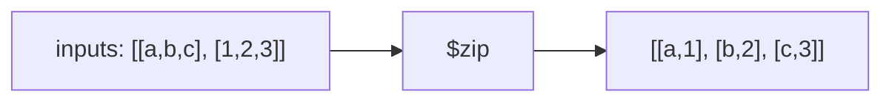

# How to Use $zip to Combine Arrays in MongoDB Aggregation

Author: [nawazdhandala](https://www.github.com/nawazdhandala)

Tags: MongoDB, Aggregation, Array, Pipeline, Expression

Description: Learn how to use $zip in MongoDB aggregation to merge multiple arrays element-by-element, with options for padding shorter arrays to matching lengths.

---

## How $zip Works

`$zip` transposes multiple input arrays into a single array of arrays. Each element at index `i` in the output contains the elements at index `i` from each input array. It is the MongoDB equivalent of Python's `zip()` function.



## Syntax

```javascript
{
  $zip: {
    inputs: [ <array expression>, ... ],
    useLongestLength: <boolean>,      // optional, default false
    defaults: [ <expression>, ... ]   // optional, used with useLongestLength: true
  }
}
```

- `inputs` - array of array expressions to zip together
- `useLongestLength` - when `true`, pads shorter arrays instead of truncating to the shortest
- `defaults` - fill values used for padding when `useLongestLength` is `true`

## Examples

### Example 1 - Basic Array Combination

Combine product names with their prices into pairs:

```javascript
// Input: { _id: 1, names: ["apple", "banana", "cherry"], prices: [1.2, 0.5, 2.0] }
db.products.aggregate([
  {
    $project: {
      catalog: {
        $zip: {
          inputs: ["$names", "$prices"]
        }
      }
    }
  }
])
```

Output:

```javascript
[
  { _id: 1, catalog: [["apple", 1.2], ["banana", 0.5], ["cherry", 2.0]] }
]
```

### Example 2 - Zip Three Arrays Together

Combine names, scores, and grades from separate arrays:

```javascript
// Input: { _id: 1, names: ["Alice", "Bob"], scores: [95, 82], grades: ["A", "B"] }
db.students.aggregate([
  {
    $project: {
      records: {
        $zip: {
          inputs: ["$names", "$scores", "$grades"]
        }
      }
    }
  }
])
```

Output:

```javascript
[
  { _id: 1, records: [["Alice", 95, "A"], ["Bob", 82, "B"]] }
]
```

### Example 3 - useLongestLength with Defaults

Pad shorter arrays with default values instead of truncating:

```javascript
// Input: { _id: 1, a: [1, 2, 3], b: [10, 20] }
db.data.aggregate([
  {
    $project: {
      zipped: {
        $zip: {
          inputs: ["$a", "$b"],
          useLongestLength: true,
          defaults: [0, 0]
        }
      }
    }
  }
])
```

Output:

```javascript
[
  { _id: 1, zipped: [[1, 10], [2, 20], [3, 0]] }
]
```

### Example 4 - Convert Zipped Pairs to Objects

Zip keys and values then convert each pair to an object with `$arrayToObject`:

```javascript
// Input: { _id: 1, keys: ["name", "city", "age"], values: ["Alice", "NY", 30] }
db.data.aggregate([
  {
    $project: {
      obj: {
        $arrayToObject: {
          $zip: {
            inputs: ["$keys", "$values"]
          }
        }
      }
    }
  }
])
```

Output:

```javascript
[
  { _id: 1, obj: { name: "Alice", city: "NY", age: 30 } }
]
```

### Example 5 - Use $zip in a Real Pipeline

Annotate each month's sales with its month number from a separate field:

```javascript
db.reports.aggregate([
  {
    $project: {
      annotated: {
        $map: {
          input: {
            $zip: {
              inputs: ["$months", "$sales"]
            }
          },
          as: "pair",
          in: {
            month: { $arrayElemAt: ["$$pair", 0] },
            revenue: { $arrayElemAt: ["$$pair", 1] }
          }
        }
      }
    }
  }
])
```

## Behavior Notes

- If `useLongestLength` is `false` (default), output length equals the length of the shortest input array.
- If `useLongestLength` is `true` and `defaults` are not provided, missing positions are filled with `null`.
- Passing an empty `inputs` array returns an empty array.

## Use Cases

- Pairing parallel arrays of keys and values to build objects
- Combining sensor channels sampled at the same rate
- Creating coordinate pairs from separate latitude and longitude arrays
- Annotating arrays with index or label arrays before `$map` processing

## Summary

`$zip` merges multiple parallel arrays element-by-element into a single array of tuples. Use it when data is stored across separate arrays that share positional correspondence. Combine `$zip` with `$map` and `$arrayToObject` to build powerful transformations that turn split arrays into structured documents without any application-side processing.
