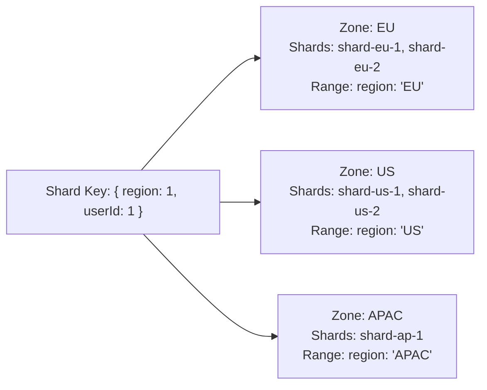

# How to Use Zones in MongoDB Sharding for Data Locality

Author: [nawazdhandala](https://www.github.com/nawazdhandala)

Tags: MongoDB, Sharding, Zone, Data Locality, Compliance

Description: Learn how to use MongoDB zone sharding to pin specific data ranges to designated shards, enabling data residency, geographic locality, and tiered storage strategies.

---

## What is Zone Sharding

Zone sharding (also called tag-aware sharding) allows you to associate specific shard key ranges with designated shards. Data in those ranges is pinned to the assigned shards and will not migrate to other shards.

Use cases:
- **Data residency/compliance** - keep EU user data on EU shards.
- **Geographic locality** - keep regional data close to users.
- **Tiered storage** - keep hot data on fast NVMe shards, cold data on cheaper HDD shards.
- **Multi-tenant isolation** - keep each tenant's data on a dedicated shard.



## Setting Up Zone Sharding

### Step 1: Assign Zones to Shards

```javascript
// Connect to mongos
mongosh "mongodb://mongos:27017"

// Assign zone labels to shards
sh.addShardToZone("rs-shard-eu1", "EU")
sh.addShardToZone("rs-shard-eu2", "EU")
sh.addShardToZone("rs-shard-us1", "US")
sh.addShardToZone("rs-shard-us2", "US")
sh.addShardToZone("rs-shard-ap1", "APAC")
```

### Step 2: Enable Sharding and Create the Collection

```javascript
sh.enableSharding("myapp")

// Create index on the shard key
db.users.createIndex({ region: 1, userId: 1 })

// Shard the collection
sh.shardCollection("myapp.users", { region: 1, userId: 1 })
```

### Step 3: Define Zone Key Ranges

```javascript
// Assign EU data to the EU zone
sh.updateZoneKeyRange(
  "myapp.users",
  { region: "EU", userId: MinKey },   // range start (inclusive)
  { region: "EU", userId: MaxKey },   // range end (exclusive)
  "EU"                                 // zone name
)

// Assign US data to the US zone
sh.updateZoneKeyRange(
  "myapp.users",
  { region: "US", userId: MinKey },
  { region: "US", userId: MaxKey },
  "US"
)

// Assign APAC data to the APAC zone
sh.updateZoneKeyRange(
  "myapp.users",
  { region: "APAC", userId: MinKey },
  { region: "APAC", userId: MaxKey },
  "APAC"
)
```

### Step 4: Verify Zone Configuration

```javascript
sh.status()
```

Output shows zone assignments:

```text
  myapp.users
    shard key: { "region" : 1, "userId" : 1 }
    tag: EU  { "region" : "EU", "userId" : { "$minKey" : 1 } } -->> { "region" : "EU", "userId" : { "$maxKey" : 1 } }
    tag: US  { "region" : "US", "userId" : { "$minKey" : 1 } } -->> { "region" : "US", "userId" : { "$maxKey" : 1 } }
    tag: APAC  ...
```

## Tiered Storage with Zones

Use zones to separate hot (recent) and cold (archival) data across different storage tiers:

```javascript
// Label shards by storage tier
sh.addShardToZone("rs-nvme-shard1", "hot")
sh.addShardToZone("rs-nvme-shard2", "hot")
sh.addShardToZone("rs-hdd-shard1", "cold")
sh.addShardToZone("rs-hdd-shard2", "cold")

// Shard events by date
db.events.createIndex({ date: 1 })
sh.shardCollection("analytics.events", { date: 1 })

// Hot: current year data on fast NVMe
sh.updateZoneKeyRange(
  "analytics.events",
  { date: ISODate("2026-01-01") },
  { date: MaxKey },
  "hot"
)

// Cold: older data on HDD
sh.updateZoneKeyRange(
  "analytics.events",
  { date: MinKey },
  { date: ISODate("2026-01-01") },
  "cold"
)
```

## Multi-Tenant Zone Isolation

```javascript
// Each tenant gets their own shard(s)
sh.addShardToZone("rs-tenant-a", "tenant_a")
sh.addShardToZone("rs-tenant-b", "tenant_b")

db.records.createIndex({ tenantId: 1, recordId: 1 })
sh.shardCollection("platform.records", { tenantId: 1, recordId: 1 })

sh.updateZoneKeyRange(
  "platform.records",
  { tenantId: "tenant_a", recordId: MinKey },
  { tenantId: "tenant_a", recordId: MaxKey },
  "tenant_a"
)

sh.updateZoneKeyRange(
  "platform.records",
  { tenantId: "tenant_b", recordId: MinKey },
  { tenantId: "tenant_b", recordId: MaxKey },
  "tenant_b"
)
```

## Node.js: Querying Zone-Sharded Collections

Zone sharding is transparent to application code. Queries with the shard key prefix are automatically routed to the correct zone:

```javascript
const { MongoClient } = require("mongodb");

async function main() {
  const client = new MongoClient("mongodb://mongos:27017");
  await client.connect();

  const users = client.db("myapp").collection("users");

  // Insert EU user - goes to EU zone automatically
  await users.insertOne({
    userId: "eu-user-001",
    region: "EU",
    name: "Hans Muller",
    email: "hans@example.de"
  });

  // Insert US user - goes to US zone automatically
  await users.insertOne({
    userId: "us-user-001",
    region: "US",
    name: "John Smith",
    email: "john@example.com"
  });

  // This query goes only to the EU shard (targeted)
  const euUsers = await users.find({ region: "EU" }).toArray();
  console.log("EU users:", euUsers.length);

  // Verify zone routing with explain
  const plan = await users.find({ region: "EU" }).explain("executionStats");
  console.log("Shards used:", plan.executionStats.executionStages.shards?.length ?? 1);

  await client.close();
}

main().catch(console.error);
```

## Removing a Zone Range

To remove a zone key range:

```javascript
sh.removeRangeFromZone(
  "myapp.users",
  { region: "EU", userId: MinKey },
  { region: "EU", userId: MaxKey }
)
```

To remove a shard from a zone:

```javascript
sh.removeShardFromZone("rs-shard-eu1", "EU")
```

## Monitoring Zone Balance

Check that data is balanced within zones:

```javascript
// Count documents per shard
db.getSiblingDB("config").collection("chunks").aggregate([
  { $match: { ns: "myapp.users" } },
  { $group: { _id: { shard: "$shard", tag: "$tag" }, count: { $sum: 1 } } },
  { $sort: { "_id.tag": 1, "_id.shard": 1 } }
]).toArray()
```

## Best Practices

- **Use the zone field as the first field in the shard key** so that zone-based queries are targeted to the correct shards.
- **Pre-define zone ranges before inserting data** to prevent the balancer from migrating chunks later.
- **Assign at least 2 shards per zone** for redundancy within the zone.
- **Use `MinKey` and `MaxKey`** to define open-ended ranges (beginning or end of the shard key space).
- **Test zone routing with `explain()`** to verify queries go to the expected shards.
- **Plan zone transitions carefully** - moving data between zones triggers chunk migrations.

## Summary

Zone sharding in MongoDB pins specific shard key ranges to designated shards using zone labels. Assign zones to shards with `sh.addShardToZone()`, then define key ranges for each zone with `sh.updateZoneKeyRange()`. This enables data residency compliance (keeping regional data on regional shards), tiered storage (hot/cold data separation), and multi-tenant isolation. Application code is unchanged - the mongos router automatically directs data to the correct zone based on the shard key.
