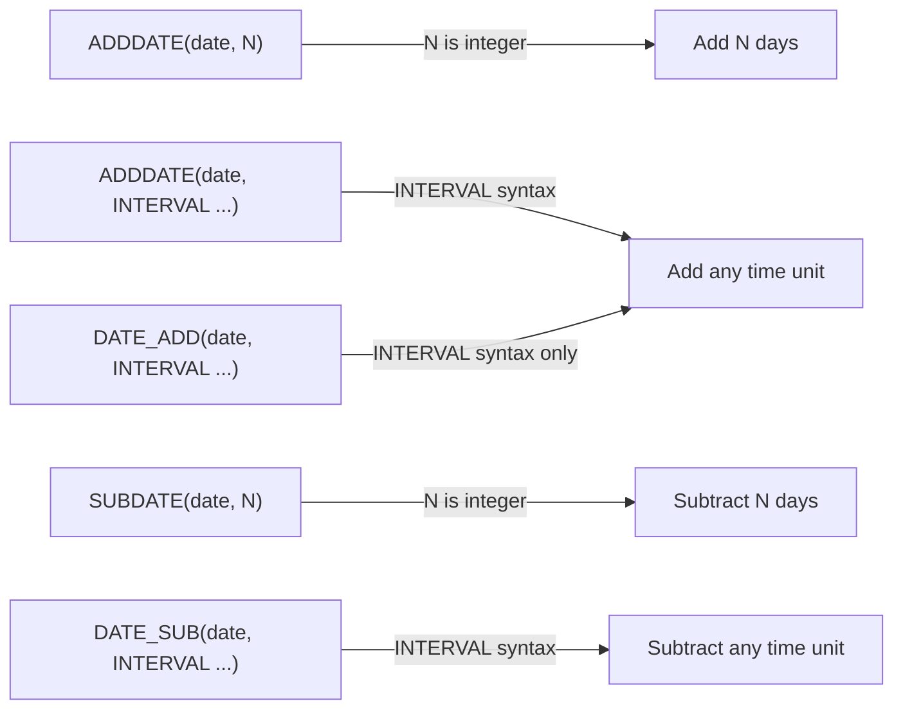

# How to Use ADDDATE() and SUBDATE() Functions in MySQL

Author: [nawazdhandala](https://www.github.com/nawazdhandala)

Tags: MySQL, SQL, Date Function, Database

Description: Learn how to use MySQL ADDDATE() and SUBDATE() to add or subtract days or intervals from dates, including their shorthand integer day syntax.

---

## Overview

`ADDDATE()` and `SUBDATE()` are MySQL date arithmetic functions that add or subtract time from a date. They serve as alternatives to `DATE_ADD()` and `DATE_SUB()`, and also support a shorthand two-argument syntax where the second argument is a plain integer representing a number of days.

---

## ADDDATE() Function

**Syntax:**

```sql
-- Full interval syntax (same as DATE_ADD)
ADDDATE(date, INTERVAL expr unit)

-- Shorthand: add N days
ADDDATE(date, days)
```

### Examples

```sql
-- Add 10 days using integer shorthand
SELECT ADDDATE('2026-03-31', 10);
-- Returns: '2026-04-10'

-- Add 3 months using INTERVAL
SELECT ADDDATE('2026-03-31', INTERVAL 3 MONTH);
-- Returns: '2026-06-30'

-- Add 2 hours and 30 minutes
SELECT ADDDATE('2026-03-31 09:00:00', INTERVAL '2:30' HOUR_MINUTE);
-- Returns: '2026-03-31 11:30:00'

-- Add 0 days
SELECT ADDDATE('2026-03-31', 0);
-- Returns: '2026-03-31'

-- Negative integer (same as SUBDATE)
SELECT ADDDATE('2026-03-31', -7);
-- Returns: '2026-03-24'
```

---

## SUBDATE() Function

**Syntax:**

```sql
-- Full interval syntax (same as DATE_SUB)
SUBDATE(date, INTERVAL expr unit)

-- Shorthand: subtract N days
SUBDATE(date, days)
```

### Examples

```sql
-- Subtract 10 days using integer shorthand
SELECT SUBDATE('2026-03-31', 10);
-- Returns: '2026-03-21'

-- Subtract 1 month
SELECT SUBDATE('2026-03-31', INTERVAL 1 MONTH);
-- Returns: '2026-02-28'

-- Subtract 2 weeks
SELECT SUBDATE(CURDATE(), INTERVAL 2 WEEK);
-- Returns: date 14 days ago

-- Subtract 90 days
SELECT SUBDATE(NOW(), 90);
-- Returns: datetime 90 days ago
```

---

## ADDDATE() vs DATE_ADD()

`ADDDATE(date, INTERVAL expr unit)` is fully equivalent to `DATE_ADD(date, INTERVAL expr unit)`. The only difference is the integer shorthand form:

```sql
-- These three are equivalent for adding days
SELECT ADDDATE('2026-03-31', 5);
SELECT ADDDATE('2026-03-31', INTERVAL 5 DAY);
SELECT DATE_ADD('2026-03-31', INTERVAL 5 DAY);
-- All return: '2026-04-05'
```

The integer shorthand `ADDDATE(date, N)` is not supported by `DATE_ADD()`.

---

## Function Comparison



---

## Practical: Deadline Calculation

```sql
CREATE TABLE tasks (
    id INT AUTO_INCREMENT PRIMARY KEY,
    task_name VARCHAR(100),
    created_date DATE,
    due_days INT
);

INSERT INTO tasks (task_name, created_date, due_days) VALUES
('Write report',    '2026-03-31', 7),
('Review code',     '2026-03-31', 3),
('Deploy to prod',  '2026-03-31', 14);

SELECT
    task_name,
    created_date,
    ADDDATE(created_date, due_days) AS due_date
FROM tasks;
```

Result:

| task_name      | created_date | due_date   |
|----------------|--------------|------------|
| Write report   | 2026-03-31   | 2026-04-07 |
| Review code    | 2026-03-31   | 2026-04-03 |
| Deploy to prod | 2026-03-31   | 2026-04-14 |

---

## Date Windows for Reporting

```sql
-- Records from the last 30 days
SELECT * FROM orders
WHERE order_date >= SUBDATE(CURDATE(), 30);

-- Records for the next 7 days
SELECT * FROM appointments
WHERE appointment_date BETWEEN CURDATE() AND ADDDATE(CURDATE(), 7);
```

---

## Combining with Other Date Functions

```sql
-- Last day of the month, 3 months from now
SELECT LAST_DAY(ADDDATE(CURDATE(), INTERVAL 3 MONTH)) AS future_month_end;

-- First day of the month 6 months ago
SELECT DATE_FORMAT(SUBDATE(CURDATE(), INTERVAL 6 MONTH), '%Y-%m-01') AS past_month_start;
```

---

## NULL Handling

```sql
SELECT ADDDATE(NULL, 10);              -- NULL
SELECT ADDDATE('2026-03-31', NULL);    -- NULL
SELECT SUBDATE(NULL, INTERVAL 7 DAY); -- NULL
```

---

## Supported INTERVAL Units for Both Functions

Both `ADDDATE()` and `SUBDATE()` support all standard interval units when using the `INTERVAL` form:

```sql
SELECT ADDDATE('2026-03-31', INTERVAL 1 YEAR);
SELECT ADDDATE('2026-03-31', INTERVAL 1 QUARTER);
SELECT ADDDATE('2026-03-31', INTERVAL 1 MONTH);
SELECT ADDDATE('2026-03-31', INTERVAL 1 WEEK);
SELECT ADDDATE('2026-03-31', INTERVAL 1 DAY);
SELECT ADDDATE('2026-03-31 00:00:00', INTERVAL 1 HOUR);
SELECT ADDDATE('2026-03-31 00:00:00', INTERVAL 1 MINUTE);
SELECT ADDDATE('2026-03-31 00:00:00', INTERVAL 1 SECOND);
```

---

## Summary

`ADDDATE()` and `SUBDATE()` are MySQL date functions for adding and subtracting time from dates. They are equivalent to `DATE_ADD()` and `DATE_SUB()` when used with `INTERVAL` syntax, but offer the convenient additional form of accepting a plain integer as the number of days to add or subtract. Use the integer shorthand for simple day arithmetic and the `INTERVAL` form for multi-unit operations like months, quarters, or hours.
