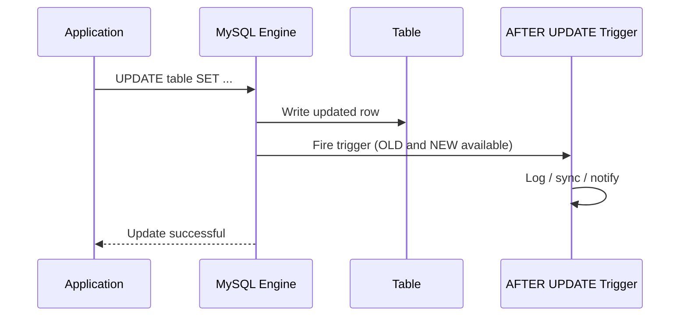

# How to Create an AFTER UPDATE Trigger in MySQL

Author: [nawazdhandala](https://www.github.com/nawazdhandala)

Tags: MySQL, Trigger, SQL, Database, Data Integrity

Description: Learn how to create AFTER UPDATE triggers in MySQL to audit changes, maintain derived columns, and sync related tables after a row is updated.

---

## What is an AFTER UPDATE Trigger?

An AFTER UPDATE trigger fires automatically for each row after MySQL successfully writes an updated row to a table. Unlike BEFORE UPDATE, it cannot modify the values that were saved, but it has access to both the old (`OLD`) and new (`NEW`) values of every column.



## Syntax

```sql
CREATE TRIGGER trigger_name
AFTER UPDATE ON table_name
FOR EACH ROW
BEGIN
    -- OLD.column_name: value before the update
    -- NEW.column_name: value after the update
END;
```

- `OLD.column_name` - the column value before the UPDATE.
- `NEW.column_name` - the column value after the UPDATE.
- AFTER triggers cannot use `SET NEW.column_name`; to change values, use a BEFORE UPDATE trigger.

## Setup: Sample Tables

```sql
CREATE TABLE employees (
    id           INT PRIMARY KEY AUTO_INCREMENT,
    name         VARCHAR(100) NOT NULL,
    department   VARCHAR(50),
    salary       DECIMAL(10,2),
    status       VARCHAR(20) DEFAULT 'active',
    updated_at   DATETIME DEFAULT CURRENT_TIMESTAMP ON UPDATE CURRENT_TIMESTAMP
);

CREATE TABLE salary_audit (
    id           INT PRIMARY KEY AUTO_INCREMENT,
    emp_id       INT,
    emp_name     VARCHAR(100),
    old_salary   DECIMAL(10,2),
    new_salary   DECIMAL(10,2),
    pct_change   DECIMAL(6,2),
    changed_by   VARCHAR(100),
    changed_at   DATETIME DEFAULT CURRENT_TIMESTAMP
);

CREATE TABLE status_change_log (
    id           INT PRIMARY KEY AUTO_INCREMENT,
    emp_id       INT,
    old_status   VARCHAR(20),
    new_status   VARCHAR(20),
    changed_at   DATETIME DEFAULT CURRENT_TIMESTAMP
);

INSERT INTO employees (name, department, salary, status) VALUES
    ('Alice', 'Engineering', 95000.00, 'active'),
    ('Bob',   'Marketing',   72000.00, 'active'),
    ('Carol', 'Finance',     88000.00, 'active');
```

## Example 1: Audit Salary Changes

Record every salary modification, including the percentage change.

```sql
DELIMITER $$

CREATE TRIGGER after_salary_update
AFTER UPDATE ON employees
FOR EACH ROW
BEGIN
    -- Only log if salary actually changed
    IF OLD.salary != NEW.salary THEN
        INSERT INTO salary_audit (emp_id, emp_name, old_salary, new_salary, pct_change, changed_by)
        VALUES (
            NEW.id,
            NEW.name,
            OLD.salary,
            NEW.salary,
            ROUND((NEW.salary - OLD.salary) / OLD.salary * 100, 2),
            USER()
        );
    END IF;
END$$

DELIMITER ;
```

```sql
UPDATE employees SET salary = 105000.00 WHERE id = 1;
UPDATE employees SET salary = 68000.00  WHERE id = 2;

SELECT * FROM salary_audit;
```

```text
+----+--------+----------+------------+------------+------------+----------------+
| id | emp_id | emp_name | old_salary | new_salary | pct_change | changed_by     |
+----+--------+----------+------------+------------+------------+----------------+
|  1 |      1 | Alice    |   95000.00 |  105000.00 |      10.53 | root@localhost |
|  2 |      2 | Bob      |   72000.00 |   68000.00 |      -5.56 | root@localhost |
+----+--------+----------+------------+------------+------------+----------------+
```

## Example 2: Track Status Changes

Log every status transition with timestamps.

```sql
DELIMITER $$

CREATE TRIGGER after_status_update
AFTER UPDATE ON employees
FOR EACH ROW
BEGIN
    IF OLD.status != NEW.status THEN
        INSERT INTO status_change_log (emp_id, old_status, new_status)
        VALUES (NEW.id, OLD.status, NEW.status);
    END IF;
END$$

DELIMITER ;
```

```sql
UPDATE employees SET status = 'inactive' WHERE id = 3;

SELECT e.name, l.old_status, l.new_status, l.changed_at
FROM status_change_log l
JOIN employees e ON e.id = l.emp_id;
```

```text
+-------+------------+------------+---------------------+
| name  | old_status | new_status | changed_at          |
+-------+------------+------------+---------------------+
| Carol | active     | inactive   | 2024-01-15 11:00:00 |
+-------+------------+------------+---------------------+
```

## Example 3: Maintain a Summary Table

Keep a department salary summary table in sync after every employee update.

```sql
CREATE TABLE dept_salary_summary (
    department   VARCHAR(50) PRIMARY KEY,
    total_salary DECIMAL(12,2),
    avg_salary   DECIMAL(10,2),
    headcount    INT,
    last_updated DATETIME
);

INSERT INTO dept_salary_summary
SELECT department, SUM(salary), AVG(salary), COUNT(*), NOW()
FROM employees
GROUP BY department;
```

```sql
DELIMITER $$

CREATE TRIGGER sync_dept_summary_after_update
AFTER UPDATE ON employees
FOR EACH ROW
BEGIN
    -- Update summary for affected departments
    IF OLD.department = NEW.department THEN
        -- Same department, just update the stats
        INSERT INTO dept_salary_summary (department, total_salary, avg_salary, headcount, last_updated)
        SELECT department, SUM(salary), AVG(salary), COUNT(*), NOW()
        FROM employees
        WHERE department = NEW.department
        GROUP BY department
        ON DUPLICATE KEY UPDATE
            total_salary = VALUES(total_salary),
            avg_salary   = VALUES(avg_salary),
            headcount    = VALUES(headcount),
            last_updated = VALUES(last_updated);
    ELSE
        -- Department changed - update both old and new departments
        INSERT INTO dept_salary_summary (department, total_salary, avg_salary, headcount, last_updated)
        SELECT department, SUM(salary), AVG(salary), COUNT(*), NOW()
        FROM employees
        WHERE department IN (OLD.department, NEW.department)
        GROUP BY department
        ON DUPLICATE KEY UPDATE
            total_salary = VALUES(total_salary),
            avg_salary   = VALUES(avg_salary),
            headcount    = VALUES(headcount),
            last_updated = VALUES(last_updated);
    END IF;
END$$

DELIMITER ;
```

## Example 4: Reject Invalid Updates with BEFORE UPDATE + AFTER UPDATE

Use BEFORE UPDATE for validation and AFTER UPDATE for auditing in combination.

```sql
DELIMITER $$

CREATE TRIGGER before_salary_update
BEFORE UPDATE ON employees
FOR EACH ROW
BEGIN
    -- Reject salary decreases above 20%
    IF NEW.salary < OLD.salary * 0.80 THEN
        SIGNAL SQLSTATE '45000'
            SET MESSAGE_TEXT = 'Salary reduction cannot exceed 20% in a single update';
    END IF;
END$$

DELIMITER ;
```

```sql
-- Rejected: 50% reduction
UPDATE employees SET salary = 30000.00 WHERE id = 1;
-- ERROR 1644 (45000): Salary reduction cannot exceed 20% in a single update
```

## Checking Which Columns Changed

Use `IF OLD.col != NEW.col` (or `IF NOT (OLD.col <=> NEW.col)` when NULL is possible) to fire logic only when specific columns change.

```sql
DELIMITER $$

CREATE TRIGGER after_employee_update_detailed
AFTER UPDATE ON employees
FOR EACH ROW
BEGIN
    -- NULL-safe comparison for nullable columns
    IF NOT (OLD.department <=> NEW.department) THEN
        INSERT INTO status_change_log (emp_id, old_status, new_status)
        VALUES (NEW.id,
                CONCAT('dept:', COALESCE(OLD.department,'NULL')),
                CONCAT('dept:', COALESCE(NEW.department,'NULL')));
    END IF;
END$$

DELIMITER ;
```

## Managing Triggers

```sql
-- List all triggers on the employees table
SHOW TRIGGERS LIKE 'employees'\G

-- View trigger definition
SHOW CREATE TRIGGER after_salary_update\G

-- Drop a trigger
DROP TRIGGER IF EXISTS after_salary_update;
```

## BEFORE vs AFTER UPDATE

| Feature | BEFORE UPDATE | AFTER UPDATE |
|---|---|---|
| Can modify NEW values | YES | NO |
| Can reject update with SIGNAL | YES | YES (row already written) |
| Access OLD values | YES | YES |
| Audit with guaranteed final values | NO | YES |
| Sync other tables | YES (but row not committed yet) | YES (row is committed) |

## Best Practices

- Use `OLD.col != NEW.col` checks to avoid writing audit rows when values did not actually change.
- For nullable columns, use the NULL-safe operator `NOT (OLD.col <=> NEW.col)` instead of `!=`.
- Keep trigger bodies short - delegate complex logic to stored procedures called from the trigger.
- AFTER UPDATE triggers run inside the same transaction as the UPDATE; if the transaction rolls back, trigger effects also roll back.
- Index columns in the target audit table on `emp_id` and `changed_at` for efficient queries.

## Summary

AFTER UPDATE triggers fire after MySQL commits a row change, giving access to both `OLD` and `NEW` column values. Use them for audit trails, syncing summary tables, and maintaining derived data. Unlike BEFORE UPDATE triggers, AFTER UPDATE cannot modify the saved values but provides reliable access to the final committed state. Always check whether columns actually changed to avoid unnecessary audit records.
