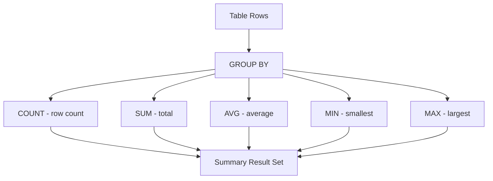

# How to Use MySQL Aggregate Functions (COUNT, SUM, AVG, MIN, MAX)

Author: [nawazdhandala](https://www.github.com/nawazdhandala)

Tags: MySQL, SQL, Aggregate Function, Database

Description: Learn how to use MySQL aggregate functions COUNT, SUM, AVG, MIN, and MAX to summarize and analyze data across groups of rows.

---

## How MySQL Aggregate Functions Work

Aggregate functions collapse multiple rows into a single summary value. They are almost always used with `GROUP BY` to produce per-group statistics, though they also work on an entire table when no grouping is specified. NULL values are ignored by all aggregate functions except `COUNT(*)`.



## Setup: Sample Table

```sql
CREATE TABLE sales (
    id          INT AUTO_INCREMENT PRIMARY KEY,
    region      VARCHAR(50),
    salesperson VARCHAR(100),
    product     VARCHAR(100),
    amount      DECIMAL(10,2),
    sale_date   DATE
);

INSERT INTO sales (region, salesperson, product, amount, sale_date) VALUES
('North', 'Alice', 'Laptop',     1299.99, '2026-01-10'),
('North', 'Alice', 'Monitor',     499.50, '2026-01-15'),
('South', 'Bob',   'Keyboard',     49.99, '2026-01-20'),
('South', 'Bob',   'Mouse',        29.95, '2026-02-01'),
('East',  'Carol', 'Laptop',     1299.99, '2026-02-05'),
('East',  'Carol', 'Headphones',   89.49, '2026-02-10'),
('West',  'Dave',  'Monitor',     499.50, '2026-02-15'),
('West',  'Dave',  'Keyboard',     49.99, '2026-03-01'),
('North', 'Alice', 'Mouse',        29.95, '2026-03-05'),
('South', 'Bob',   'Laptop',     1299.99, '2026-03-10');
```

## COUNT

`COUNT(*)` counts all rows including those with NULL values. `COUNT(column)` counts only non-NULL values in that column.

**Syntax:**

```sql
COUNT(*)
COUNT(column_name)
COUNT(DISTINCT column_name)
```

**Example - total sales count:**

```sql
SELECT COUNT(*) AS total_sales FROM sales;
```

**Example - sales count per region:**

```sql
SELECT
    region,
    COUNT(*) AS sale_count
FROM sales
GROUP BY region
ORDER BY sale_count DESC;
```

```text
+--------+------------+
| region | sale_count |
+--------+------------+
| North  | 3          |
| South  | 3          |
| East   | 2          |
| West   | 2          |
+--------+------------+
```

**Example - count distinct salespersons:**

```sql
SELECT COUNT(DISTINCT salesperson) AS unique_salespeople FROM sales;
```

## SUM

`SUM` adds all non-NULL values in a numeric column.

**Syntax:**

```sql
SUM(column_name)
SUM(expression)
```

**Example - total revenue per region:**

```sql
SELECT
    region,
    SUM(amount) AS total_revenue
FROM sales
GROUP BY region
ORDER BY total_revenue DESC;
```

```text
+--------+---------------+
| region | total_revenue |
+--------+---------------+
| North  | 1829.44       |
| South  | 1379.93       |
| East   | 1389.48       |
| West   |  549.49       |
+--------+---------------+
```

## AVG

`AVG` computes the arithmetic mean of non-NULL values.

**Syntax:**

```sql
AVG(column_name)
```

**Example - average sale amount per salesperson:**

```sql
SELECT
    salesperson,
    ROUND(AVG(amount), 2) AS avg_sale
FROM sales
GROUP BY salesperson
ORDER BY avg_sale DESC;
```

**Example - average vs. grand average comparison:**

```sql
SELECT
    region,
    ROUND(AVG(amount), 2)                             AS region_avg,
    ROUND((SELECT AVG(amount) FROM sales), 2)          AS global_avg
FROM sales
GROUP BY region;
```

## MIN and MAX

`MIN` and `MAX` return the smallest and largest values respectively. They work on numeric, string, and date columns.

**Syntax:**

```sql
MIN(column_name)
MAX(column_name)
```

**Example - cheapest and most expensive sale per region:**

```sql
SELECT
    region,
    MIN(amount) AS min_sale,
    MAX(amount) AS max_sale,
    MAX(amount) - MIN(amount) AS range_amount
FROM sales
GROUP BY region;
```

```text
+--------+----------+----------+--------------+
| region | min_sale | max_sale | range_amount |
+--------+----------+----------+--------------+
| North  |    29.95 |  1299.99 |     1270.04  |
| South  |    29.95 |  1299.99 |     1270.04  |
| East   |    89.49 |  1299.99 |     1210.50  |
| West   |    49.99 |   499.50 |      449.51  |
+--------+----------+----------+--------------+
```

## HAVING - Filtering Aggregated Results

`HAVING` filters groups after aggregation, unlike `WHERE` which filters individual rows before aggregation.

**Example - regions with total revenue above 1000:**

```sql
SELECT
    region,
    SUM(amount) AS total_revenue
FROM sales
GROUP BY region
HAVING total_revenue > 1000
ORDER BY total_revenue DESC;
```

## Combining Multiple Aggregates

```sql
SELECT
    region,
    COUNT(*)              AS transactions,
    SUM(amount)           AS total_revenue,
    ROUND(AVG(amount), 2) AS avg_transaction,
    MIN(amount)           AS min_sale,
    MAX(amount)           AS max_sale
FROM sales
GROUP BY region
ORDER BY total_revenue DESC;
```

## GROUP_CONCAT

`GROUP_CONCAT` is a special aggregate that concatenates non-NULL values from a group into a delimited string.

```sql
SELECT
    region,
    GROUP_CONCAT(DISTINCT product ORDER BY product SEPARATOR ', ') AS products_sold
FROM sales
GROUP BY region;
```

## Best Practices

- Use `COUNT(*)` when you want all rows; use `COUNT(column)` only when you want to exclude NULLs.
- Place aggregate-level filters in `HAVING`, not `WHERE`.
- Index columns used in `GROUP BY` to improve query performance on large tables.
- Avoid selecting non-aggregated columns that are not in the `GROUP BY` clause (enable `sql_mode=ONLY_FULL_GROUP_BY` to enforce this).
- Round `AVG` results when presenting them to users - floating-point averages rarely need more than two decimal places.

## Summary

MySQL aggregate functions summarize data across rows into single computed values. `COUNT` counts rows or distinct values. `SUM` totals a numeric column. `AVG` calculates the mean. `MIN` and `MAX` find the boundary values. Combined with `GROUP BY` and `HAVING`, these five functions cover most reporting and analytics needs directly within SQL, reducing the need to pull raw rows into application code for post-processing.
