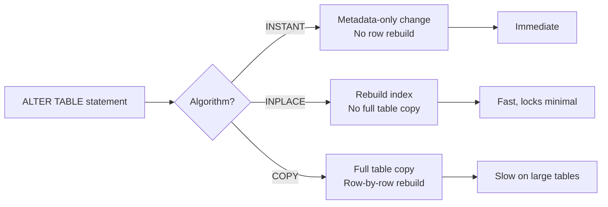

# How to Add and Drop Columns with ALTER TABLE in MySQL

Author: [nawazdhandala](https://www.github.com/nawazdhandala)

Tags: MySQL, SQL, DDL, ALTER TABLE, Column, Schema

Description: Add new columns to an existing MySQL table and remove obsolete ones using ALTER TABLE ADD COLUMN and DROP COLUMN with online DDL considerations.

---

## How It Works

`ALTER TABLE` modifies an existing table's structure. In MySQL 8.0 with InnoDB, many `ALTER TABLE` operations are performed online (without a full table copy) using the `ALGORITHM=INSTANT` or `ALGORITHM=INPLACE` modes. `DROP COLUMN` and most `ADD COLUMN` operations use `ALGORITHM=INSTANT` since MySQL 8.0.29, making them very fast even on large tables.



## Adding a Column

### Basic Syntax

```sql
ALTER TABLE table_name
    ADD COLUMN column_name data_type [column_options];
```

### Add a Column at the End (Default Position)

```sql
ALTER TABLE users
    ADD COLUMN phone VARCHAR(20);
```

### Add a Column at the Beginning

```sql
ALTER TABLE users
    ADD COLUMN prefix VARCHAR(10) FIRST;
```

### Add a Column After a Specific Column

```sql
ALTER TABLE users
    ADD COLUMN middle_name VARCHAR(100) AFTER first_name;
```

### Add a Column with NOT NULL and DEFAULT

```sql
ALTER TABLE products
    ADD COLUMN is_featured BOOLEAN NOT NULL DEFAULT FALSE;
```

### Add Multiple Columns in One Statement

```sql
ALTER TABLE users
    ADD COLUMN first_name  VARCHAR(100) AFTER username,
    ADD COLUMN last_name   VARCHAR(100) AFTER first_name,
    ADD COLUMN phone       VARCHAR(20)  AFTER last_name,
    ADD COLUMN avatar_url  VARCHAR(500);
```

Combining multiple changes in one `ALTER TABLE` is more efficient than running separate statements because it performs only one table rebuild.

## Dropping a Column

### Basic Syntax

```sql
ALTER TABLE table_name
    DROP COLUMN column_name;
```

### Example

```sql
ALTER TABLE users
    DROP COLUMN legacy_id;
```

### Drop Multiple Columns

```sql
ALTER TABLE orders
    DROP COLUMN legacy_reference,
    DROP COLUMN old_status_code;
```

## Complete Working Example

```sql
-- Start with a simple table
CREATE TABLE articles (
    id         INT UNSIGNED AUTO_INCREMENT PRIMARY KEY,
    title      VARCHAR(255) NOT NULL,
    body       TEXT         NOT NULL,
    created_at DATETIME     NOT NULL DEFAULT CURRENT_TIMESTAMP
);

INSERT INTO articles (title, body) VALUES
    ('First Post',  'Hello world content'),
    ('Second Post', 'More content here');

-- Add columns
ALTER TABLE articles
    ADD COLUMN author_id    INT UNSIGNED AFTER id,
    ADD COLUMN slug         VARCHAR(255) AFTER title,
    ADD COLUMN view_count   INT UNSIGNED NOT NULL DEFAULT 0,
    ADD COLUMN published_at DATETIME;

-- Verify the new structure
DESCRIBE articles;
```

```text
+--------------+--------------+------+-----+-------------------+-------------------+
| Field        | Type         | Null | Key | Default           | Extra             |
+--------------+--------------+------+-----+-------------------+-------------------+
| id           | int unsigned | NO   | PRI | NULL              | auto_increment    |
| author_id    | int unsigned | YES  |     | NULL              |                   |
| title        | varchar(255) | NO   |     | NULL              |                   |
| slug         | varchar(255) | YES  |     | NULL              |                   |
| body         | text         | NO   |     | NULL              |                   |
| view_count   | int unsigned | NO   |     | 0                 |                   |
| published_at | datetime     | YES  |     | NULL              |                   |
| created_at   | datetime     | NO   |     | CURRENT_TIMESTAMP | DEFAULT_GENERATED |
+--------------+--------------+------+-----+-------------------+-------------------+
```

```sql
-- Remove a column that is no longer needed
ALTER TABLE articles DROP COLUMN slug;
```

## Checking If a Column Exists Before Adding

MySQL does not have `ADD COLUMN IF NOT EXISTS` in a single statement. Check programmatically first.

```sql
SELECT COUNT(*) AS col_exists
FROM information_schema.COLUMNS
WHERE TABLE_SCHEMA = DATABASE()
  AND TABLE_NAME   = 'articles'
  AND COLUMN_NAME  = 'view_count';
```

If `col_exists = 0`, the column does not exist and you can safely add it.

## Using ALGORITHM Hint for Large Tables

For large tables, specify the algorithm explicitly to ensure MySQL uses the fastest available method.

```sql
ALTER TABLE large_table
    ADD COLUMN metadata JSON,
    ALGORITHM=INSTANT;
```

If `INSTANT` is not supported for the operation, MySQL returns an error so you can choose a maintenance window instead of silently degrading to `COPY`.

## Viewing Column Information

```sql
SELECT COLUMN_NAME, ORDINAL_POSITION, COLUMN_TYPE,
       IS_NULLABLE, COLUMN_DEFAULT
FROM information_schema.COLUMNS
WHERE TABLE_SCHEMA = DATABASE()
  AND TABLE_NAME = 'articles'
ORDER BY ORDINAL_POSITION;
```

## Best Practices

- Combine multiple column changes in a single `ALTER TABLE` statement to minimise table rebuilds.
- Add new `NOT NULL` columns with a `DEFAULT` value so existing rows get a valid value immediately.
- Use `ALGORITHM=INSTANT` for large production tables to get metadata-only changes with no locking.
- Before dropping a column, verify no application code, stored procedures, views, or triggers reference it.
- Consider using pt-online-schema-change or gh-ost for very large table alterations on busy production databases where even brief locks are unacceptable.

## Summary

`ALTER TABLE ADD COLUMN` adds one or more columns to an existing table, optionally at a specific position. `ALTER TABLE DROP COLUMN` removes a column and all its data permanently. MySQL 8.0 with InnoDB supports `ALGORITHM=INSTANT` for many column additions and all column drops on tables using the new row format, making these operations nearly instantaneous even on billion-row tables. Batch multiple changes in one `ALTER TABLE` for efficiency.
