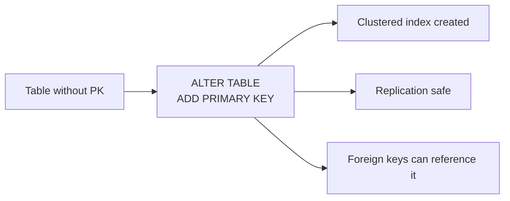

# How to Add a Primary Key with ALTER TABLE in MySQL

Author: [nawazdhandala](https://www.github.com/nawazdhandala)

Tags: MySQL, SQL, DDL, Primary Key, Database

Description: Learn how to add a primary key to an existing MySQL table using ALTER TABLE, handle tables without a primary key, add composite primary keys, and migrate existing keys.

---

## Why Add a Primary Key After Table Creation

Tables are sometimes created without a primary key -- through ad-hoc schema creation, migration imports, or legacy code. Adding a primary key to an existing table improves query performance (InnoDB uses the primary key as the clustered index), enables reliable replication, and satisfies referential integrity requirements.



## Syntax

```sql
ALTER TABLE table_name ADD PRIMARY KEY (column1 [, column2, ...]);
```

## Adding a Primary Key to a Single Column

```sql
-- Create a table without a primary key
CREATE TABLE legacy_products (
    sku         VARCHAR(20) NOT NULL UNIQUE,
    name        VARCHAR(200) NOT NULL,
    price       DECIMAL(10, 2) NOT NULL,
    stock       INT NOT NULL DEFAULT 0
);

-- Add a primary key on the existing SKU column
ALTER TABLE legacy_products
    ADD PRIMARY KEY (sku);
```

The column used as the primary key must already be `NOT NULL`. If it is nullable, add `NOT NULL` first:

```sql
-- Make the column NOT NULL first if needed
ALTER TABLE legacy_products
    MODIFY COLUMN sku VARCHAR(20) NOT NULL;

-- Then add the primary key
ALTER TABLE legacy_products
    ADD PRIMARY KEY (sku);
```

## Adding an AUTO_INCREMENT Primary Key Column

A common pattern is to add a new `id` column as an auto-increment primary key:

```sql
CREATE TABLE legacy_orders (
    order_ref   VARCHAR(30) NOT NULL,
    customer_id INT NOT NULL,
    total       DECIMAL(10, 2) NOT NULL,
    placed_at   DATETIME NOT NULL
);

-- Add an auto-increment id column as the primary key
ALTER TABLE legacy_orders
    ADD COLUMN id INT UNSIGNED NOT NULL AUTO_INCREMENT FIRST,
    ADD PRIMARY KEY (id);
```

```text
DESCRIBE legacy_orders;
+-------------+-----------------+------+-----+-------------------+
| Field       | Type            | Null | Key | Extra             |
+-------------+-----------------+------+-----+-------------------+
| id          | int unsigned    | NO   | PRI | auto_increment    |
| order_ref   | varchar(30)     | NO   |     |                   |
| customer_id | int             | NO   |     |                   |
| total       | decimal(10,2)   | NO   |     |                   |
| placed_at   | datetime        | NO   |     |                   |
+-------------+-----------------+------+-----+-------------------+
```

## Adding a Composite Primary Key

A composite (multi-column) primary key uniquely identifies rows by combining two or more columns:

```sql
CREATE TABLE order_items_legacy (
    order_id    INT NOT NULL,
    product_id  INT NOT NULL,
    quantity    INT NOT NULL DEFAULT 1,
    unit_price  DECIMAL(10, 2) NOT NULL
);

-- Add a composite primary key
ALTER TABLE order_items_legacy
    ADD PRIMARY KEY (order_id, product_id);
```

## Removing an Existing Primary Key Before Adding a New One

A table can have only one primary key. Remove the existing one before adding a new key:

```sql
ALTER TABLE legacy_products DROP PRIMARY KEY;
ALTER TABLE legacy_products ADD PRIMARY KEY (sku);
```

Do both in one statement to minimize locking:

```sql
ALTER TABLE legacy_products
    DROP PRIMARY KEY,
    ADD PRIMARY KEY (new_id_column);
```

## Checking Whether a Table Has a Primary Key

```sql
SELECT constraint_name, column_name
FROM information_schema.key_column_usage
WHERE table_schema = DATABASE()
  AND table_name = 'legacy_orders'
  AND constraint_name = 'PRIMARY';
```

```text
+-----------------+-------------+
| constraint_name | column_name |
+-----------------+-------------+
| PRIMARY         | id          |
+-----------------+-------------+
```

Or use:

```sql
SHOW INDEX FROM legacy_orders WHERE Key_name = 'PRIMARY';
```

## Finding Tables Without a Primary Key

```sql
SELECT t.table_name
FROM information_schema.tables t
LEFT JOIN information_schema.table_constraints c
    ON c.table_schema = t.table_schema
    AND c.table_name = t.table_name
    AND c.constraint_type = 'PRIMARY KEY'
WHERE t.table_schema = DATABASE()
  AND t.table_type = 'BASE TABLE'
  AND c.constraint_name IS NULL
ORDER BY t.table_name;
```

## Impact on Existing Data

Adding a primary key on a column with duplicate or NULL values will fail:

```sql
-- Check for duplicates before adding PK
SELECT sku, COUNT(*) AS cnt
FROM legacy_products
GROUP BY sku
HAVING cnt > 1;

-- Resolve duplicates, then add the PK
ALTER TABLE legacy_products ADD PRIMARY KEY (sku);
```

## Performance Considerations

In InnoDB, adding a primary key to a large table causes a table rebuild (the entire table is re-written on disk). This can take time and lock the table. Use `pt-online-schema-change` or MySQL 8.0 instant DDL where possible for large tables.

```sql
-- MySQL 8.0 instant DDL for some ALTER TABLE operations (not always applicable for PK)
ALTER TABLE legacy_orders
    ADD COLUMN id INT UNSIGNED NOT NULL AUTO_INCREMENT FIRST,
    ADD PRIMARY KEY (id),
    ALGORITHM = INPLACE, LOCK = NONE;
```

## Best Practices

- Always define a primary key at table creation time rather than adding it later.
- Use `INT UNSIGNED AUTO_INCREMENT` or `BIGINT UNSIGNED AUTO_INCREMENT` for surrogate primary keys.
- Check for duplicate and NULL values in the target column before running `ALTER TABLE ADD PRIMARY KEY`.
- For large tables in production, schedule the `ALTER TABLE` during low-traffic periods or use online schema change tools.
- Add the column and the primary key in a single `ALTER TABLE` statement to minimize the number of table rebuilds.

## Summary

`ALTER TABLE table_name ADD PRIMARY KEY (column)` adds a primary key to an existing table. The target column must be `NOT NULL` and contain unique values. To add an auto-increment surrogate key, add the column and the primary key in one `ALTER TABLE` statement. Use `information_schema.key_column_usage` to audit which tables lack a primary key. In InnoDB, adding a primary key rebuilds the table, so plan for downtime or use online schema change tools on large tables.
