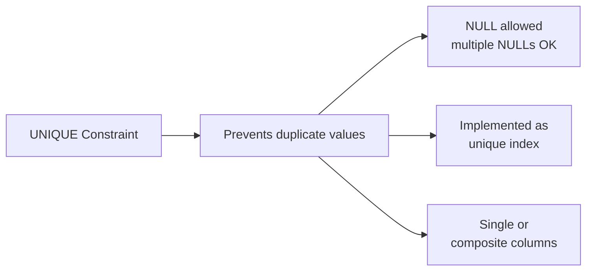

# How to Add a UNIQUE Constraint with ALTER TABLE in MySQL

Author: [nawazdhandala](https://www.github.com/nawazdhandala)

Tags: MySQL, SQL, DDL, Constraint, Database

Description: Learn how to add a UNIQUE constraint to an existing MySQL table using ALTER TABLE, handle composite unique constraints, check for duplicates, and manage unique indexes.

---

## What Is a UNIQUE Constraint

A `UNIQUE` constraint ensures that no two rows in a table have the same value (or combination of values) in the constrained column(s). In MySQL, a `UNIQUE` constraint is implemented as a unique index. NULL values are allowed and are treated as distinct from one another.



## Syntax

```sql
-- Add a named unique constraint
ALTER TABLE table_name
    ADD CONSTRAINT constraint_name UNIQUE (column1 [, column2, ...]);

-- Add an unnamed unique index (MySQL creates a name automatically)
ALTER TABLE table_name
    ADD UNIQUE INDEX index_name (column1 [, column2, ...]);

-- Shortest form (index name defaults to column name)
ALTER TABLE table_name
    ADD UNIQUE (column_name);
```

## Adding a Unique Constraint on a Single Column

```sql
CREATE TABLE users (
    id       INT UNSIGNED AUTO_INCREMENT PRIMARY KEY,
    username VARCHAR(50) NOT NULL,
    email    VARCHAR(255) NOT NULL,
    phone    VARCHAR(20)
);

-- Ensure emails are unique
ALTER TABLE users
    ADD CONSTRAINT uq_users_email UNIQUE (email);

-- Ensure usernames are unique
ALTER TABLE users
    ADD UNIQUE (username);
```

## Adding a Composite UNIQUE Constraint

A composite unique constraint ensures the combination of values is unique:

```sql
CREATE TABLE user_roles (
    user_id INT UNSIGNED NOT NULL,
    role_id INT UNSIGNED NOT NULL,
    granted_at DATETIME NOT NULL DEFAULT CURRENT_TIMESTAMP
);

-- Each user can have each role only once
ALTER TABLE user_roles
    ADD CONSTRAINT uq_user_role UNIQUE (user_id, role_id);
```

## Checking for Duplicates Before Adding

Adding a unique constraint fails if existing data contains duplicates. Check first:

```sql
-- Find duplicate emails before adding the constraint
SELECT email, COUNT(*) AS cnt
FROM users
GROUP BY email
HAVING cnt > 1;
```

If duplicates exist, resolve them before running `ALTER TABLE`:

```sql
-- Example: delete older duplicate rows, keeping the one with the highest id
DELETE u1
FROM users u1
JOIN users u2
    ON u1.email = u2.email
    AND u1.id < u2.id;

-- Now add the unique constraint safely
ALTER TABLE users
    ADD CONSTRAINT uq_users_email UNIQUE (email);
```

## Naming the Constraint

Always name constraints explicitly for easier management:

```sql
-- Named constraint
ALTER TABLE users
    ADD CONSTRAINT uq_users_phone UNIQUE (phone);

-- Find constraint by name later
SELECT constraint_name, column_name
FROM information_schema.key_column_usage
WHERE table_schema = DATABASE()
  AND table_name = 'users'
  AND constraint_name = 'uq_users_phone';
```

## Dropping a UNIQUE Constraint

```sql
-- Drop by index name (in MySQL, UNIQUE constraints are unique indexes)
ALTER TABLE users DROP INDEX uq_users_phone;

-- Or using DROP KEY (synonym for DROP INDEX)
ALTER TABLE users DROP KEY uq_users_email;
```

## Listing All UNIQUE Constraints on a Table

```sql
SHOW INDEX FROM users WHERE Non_unique = 0;
```

```text
+-------+----------+------------------+------------+
| Table | Key_name | Column_name      | Non_unique |
+-------+----------+------------------+------------+
| users | PRIMARY  | id               |          0 |
| users | uq_users_email | email       |          0 |
| users | username | username         |          0 |
+-------+----------+------------------+------------+
```

Or query `information_schema`:

```sql
SELECT tc.constraint_name,
       kcu.column_name
FROM information_schema.table_constraints tc
JOIN information_schema.key_column_usage kcu
    ON kcu.constraint_schema = tc.constraint_schema
    AND kcu.constraint_name = tc.constraint_name
    AND kcu.table_name = tc.table_name
WHERE tc.table_schema = DATABASE()
  AND tc.table_name = 'users'
  AND tc.constraint_type = 'UNIQUE'
ORDER BY tc.constraint_name, kcu.ordinal_position;
```

## UNIQUE with NULL Values

MySQL allows multiple rows to have `NULL` in a `UNIQUE` column because `NULL != NULL` in SQL:

```sql
-- Phone is nullable; multiple users can have NULL phone
INSERT INTO users (username, email, phone) VALUES
('alice', 'alice@example.com', NULL),
('bob',   'bob@example.com',   NULL),    -- allowed, second NULL
('carol', 'carol@example.com', '+15551234567');

-- But duplicate non-NULL values are rejected
INSERT INTO users (username, email, phone) VALUES
('dave', 'dave@example.com', '+15551234567');
-- ERROR 1062 (23000): Duplicate entry '+15551234567' for key 'uq_users_phone'
```

## Upsert with ON DUPLICATE KEY UPDATE

Unique constraints enable efficient upsert patterns:

```sql
INSERT INTO users (username, email) VALUES ('alice', 'alice@example.com')
ON DUPLICATE KEY UPDATE username = VALUES(username);
```

## UNIQUE Constraint vs UNIQUE Index

In MySQL, `ADD CONSTRAINT ... UNIQUE` and `ADD UNIQUE INDEX` are functionally identical; both create a unique index. The difference is naming convention and portability:

```sql
-- These are equivalent
ALTER TABLE users ADD CONSTRAINT uq_email UNIQUE (email);
ALTER TABLE users ADD UNIQUE INDEX idx_email (email);
```

## Best Practices

- Always check for duplicate values before adding a unique constraint to avoid failed migrations.
- Name constraints explicitly (`uq_tablename_columnname`) so they are easy to identify and drop.
- Use composite unique constraints for natural keys spanning multiple columns (e.g., `(user_id, role_id)`).
- Remember that multiple `NULL` values are allowed in unique columns; if you need to prevent this, add a `NOT NULL` constraint as well.
- Combine `ADD UNIQUE` with `INSERT ... ON DUPLICATE KEY UPDATE` for efficient upsert patterns.

## Summary

`ALTER TABLE table_name ADD CONSTRAINT constraint_name UNIQUE (column)` adds a unique constraint to an existing table. In MySQL, a unique constraint is implemented as a unique index. Check for duplicate data before adding the constraint. Use composite unique constraints for multi-column uniqueness requirements. Multiple `NULL` values are allowed in a unique column. Drop a unique constraint with `ALTER TABLE ... DROP INDEX constraint_name`.
