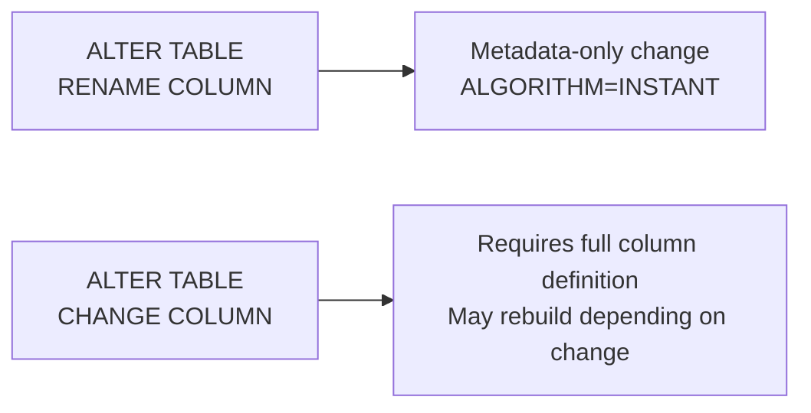

# How to Rename a Column in MySQL with ALTER TABLE

Author: [nawazdhandala](https://www.github.com/nawazdhandala)

Tags: MySQL, SQL, DDL, ALTER TABLE, Column, Schema

Description: Rename a MySQL column using ALTER TABLE RENAME COLUMN (MySQL 8.0) or CHANGE COLUMN (all versions) without losing data or indexes.

---

## How It Works

MySQL provides two ways to rename a column:
- `RENAME COLUMN` - available since MySQL 8.0.4, changes only the name, leaves definition unchanged
- `CHANGE COLUMN` - available in all MySQL versions, requires you to repeat the full column definition



## Method 1 - RENAME COLUMN (MySQL 8.0+)

This is the preferred method on MySQL 8.0 because it only changes the column name. No data is copied, and the operation uses `ALGORITHM=INSTANT` so it is very fast even on large tables.

### Syntax

```sql
ALTER TABLE table_name
    RENAME COLUMN old_name TO new_name;
```

### Example

```sql
CREATE TABLE users (
    id         INT UNSIGNED AUTO_INCREMENT PRIMARY KEY,
    usr_name   VARCHAR(50)  NOT NULL UNIQUE,
    mail       VARCHAR(255) NOT NULL,
    created_at DATETIME     NOT NULL DEFAULT CURRENT_TIMESTAMP
);

INSERT INTO users (usr_name, mail) VALUES
    ('alice', 'alice@example.com'),
    ('bob',   'bob@example.com');

-- Rename the poorly named columns
ALTER TABLE users
    RENAME COLUMN usr_name TO username,
    RENAME COLUMN mail     TO email;

DESCRIBE users;
```

```text
+-----------+--------------+------+-----+-------------------+----------------+
| Field     | Type         | Null | Key | Default           | Extra          |
+-----------+--------------+------+-----+-------------------+----------------+
| id        | int unsigned | NO   | PRI | NULL              | auto_increment |
| username  | varchar(50)  | NO   | UNI | NULL              |                |
| email     | varchar(255) | NO   |     | NULL              |                |
| created_at| datetime     | NO   |     | CURRENT_TIMESTAMP |                |
+-----------+--------------+------+-----+-------------------+----------------+
```

Data is preserved.

```sql
SELECT id, username, email FROM users;
```

```text
+----+----------+-------------------+
| id | username | email             |
+----+----------+-------------------+
|  1 | alice    | alice@example.com |
|  2 | bob      | bob@example.com   |
+----+----------+-------------------+
```

## Method 2 - CHANGE COLUMN (All MySQL Versions)

`CHANGE COLUMN` requires you to write the complete new column definition. Use it when you need to rename and change the type in one statement, or on MySQL 5.x.

### Syntax

```sql
ALTER TABLE table_name
    CHANGE COLUMN old_column_name new_column_name data_type [column_options];
```

### Example - Rename Only

```sql
ALTER TABLE users
    CHANGE COLUMN mail email VARCHAR(255) NOT NULL;
```

You must repeat the data type and constraints exactly. Missing a constraint (like `NOT NULL`) will silently change the column definition.

### Example - Rename and Change Type

```sql
ALTER TABLE products
    CHANGE COLUMN price unit_price DECIMAL(10, 2) NOT NULL DEFAULT 0.00;
```

## Renaming a Column That Is Part of an Index

MySQL automatically updates index metadata when you rename a column.

```sql
CREATE TABLE articles (
    id    INT UNSIGNED AUTO_INCREMENT PRIMARY KEY,
    titl  VARCHAR(255) NOT NULL,
    KEY idx_titl (titl)
);

-- Rename the misspelled column
ALTER TABLE articles RENAME COLUMN titl TO title;

-- The index is automatically updated to reference the new name
SHOW CREATE TABLE articles\G
```

```text
KEY `idx_titl` (`title`)
```

The index name (`idx_titl`) stays the same; only the column reference updates.

## Renaming a Column Referenced by a Foreign Key

MySQL automatically updates the foreign key constraint when the referenced column is renamed.

```sql
CREATE TABLE parent (
    id   INT UNSIGNED PRIMARY KEY,
    name VARCHAR(50) NOT NULL
);

CREATE TABLE child (
    id        INT UNSIGNED AUTO_INCREMENT PRIMARY KEY,
    parent_id INT UNSIGNED NOT NULL,
    CONSTRAINT fk_child_parent FOREIGN KEY (parent_id) REFERENCES parent (id)
);

-- Rename the FK column in the child table
ALTER TABLE child RENAME COLUMN parent_id TO parent_ref_id;
```

MySQL updates `fk_child_parent` to reference `parent_ref_id` automatically.

## Checking What References a Column Before Renaming

Before renaming a column, check for views, stored procedures, triggers, and foreign keys that reference it.

```sql
-- Check views
SELECT TABLE_NAME, VIEW_DEFINITION
FROM information_schema.VIEWS
WHERE TABLE_SCHEMA = DATABASE()
  AND VIEW_DEFINITION LIKE '%old_column_name%';

-- Check routines (stored procedures and functions)
SELECT ROUTINE_NAME, ROUTINE_TYPE
FROM information_schema.ROUTINES
WHERE ROUTINE_SCHEMA = DATABASE()
  AND ROUTINE_DEFINITION LIKE '%old_column_name%';

-- Check triggers
SELECT TRIGGER_NAME
FROM information_schema.TRIGGERS
WHERE TRIGGER_SCHEMA = DATABASE()
  AND ACTION_STATEMENT LIKE '%old_column_name%';
```

## Best Practices

- Prefer `RENAME COLUMN` over `CHANGE COLUMN` on MySQL 8.0+ to avoid accidentally changing the column definition.
- When using `CHANGE COLUMN`, copy the exact type and constraints from `SHOW CREATE TABLE` to avoid unintentional changes.
- Audit views, stored procedures, triggers, and application code for the old column name before renaming.
- Update application ORM mappings, queries, and API field names in the same deployment as the migration.
- Rename columns in a migration script that is version-controlled alongside application code.

## Summary

`ALTER TABLE RENAME COLUMN old TO new` is the cleanest way to rename a column in MySQL 8.0 - it makes a metadata-only change, preserving data, indexes, and constraints. On MySQL 5.x, use `CHANGE COLUMN old new data_type [options]` and repeat the full column definition carefully. Always audit views, triggers, and stored procedures for the old column name before renaming, and update application code in the same deployment.
