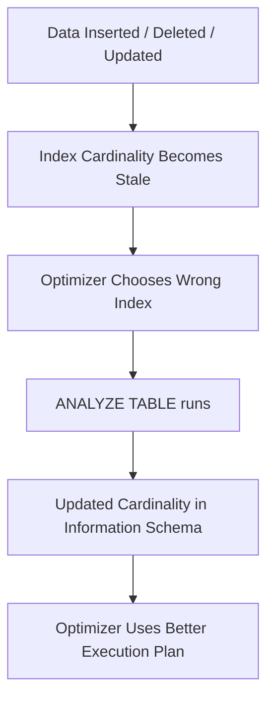

# How to Use MySQL ANALYZE TABLE to Update Statistics

Author: [nawazdhandala](https://www.github.com/nawazdhandala)

Tags: MySQL, SQL, ANALYZE TABLE, Query Optimizer, Index Statistics, Database Administration

Description: Learn how to use MySQL ANALYZE TABLE to refresh index statistics so the query optimizer can choose optimal execution plans for your queries.

---

## How ANALYZE TABLE Works

The MySQL query optimizer chooses execution plans based on statistics about each table's indexes, including the estimated number of distinct values (cardinality) per column. These statistics can become stale after large data changes. `ANALYZE TABLE` re-samples the index data and updates these statistics, enabling the optimizer to make better decisions.



## Syntax

```sql
ANALYZE [NO_WRITE_TO_BINLOG | LOCAL] TABLE table_name [, table_name ...]
```

- `NO_WRITE_TO_BINLOG` (or `LOCAL`): Prevents the statement from being written to the binary log. Use this on replicas to avoid re-analyzing on replicas unnecessarily.

## Setup: Sample Table

```sql
CREATE TABLE orders (
    id          INT AUTO_INCREMENT PRIMARY KEY,
    customer_id INT NOT NULL,
    status      VARCHAR(20) NOT NULL,
    total       DECIMAL(10,2) NOT NULL,
    order_date  DATE NOT NULL,
    INDEX idx_status     (status),
    INDEX idx_customer   (customer_id),
    INDEX idx_order_date (order_date)
);

-- Insert sample data:
INSERT INTO orders (customer_id, status, total, order_date)
SELECT
    FLOOR(RAND() * 1000) + 1,
    ELT(FLOOR(RAND() * 4) + 1, 'pending', 'shipped', 'delivered', 'cancelled'),
    ROUND(RAND() * 500 + 10, 2),
    DATE_SUB(CURDATE(), INTERVAL FLOOR(RAND() * 365) DAY)
FROM information_schema.COLUMNS c1
CROSS JOIN information_schema.COLUMNS c2
LIMIT 100000;
```

## Running ANALYZE TABLE

```sql
ANALYZE TABLE orders;
```

```text
+----------+---------+----------+----------+
| Table    | Op      | Msg_type | Msg_text |
+----------+---------+----------+----------+
| myapp.orders | analyze | status  | OK       |
+----------+---------+----------+----------+
```

**Analyze multiple tables:**

```sql
ANALYZE TABLE orders, customers, products;
```

**Analyze without writing to binary log (for replicas):**

```sql
ANALYZE LOCAL TABLE orders;
```

## Verifying Updated Statistics

After ANALYZE TABLE, check the updated cardinality values:

```sql
SELECT
    TABLE_NAME,
    INDEX_NAME,
    COLUMN_NAME,
    CARDINALITY,
    SEQ_IN_INDEX
FROM information_schema.STATISTICS
WHERE TABLE_SCHEMA = DATABASE()
  AND TABLE_NAME   = 'orders'
ORDER BY INDEX_NAME, SEQ_IN_INDEX;
```

```text
+--------+----------------+-------------+-------------+--------------+
| TABLE  | INDEX_NAME     | COLUMN_NAME | CARDINALITY | SEQ_IN_INDEX |
+--------+----------------+-------------+-------------+--------------+
| orders | PRIMARY        | id          | 100000      | 1            |
| orders | idx_customer   | customer_id | 998         | 1            |
| orders | idx_order_date | order_date  | 365         | 1            |
| orders | idx_status     | status      | 4           | 1            |
+--------+----------------+-------------+-------------+--------------+
```

The `CARDINALITY` column now reflects the actual distinct value count. The optimizer uses this to decide whether to use an index (low cardinality like `status` = 4 may not be worth using for large result sets).

## Checking Query Plans Before and After

Use `EXPLAIN` to see how the optimizer uses indexes:

```sql
EXPLAIN SELECT * FROM orders WHERE status = 'pending' AND customer_id = 42;
```

If the optimizer was using the wrong index before ANALYZE, it should now choose the more selective one (higher cardinality = more selective).

## When to Run ANALYZE TABLE

```text
Situation                              Action
-----------                            ------
After bulk INSERT (> 10% of rows)      ANALYZE TABLE
After bulk DELETE                      ANALYZE TABLE
After a large UPDATE on indexed cols   ANALYZE TABLE
Optimizer chooses wrong index (EXPLAIN shows unexpected type)  ANALYZE TABLE
After restoring from a backup          ANALYZE TABLE
Regularly scheduled maintenance        Weekly or monthly depending on change rate
```

## InnoDB Automatic Statistics Update

InnoDB updates statistics automatically when `innodb_stats_auto_recalc = ON` (default) after about 10% of rows change. However, this is asynchronous and approximate. For tables with very fast data changes or for critical queries, manual `ANALYZE TABLE` provides fresher statistics immediately.

**Check auto-recalc setting:**

```sql
SHOW VARIABLES LIKE 'innodb_stats_auto_recalc';
SHOW VARIABLES LIKE 'innodb_stats_persistent';
SHOW VARIABLES LIKE 'innodb_stats_sample_pages';
```

**Increase sample pages for more accurate statistics on large tables:**

```sql
SET GLOBAL innodb_stats_sample_pages = 20;   -- Default is 8
ANALYZE TABLE orders;
```

Or per table:

```sql
ALTER TABLE orders STATS_SAMPLE_PAGES = 50;
ANALYZE TABLE orders;
```

## mysqlcheck for Bulk Analysis

```bash
# Analyze all tables in a database:
mysqlcheck -u root -p --analyze mydb

# Analyze all databases:
mysqlcheck -u root -p --analyze --all-databases
```

## Automating with MySQL Events

```sql
CREATE EVENT nightly_analyze
ON SCHEDULE EVERY 1 DAY
STARTS '2026-04-01 02:00:00'
DO
    ANALYZE LOCAL TABLE orders, customers, products;
```

## Best Practices

- Run `ANALYZE TABLE` after any bulk data operation that changes more than 10% of rows in a table.
- Use `ANALYZE LOCAL TABLE` on replicas to update statistics without generating binlog events.
- Increase `innodb_stats_sample_pages` for very large tables where default sampling produces inconsistent cardinality estimates.
- Monitor execution plans with `EXPLAIN` on key queries after each major data load to verify the optimizer is using the expected index.
- Do not over-run `ANALYZE TABLE` on small tables - InnoDB's auto-recalculation handles these well.
- Schedule nightly analysis for tables with high churn as part of routine maintenance.

## Summary

`ANALYZE TABLE` refreshes the index cardinality statistics that the MySQL query optimizer uses to select execution plans. Stale statistics after bulk inserts, deletes, or updates can cause the optimizer to choose suboptimal indexes, resulting in slow queries. Running `ANALYZE TABLE` after significant data changes updates cardinality values visible in `INFORMATION_SCHEMA.STATISTICS`. InnoDB updates statistics automatically, but manual ANALYZE provides immediate consistency for critical queries. Use `mysqlcheck --analyze` for bulk analysis across multiple tables.
