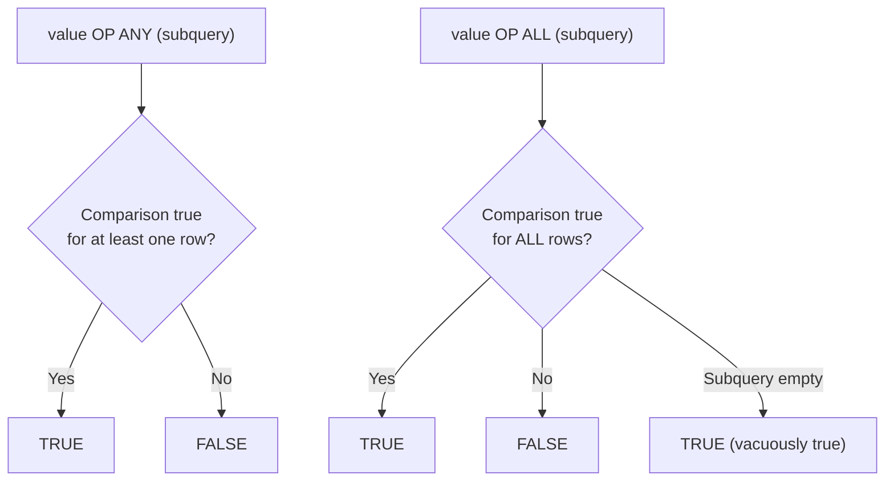

# How to Use ANY and ALL Operators in MySQL Subqueries

Author: [OneUptime](https://www.github.com/OneUptime)

Tags: MySQL, SQL, Subquery, Operator, Database, Query

Description: Learn how to use ANY and ALL operators in MySQL subqueries to compare a value against a set of results, with practical filtering and aggregation examples.

---

## What Are ANY and ALL

`ANY` and `ALL` are subquery comparison operators in MySQL that apply a comparison operator (=, >, <, >=, <=, <>) to a value against every value returned by a subquery:

- `value OP ANY (subquery)` returns TRUE if the comparison is true for at least one value in the subquery result.
- `value OP ALL (subquery)` returns TRUE if the comparison is true for every value in the subquery result.

`ANY` is equivalent to the `IN` operator when used with `=`. `ALL` has no direct equivalent and is used for strict universal comparisons.



## Syntax

```sql
-- ANY: true if comparison holds for at least one subquery value
expression comparison_operator ANY (subquery)
expression comparison_operator SOME (subquery)   -- SOME is a synonym for ANY

-- ALL: true if comparison holds for all subquery values
expression comparison_operator ALL (subquery)

-- Common comparison operators: =, !=, <>, >, <, >=, <=
```

## Examples

### Setup: Sales Data

```sql
CREATE TABLE employees (
    id         INT          PRIMARY KEY AUTO_INCREMENT,
    name       VARCHAR(100) NOT NULL,
    department VARCHAR(50),
    salary     DECIMAL(10,2)
);

CREATE TABLE sales (
    id          INT   PRIMARY KEY AUTO_INCREMENT,
    employee_id INT,
    amount      DECIMAL(10,2),
    month       DATE,
    FOREIGN KEY (employee_id) REFERENCES employees(id)
);

INSERT INTO employees (name, department, salary) VALUES
    ('Alice',   'Engineering', 95000),
    ('Bob',     'Engineering', 82000),
    ('Carol',   'Marketing',   74000),
    ('Dave',    'Marketing',   68000),
    ('Eve',     'Sales',       59000),
    ('Frank',   'Sales',       63000);

INSERT INTO sales (employee_id, amount, month) VALUES
    (1, 12000, '2025-01-01'), (1, 15000, '2025-02-01'), (1, 11000, '2025-03-01'),
    (2, 9500,  '2025-01-01'), (2, 8800,  '2025-02-01'), (2, 10200, '2025-03-01'),
    (3, 7200,  '2025-01-01'), (3, 8100,  '2025-02-01'), (3, 6900,  '2025-03-01'),
    (4, 5500,  '2025-01-01'), (4, 6200,  '2025-02-01'), (4, 5900,  '2025-03-01'),
    (5, 4800,  '2025-01-01'), (5, 5100,  '2025-02-01'), (5, 4600,  '2025-03-01'),
    (6, 6100,  '2025-01-01'), (6, 6800,  '2025-02-01'), (6, 7200,  '2025-03-01');
```

### ANY: Find Employees with Salary Greater Than Any Marketing Salary

```sql
-- Returns employees whose salary is greater than at least one Marketing salary
SELECT name, department, salary
FROM employees
WHERE salary > ANY (
    SELECT salary FROM employees WHERE department = 'Marketing'
)
ORDER BY salary DESC;
```

```text
+-------+--------------+-----------+
| name  | department   | salary    |
+-------+--------------+-----------+
| Alice | Engineering  | 95000.00  |
| Bob   | Engineering  | 82000.00  |
| Carol | Marketing    | 74000.00  |
+-------+--------------+-----------+
```

`> ANY` means "greater than at least one Marketing salary." The lowest Marketing salary is 68000, so anyone earning more than 68000 qualifies. Dave (Marketing, 68000) does not qualify because no one earns less than him in Marketing.

### ALL: Find Employees with Salary Greater Than ALL Sales Salaries

```sql
-- Returns employees earning more than every Sales department employee
SELECT name, department, salary
FROM employees
WHERE salary > ALL (
    SELECT salary FROM employees WHERE department = 'Sales'
)
ORDER BY salary DESC;
```

```text
+-------+--------------+-----------+
| name  | department   | salary    |
+-------+--------------+-----------+
| Alice | Engineering  | 95000.00  |
| Bob   | Engineering  | 82000.00  |
| Carol | Marketing    | 74000.00  |
| Dave  | Marketing    | 68000.00  |
+-------+--------------+-----------+
```

The highest Sales salary is 63000. All rows with salary > 63000 qualify.

### = ANY: Equivalent to IN

```sql
-- These two queries are equivalent
SELECT name FROM employees
WHERE department = ANY (SELECT department FROM employees WHERE salary > 80000);

SELECT name FROM employees
WHERE department IN (SELECT department FROM employees WHERE salary > 80000);
```

```text
+-------+
| name  |
+-------+
| Alice |
| Bob   |
+-------+
```

### != ALL: Equivalent to NOT IN

```sql
-- These two queries are equivalent
SELECT name FROM employees
WHERE department != ALL (SELECT DISTINCT department FROM employees WHERE salary < 65000);

SELECT name FROM employees
WHERE department NOT IN (SELECT DISTINCT department FROM employees WHERE salary < 65000);
```

```text
+-------+--------------+
| name  | department   |
+-------+--------------+
| Alice | Engineering  |
| Bob   | Engineering  |
| Carol | Marketing    |
| Dave  | Marketing    |
+-------+--------------+
```

Sales has salaries below 65000, so Engineering and Marketing employees are excluded from the NOT IN list.

### ANY with Aggregate: Find Months with a Sale Greater Than Any Average

```sql
-- Find sales amounts that exceed the average monthly sale for at least one employee
SELECT employee_id, month, amount
FROM sales
WHERE amount > ANY (
    SELECT AVG(amount)
    FROM sales
    GROUP BY employee_id
)
ORDER BY employee_id, month;
```

### ALL: Find Employees Whose Every Sale Exceeds a Threshold

```sql
-- Find employees where every single sale was above 6000
SELECT e.name, e.department
FROM employees e
WHERE 6000 < ALL (
    SELECT s.amount
    FROM sales s
    WHERE s.employee_id = e.id
);
```

```text
+-------+--------------+
| name  | department   |
+-------+--------------+
| Alice | Engineering  |
| Bob   | Engineering  |
| Frank | Sales        |
+-------+--------------+
```

### Edge Case: ALL with an Empty Subquery

`ALL` returns TRUE when the subquery returns no rows (vacuous truth):

```sql
-- Returns all rows because the subquery is empty
SELECT name FROM employees
WHERE salary > ALL (
    SELECT salary FROM employees WHERE department = 'NonExistent'
);
```

```text
+-------+
| name  |
+-------+
| Alice |
| Bob   |
| Carol |
| Dave  |
| Eve   |
| Frank |
+-------+
```

### ANY vs ALL Summary

| Expression      | Returns TRUE When                              |
|-----------------|------------------------------------------------|
| x > ANY (...)   | x is greater than at least one subquery value  |
| x > ALL (...)   | x is greater than every subquery value         |
| x = ANY (...)   | x equals at least one value (same as IN)       |
| x != ALL (...)  | x is not equal to any value (same as NOT IN)   |
| x < ANY (...)   | x is less than the maximum subquery value      |
| x < ALL (...)   | x is less than the minimum subquery value      |

## Best Practices

- Prefer `IN` and `NOT IN` over `= ANY` and `!= ALL` for readability -- they are equivalent.
- Use `> ANY` for "beat at least one" logic and `> ALL` for "beat everyone" logic.
- Be aware that `!= ALL` with a subquery containing NULL values can return unexpected results; use `NOT EXISTS` for NULL-safe exclusion.
- Use `ALL` with empty subqueries carefully -- it always returns TRUE, which may cause all rows to match unexpectedly.

## Summary

`ANY` and `ALL` compare a value against a subquery result set using a comparison operator. `value > ANY (subquery)` is true if the value beats at least one result. `value > ALL (subquery)` is true only if the value beats every result. `= ANY` is equivalent to `IN`, and `!= ALL` is equivalent to `NOT IN`. Use them for clear, declarative comparisons against subquery result sets.
