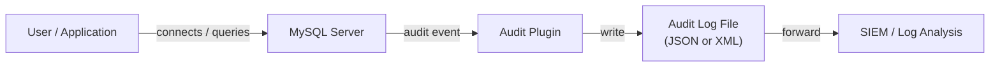

# How to Use MySQL Audit Plugin for Logging

Author: [nawazdhandala](https://www.github.com/nawazdhandala)

Tags: MySQL, Security, Audit, Logging, Compliance

Description: Learn how to install and configure the MySQL Audit Plugin to log database activity including logins, queries, and DDL operations for security and compliance requirements.

---

## How MySQL Audit Logging Works

MySQL audit logging captures database events - logins, logouts, query execution, schema changes, and more - and writes them to an audit log file. This is essential for security compliance (PCI-DSS, HIPAA, SOC 2) and for forensic investigation after a security incident.



MySQL provides two audit log implementations:
- **MySQL Enterprise Audit** - commercial plugin included in MySQL Enterprise Edition
- **MySQL Community Audit Log Plugin** - available in MySQL 8.0.30+ for community edition

The open-source alternative **MariaDB Audit Plugin** can also be used with MySQL.

## Installing the Community Audit Log Plugin (MySQL 8.0.30+)

### Install the Plugin

```sql
INSTALL PLUGIN audit_log SONAME 'audit_log.so';
```

Verify the plugin is loaded:

```sql
SELECT plugin_name, plugin_status
FROM   information_schema.PLUGINS
WHERE  plugin_name = 'audit_log';
```

To ensure the plugin loads on every restart, add it to the configuration:

```ini
# /etc/mysql/mysql.conf.d/mysqld.cnf
[mysqld]
plugin-load-add  = audit_log.so
audit_log_format = JSON
audit_log_file   = /var/log/mysql/audit.log
audit_log_policy = ALL
```

## Configuration Options

### Audit Log Format

```sql
-- JSON format (default, recommended for log parsing)
SET GLOBAL audit_log_format = 'JSON';

-- XML format (legacy, compatible with older tooling)
SET GLOBAL audit_log_format = 'XML';
```

### Audit Log Policy (What to Log)

```sql
-- Log everything (logins + queries)
SET GLOBAL audit_log_policy = 'ALL';

-- Log only logins and logouts
SET GLOBAL audit_log_policy = 'LOGINS';

-- Log only queries
SET GLOBAL audit_log_policy = 'QUERIES';

-- Log nothing
SET GLOBAL audit_log_policy = 'NONE';
```

### Audit Log Rotation

```sql
-- Rotate the log file when it reaches 100 MB
SET GLOBAL audit_log_rotate_on_size = 104857600;  -- 100 MB in bytes
```

Rotate manually:

```sql
SELECT audit_log_rotate();
```

## Viewing Current Audit Settings

```sql
SHOW GLOBAL VARIABLES LIKE 'audit_log%';
```

Expected output:

```text
+-------------------------------+------------------------------+
| Variable_name                 | Value                        |
+-------------------------------+------------------------------+
| audit_log_file                | /var/log/mysql/audit.log     |
| audit_log_format              | JSON                         |
| audit_log_policy              | ALL                          |
| audit_log_rotate_on_size      | 104857600                    |
+-------------------------------+------------------------------+
```

## Filtering Audit Events

MySQL Enterprise Audit supports filtering to log only events from specific users, databases, or query types. For community audit, filtering is done at the policy level or using log rotation tools.

### Using Audit Log Filter Functions (Enterprise)

```sql
-- Create a filter that logs all events
SELECT audit_log_filter_set_filter('log_all', '{ "filter": { "log": true } }');

-- Assign filter to all users
SELECT audit_log_filter_set_user('%', 'log_all');

-- Create a filter for specific user
SELECT audit_log_filter_set_filter(
    'log_admin',
    '{ "filter": { "log": true, "class": { "name": [ "connection", "table_access" ] } } }'
);
SELECT audit_log_filter_set_user('admin@localhost', 'log_admin');
```

## Reading the Audit Log

### JSON Format Log Sample

```json
{
    "timestamp": "2026-03-31T14:23:01.123456Z",
    "id": 1,
    "class": "connection",
    "event": "connect",
    "connection_id": 42,
    "account": { "user": "appuser", "host": "192.168.1.100" },
    "login": { "user": "appuser", "os": "", "ip": "192.168.1.100", "proxy": "" },
    "connection_data": { "connection_type": "tcp/ip", "status": 0, "db": "myapp_db" }
}
```

Query log entry:

```json
{
    "timestamp": "2026-03-31T14:23:05.456789Z",
    "id": 2,
    "class": "general",
    "event": "status",
    "connection_id": 42,
    "account": { "user": "appuser", "host": "192.168.1.100" },
    "login": { "user": "appuser", "os": "", "ip": "192.168.1.100", "proxy": "" },
    "general_data": { "command": "Query", "sql_command": "select", "query": "SELECT * FROM orders WHERE id = 42", "status": 0 }
}
```

### Parsing the Log

```bash
# Find all failed logins
grep '"event": "connect"' /var/log/mysql/audit.log | grep '"status": 1'

# Find DROP TABLE events
grep '"sql_command": "drop_table"' /var/log/mysql/audit.log

# Find queries from a specific user
grep '"user": "appuser"' /var/log/mysql/audit.log | grep '"class": "general"'
```

## MariaDB Audit Plugin for MySQL Community Edition

The MariaDB Audit Plugin works with MySQL community edition and offers per-user filtering:

```bash
# Copy the plugin to MySQL plugin directory
sudo cp server_audit.so /usr/lib/mysql/plugin/
```

```ini
# my.cnf
[mysqld]
plugin-load-add          = server_audit=server_audit.so
server_audit_logging     = ON
server_audit_events      = CONNECT,QUERY,TABLE
server_audit_file_path   = /var/log/mysql/audit.log
server_audit_file_rotate_size = 100000000
server_audit_excl_users  = 'monitoring_user,backup_user'
```

## Forwarding Audit Logs to a SIEM

For centralized security monitoring, forward logs to a SIEM using `filebeat`:

```yaml
# /etc/filebeat/filebeat.yml
filebeat.inputs:
  - type: log
    enabled: true
    paths:
      - /var/log/mysql/audit.log
    json.keys_under_root: true
    tags: ["mysql-audit"]

output.elasticsearch:
  hosts: ["https://elasticsearch:9200"]
  index: "mysql-audit-%{+yyyy.MM.dd}"
```

## Best Practices

- Log at minimum: logins, logouts, DDL (CREATE, ALTER, DROP), and privileged commands.
- Use JSON format for easier parsing and SIEM integration.
- Enable log rotation to prevent the audit log from consuming all disk space.
- Exclude high-volume, low-risk service accounts (e.g., monitoring users) from query logging.
- Store audit logs on a separate disk from MySQL data files.
- Set file permissions so only root and mysql can read audit logs.
- Retain audit logs for at least 90 days (1 year for PCI-DSS environments).

## Summary

MySQL Audit Plugin logs database activity - connections, queries, and DDL operations - to a structured log file. Install the plugin with `INSTALL PLUGIN audit_log SONAME 'audit_log.so'`, configure it in `my.cnf`, and set the policy to `ALL` to capture logins and queries. Use JSON format for easier SIEM integration, and enable log rotation to manage file size. Audit logs are critical for compliance requirements and security incident response.
