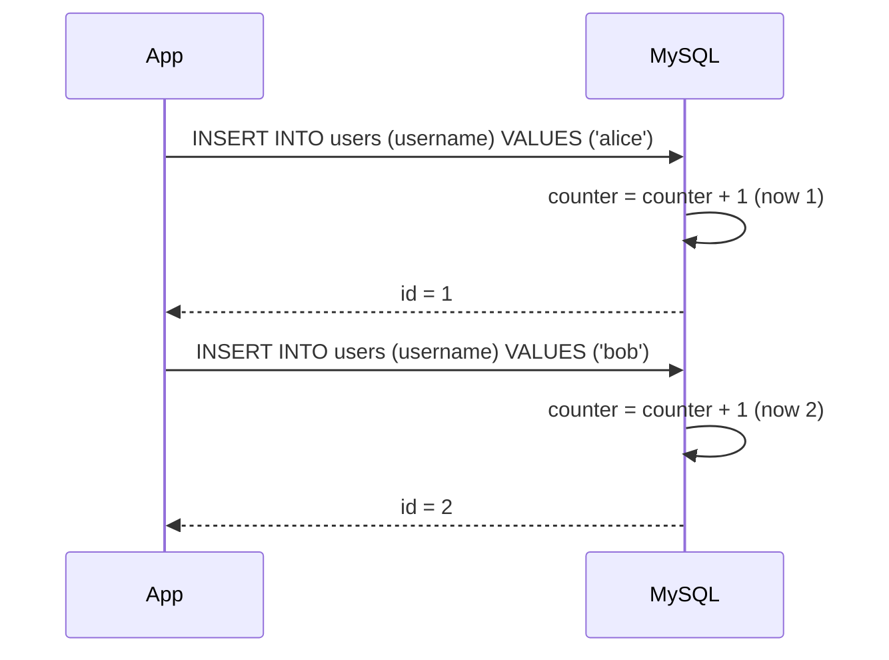

# How to Add Auto-Increment Primary Key in MySQL

Author: [nawazdhandala](https://www.github.com/nawazdhandala)

Tags: MySQL, SQL, DDL, Primary Key, Auto Increment, Schema

Description: Add an AUTO_INCREMENT primary key to new and existing MySQL tables, understand how the counter works, and reset or modify it safely.

---

## How It Works

`AUTO_INCREMENT` is a column attribute that automatically generates a unique integer value for each new row. MySQL maintains an internal counter per table. On every `INSERT`, the counter increments and the new value is assigned to the column. The column must be part of an index (usually the primary key) and must be an integer type.



## Syntax

```sql
column_name data_type UNSIGNED AUTO_INCREMENT [PRIMARY KEY]
```

The column must be `NOT NULL` (MySQL enforces this automatically for primary keys).

## Creating a Table with AUTO_INCREMENT Primary Key

```sql
CREATE TABLE users (
    id         INT UNSIGNED AUTO_INCREMENT PRIMARY KEY,
    username   VARCHAR(50)  NOT NULL UNIQUE,
    email      VARCHAR(255) NOT NULL UNIQUE,
    created_at DATETIME     NOT NULL DEFAULT CURRENT_TIMESTAMP
);
```

Alternatively, define the primary key separately.

```sql
CREATE TABLE users (
    id         INT UNSIGNED AUTO_INCREMENT,
    username   VARCHAR(50)  NOT NULL UNIQUE,
    email      VARCHAR(255) NOT NULL UNIQUE,
    created_at DATETIME     NOT NULL DEFAULT CURRENT_TIMESTAMP,
    PRIMARY KEY (id)
);
```

## Inserting Data and Observing AUTO_INCREMENT

Omit the `id` column when inserting - MySQL fills it automatically.

```sql
INSERT INTO users (username, email) VALUES
    ('alice', 'alice@example.com'),
    ('bob',   'bob@example.com'),
    ('carol', 'carol@example.com');

SELECT id, username FROM users;
```

```text
+----+----------+
| id | username |
+----+----------+
|  1 | alice    |
|  2 | bob      |
|  3 | carol    |
+----+----------+
```

## Getting the Last Inserted ID

After an insert, retrieve the generated ID with `LAST_INSERT_ID()`.

```sql
INSERT INTO users (username, email) VALUES ('dave', 'dave@example.com');
SELECT LAST_INSERT_ID();
```

```text
+-----------------+
| LAST_INSERT_ID()|
+-----------------+
|               4 |
+-----------------+
```

In application code, use the driver's equivalent method (e.g., `mysqli_insert_id()` in PHP, `cursor.lastrowid` in Python, `result.insertId` in Node.js).

## Using BIGINT for Large Tables

For tables that may exceed 4 billion rows, use `BIGINT UNSIGNED`.

```sql
CREATE TABLE events (
    id         BIGINT UNSIGNED AUTO_INCREMENT PRIMARY KEY,
    event_type VARCHAR(100) NOT NULL,
    created_at DATETIME     NOT NULL DEFAULT CURRENT_TIMESTAMP
);
```

## Adding AUTO_INCREMENT to an Existing Table

If a table already has an `id` column without `AUTO_INCREMENT`, add it with `ALTER TABLE`.

```sql
ALTER TABLE products
    MODIFY COLUMN id INT UNSIGNED NOT NULL AUTO_INCREMENT;
```

If the table has no primary key yet, add one along with `AUTO_INCREMENT`.

```sql
ALTER TABLE products
    ADD COLUMN id INT UNSIGNED NOT NULL AUTO_INCREMENT FIRST,
    ADD PRIMARY KEY (id);
```

## Viewing the Current AUTO_INCREMENT Value

```sql
SELECT AUTO_INCREMENT
FROM information_schema.tables
WHERE table_schema = DATABASE()
  AND table_name = 'users';
```

Or from the `SHOW TABLE STATUS` command.

```sql
SHOW TABLE STATUS LIKE 'users'\G
```

```text
Name: users
Auto_increment: 5
```

## Resetting the AUTO_INCREMENT Counter

You can reset the counter to any value higher than the current maximum ID. You cannot set it lower than the highest existing ID.

```sql
ALTER TABLE users AUTO_INCREMENT = 1000;
```

To reset after truncating a table (TRUNCATE resets the counter automatically):

```sql
TRUNCATE TABLE users;
-- AUTO_INCREMENT is now 1
```

## Setting an Initial AUTO_INCREMENT Value

To start IDs at a specific value, set it in the `CREATE TABLE` statement or immediately after.

```sql
CREATE TABLE orders (
    id           INT UNSIGNED AUTO_INCREMENT PRIMARY KEY,
    order_number VARCHAR(20)  NOT NULL
) AUTO_INCREMENT = 10000;
```

This is useful when migrating data from another system and you want new IDs to avoid collisions with legacy IDs.

## Composite Primary Key with AUTO_INCREMENT

`AUTO_INCREMENT` can be used on a non-primary-key column in MyISAM tables for sequence-per-group patterns, but in InnoDB it must be part of an index.

```sql
-- InnoDB: AUTO_INCREMENT must be in an index
CREATE TABLE order_items (
    order_id   INT UNSIGNED NOT NULL,
    item_id    INT UNSIGNED NOT NULL AUTO_INCREMENT,
    product_id INT UNSIGNED NOT NULL,
    PRIMARY KEY (order_id, item_id),
    KEY (item_id)   -- required for AUTO_INCREMENT in InnoDB
);
```

## Best Practices

- Use `INT UNSIGNED` for tables expected to stay under 4 billion rows, and `BIGINT UNSIGNED` for high-volume tables.
- Always use `AUTO_INCREMENT` with a primary key - never rely on `LAST_INSERT_ID()` as a substitute for a proper primary key.
- Avoid exposing raw AUTO_INCREMENT IDs in public URLs; they reveal table size and are enumerable. Use UUIDs for public-facing identifiers alongside the auto-increment internal key.
- Do not reuse IDs - deleting a row does not reclaim its ID.
- After bulk inserts, verify `LAST_INSERT_ID()` returns the first ID of the batch if multiple rows were inserted in a single statement.

## Summary

`AUTO_INCREMENT` is MySQL's built-in mechanism for generating unique integer IDs. Define it on an integer primary key column, omit the column during `INSERT`, and retrieve the generated value with `LAST_INSERT_ID()`. Use `INT UNSIGNED` for standard tables and `BIGINT UNSIGNED` for very large tables. The `AUTO_INCREMENT` counter can be reset with `ALTER TABLE` and is automatically reset to 1 by `TRUNCATE TABLE`.
