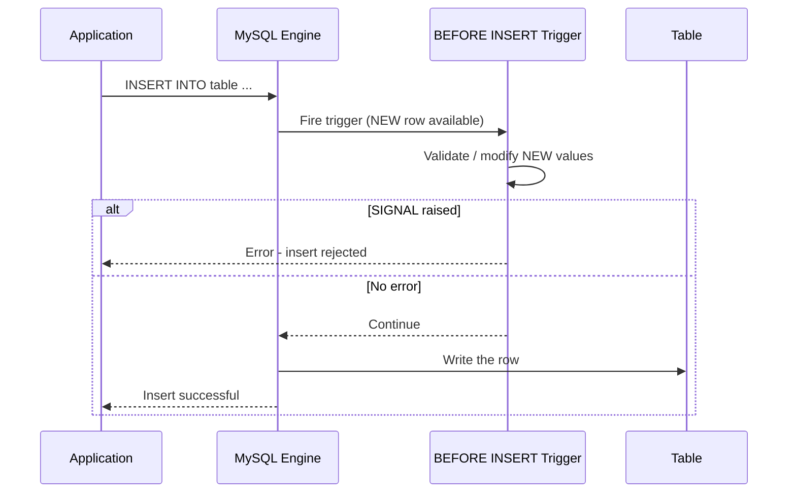

# How to Create a BEFORE INSERT Trigger in MySQL

Author: [nawazdhandala](https://www.github.com/nawazdhandala)

Tags: MySQL, Trigger, SQL, Database, Data Integrity

Description: Learn how to create BEFORE INSERT triggers in MySQL to validate data, auto-populate columns, and enforce business rules before a row is written to a table.

---

## What is a BEFORE INSERT Trigger?

A BEFORE INSERT trigger fires automatically for each row before MySQL writes a new row to a table. It can modify the values being inserted (`NEW` columns) or raise an error to reject the insert entirely.



## Syntax

```sql
CREATE TRIGGER trigger_name
BEFORE INSERT ON table_name
FOR EACH ROW
BEGIN
    -- trigger body
    -- Read NEW.column_name
    -- Write NEW.column_name to modify the value
    -- SIGNAL to reject the insert
END;
```

- `NEW.column_name` - the value about to be inserted.
- You can overwrite `NEW.column_name` to change what gets stored.
- MySQL triggers are row-level; `FOR EACH ROW` is required.

## Setup: Sample Table

```sql
CREATE TABLE employees (
    id           INT PRIMARY KEY AUTO_INCREMENT,
    name         VARCHAR(100) NOT NULL,
    email        VARCHAR(200),
    department   VARCHAR(50),
    salary       DECIMAL(10,2),
    hired_at     DATETIME,
    created_by   VARCHAR(100),
    is_active    TINYINT(1) DEFAULT 1
);
```

## Example 1: Auto-Populate Columns

Set `hired_at` to the current timestamp and normalize the department name to uppercase automatically on insert.

```sql
DELIMITER $$

CREATE TRIGGER before_employee_insert
BEFORE INSERT ON employees
FOR EACH ROW
BEGIN
    -- Auto-set hire timestamp if not provided
    IF NEW.hired_at IS NULL THEN
        SET NEW.hired_at = NOW();
    END IF;

    -- Normalize department to uppercase
    SET NEW.department = UPPER(NEW.department);

    -- Set created_by from session variable if not provided
    IF NEW.created_by IS NULL THEN
        SET NEW.created_by = USER();
    END IF;
END$$

DELIMITER ;
```

```sql
INSERT INTO employees (name, email, department, salary)
VALUES ('Alice Smith', 'alice@example.com', 'engineering', 95000.00);

SELECT id, name, department, hired_at, created_by FROM employees;
```

```text
+----+-------------+-------------+---------------------+------------------+
| id | name        | department  | hired_at            | created_by       |
+----+-------------+-------------+---------------------+------------------+
|  1 | Alice Smith | ENGINEERING | 2024-01-15 10:30:00 | root@localhost   |
+----+-------------+-------------+---------------------+------------------+
```

## Example 2: Validate Data Before Insert

Reject inserts that violate business rules using SIGNAL.

```sql
DELIMITER $$

CREATE TRIGGER validate_employee_insert
BEFORE INSERT ON employees
FOR EACH ROW
BEGIN
    -- Name must not be empty
    IF TRIM(NEW.name) = '' THEN
        SIGNAL SQLSTATE '45000'
            SET MESSAGE_TEXT = 'Employee name cannot be empty';
    END IF;

    -- Salary must be positive
    IF NEW.salary IS NOT NULL AND NEW.salary <= 0 THEN
        SIGNAL SQLSTATE '45000'
            SET MESSAGE_TEXT = 'Salary must be greater than zero';
    END IF;

    -- Email format check (basic)
    IF NEW.email IS NOT NULL AND NEW.email NOT LIKE '%@%.%' THEN
        SIGNAL SQLSTATE '45000'
            SET MESSAGE_TEXT = 'Invalid email format';
    END IF;
END$$

DELIMITER ;
```

```sql
-- Rejected: invalid salary
INSERT INTO employees (name, email, department, salary)
VALUES ('Bob', 'bob@example.com', 'Marketing', -500.00);
-- ERROR 1644 (45000): Salary must be greater than zero

-- Valid insert
INSERT INTO employees (name, email, department, salary)
VALUES ('Bob Jones', 'bob@example.com', 'Marketing', 72000.00);
```

## Example 3: Audit Log on Insert

Write to an audit table every time a new employee is inserted.

```sql
CREATE TABLE employee_audit (
    audit_id    INT PRIMARY KEY AUTO_INCREMENT,
    action      VARCHAR(20),
    emp_id      INT,
    emp_name    VARCHAR(100),
    performed_by VARCHAR(100),
    performed_at DATETIME DEFAULT CURRENT_TIMESTAMP
);
```

```sql
DELIMITER $$

CREATE TRIGGER audit_employee_insert
BEFORE INSERT ON employees
FOR EACH ROW
BEGIN
    INSERT INTO employee_audit (action, emp_id, emp_name, performed_by)
    VALUES ('INSERT', NEW.id, NEW.name, USER());
END$$

DELIMITER ;
```

Note: Because this trigger fires BEFORE the insert, `NEW.id` for AUTO_INCREMENT columns will be 0 at BEFORE INSERT time. Use AFTER INSERT if you need the generated ID.

## Example 4: Derived Column Value

Enforce a business rule that Engineering employees must have salary >= 60000.

```sql
DELIMITER $$

CREATE TRIGGER enforce_engineering_salary
BEFORE INSERT ON employees
FOR EACH ROW
BEGIN
    IF UPPER(NEW.department) = 'ENGINEERING' AND NEW.salary < 60000 THEN
        SET NEW.salary = 60000.00;
    END IF;
END$$

DELIMITER ;
```

## Managing Triggers

```sql
-- List all triggers in the current database
SHOW TRIGGERS\G

-- Show triggers for a specific table
SHOW TRIGGERS LIKE 'employees'\G

-- View trigger definition
SHOW CREATE TRIGGER before_employee_insert\G

-- Drop a trigger
DROP TRIGGER IF EXISTS before_employee_insert;
```

## Multiple Triggers on the Same Event (MySQL 5.7+)

MySQL 5.7 added support for multiple triggers on the same table and event. Use `FOLLOWS` or `PRECEDES` to define execution order.

```sql
DELIMITER $$

CREATE TRIGGER second_before_insert
BEFORE INSERT ON employees
FOR EACH ROW
FOLLOWS validate_employee_insert
BEGIN
    -- This trigger runs after validate_employee_insert
    SET NEW.name = CONCAT(UPPER(LEFT(NEW.name, 1)), LOWER(SUBSTRING(NEW.name, 2)));
END$$

DELIMITER ;
```

## BEFORE vs AFTER INSERT

| Feature | BEFORE INSERT | AFTER INSERT |
|---|---|---|
| Can modify NEW values | YES | NO |
| Can reject the insert with SIGNAL | YES | YES (but row already written) |
| AUTO_INCREMENT ID available | NO (0 for uninserted row) | YES |
| Write to audit with final values | NO (use AFTER) | YES |

## Best Practices

- Use BEFORE INSERT to validate and transform data; use AFTER INSERT for audit logging when you need the final inserted values.
- Keep trigger logic simple - complex logic belongs in stored procedures.
- Test triggers with edge cases: NULL values, boundary salaries, empty strings.
- Document each trigger with a comment explaining why it exists.
- Avoid DML on the same table inside a trigger to prevent recursive trigger issues.

## Summary

A BEFORE INSERT trigger fires for each row before MySQL writes it to the table. It can read and modify `NEW.column_name` to transform incoming data or call `SIGNAL` to reject the insert. Use BEFORE INSERT triggers for data normalization, input validation, auto-populating columns, and enforcing business rules that CHECK constraints cannot express. For audit logging with the generated AUTO_INCREMENT ID, use AFTER INSERT instead.
