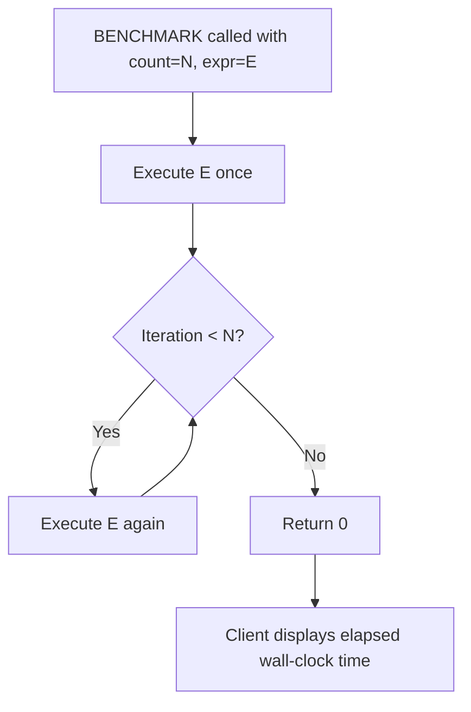
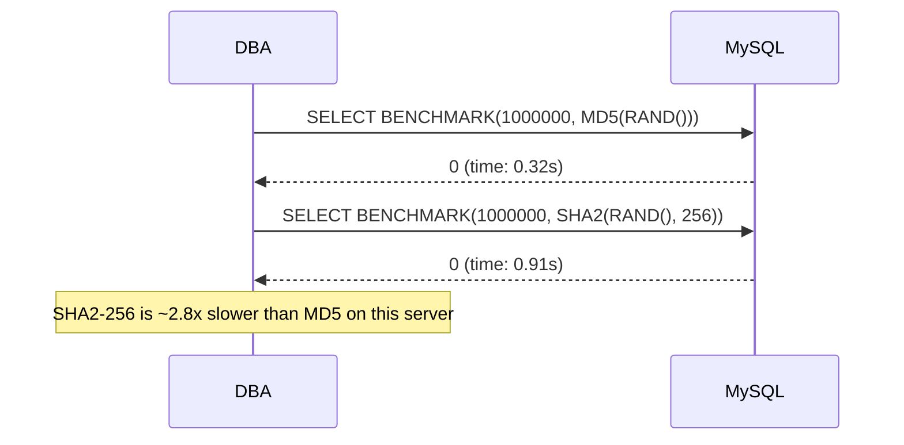

# How to Use BENCHMARK() Function in MySQL

Author: [OneUptime](https://oneuptime.com)

Tags: MySQL, Function, Performance, Benchmark, Testing

Description: Learn how to use MySQL BENCHMARK() to measure expression execution speed, compare function performance, and profile encryption and hashing operations in MySQL.

---

## Introduction

`BENCHMARK(count, expression)` executes `expression` exactly `count` times and returns `0`. Its primary purpose is to measure how fast MySQL evaluates a particular expression or function call. The elapsed wall-clock time reported by your client is the measurement you care about -- the function itself always returns `0`.

## Basic syntax

```sql
SELECT BENCHMARK(count, expression);
```

- `count` must be a positive integer literal or variable.
- `expression` can be any scalar expression, function call, or arithmetic operation.
- Always returns `0`; the value is meaningless -- look at the query execution time instead.

## Simple timing examples

```sql
-- Time 1 million MD5 computations
SELECT BENCHMARK(1000000, MD5('hello world'));
-- Query OK, result: 0
-- Time: 0.34 sec  <-- this is what you measure

-- Compare SHA2 vs MD5
SELECT BENCHMARK(1000000, MD5('hello world'));
SELECT BENCHMARK(1000000, SHA2('hello world', 256));
```

## Comparing hashing functions

```sql
-- Run each benchmark and note the time in your client

-- MD5 (128-bit)
SELECT BENCHMARK(500000, MD5(RAND()));

-- SHA1 (160-bit)
SELECT BENCHMARK(500000, SHA1(RAND()));

-- SHA2-256
SELECT BENCHMARK(500000, SHA2(RAND(), 256));

-- SHA2-512
SELECT BENCHMARK(500000, SHA2(RAND(), 512));
```

The client will print the elapsed time for each query. Higher iteration counts give more stable measurements.

## Benchmarking AES encryption

```sql
-- AES_ENCRYPT / AES_DECRYPT round-trip
SELECT BENCHMARK(100000,
  AES_DECRYPT(
    AES_ENCRYPT('sensitive_data', 'secret_key'),
    'secret_key'
  )
);
```

## Benchmarking string functions

```sql
-- CONCAT vs CONCAT_WS
SELECT BENCHMARK(1000000, CONCAT('first', '-', 'second', '-', 'third'));
SELECT BENCHMARK(1000000, CONCAT_WS('-', 'first', 'second', 'third'));

-- REGEXP vs LIKE
SELECT BENCHMARK(500000, 'hello world' REGEXP '^hello');
SELECT BENCHMARK(500000, 'hello world' LIKE 'hello%');
```

## Benchmarking JSON operations

```sql
-- JSON_EXTRACT
SET @doc = '{"user":{"id":42,"name":"Alice","roles":["admin","editor"]}}';

SELECT BENCHMARK(200000, JSON_EXTRACT(@doc, '$.user.name'));

-- JSON_TABLE (heavier operation)
SELECT BENCHMARK(10000,
  (SELECT COUNT(*) FROM JSON_TABLE(
    @doc,
    '$.user.roles[*]' COLUMNS (role VARCHAR(50) PATH '$')
  ) AS jt)
);
```

## Using BENCHMARK with a shell script for automated comparison

```bash
#!/bin/bash

MYSQL="mysql -u root -p'secret' -e"
ITERS=500000

echo "=== MD5 ==="
time $MYSQL "SELECT BENCHMARK($ITERS, MD5('test'));"

echo "=== SHA2-256 ==="
time $MYSQL "SELECT BENCHMARK($ITERS, SHA2('test', 256));"
```

## Limitations of BENCHMARK()

| Limitation | Details |
|---|---|
| No result caching elimination | MySQL may cache intermediate results, understating real-world cost |
| No I/O measurement | BENCHMARK runs in-memory; disk I/O is not tested |
| No concurrency simulation | Only one thread; does not reflect multi-user contention |
| Expression must be scalar | Cannot benchmark multi-row queries or stored procedures directly |
| Always returns 0 | The return value is meaningless; only elapsed time matters |

## Accurate benchmarking tips

```sql
-- Warm up the server before measuring
SELECT BENCHMARK(10000, SHA2(RAND(), 256));

-- Use RAND() or UUID() to prevent caching
SELECT BENCHMARK(1000000, MD5(RAND()));

-- Run each benchmark multiple times and average
SELECT BENCHMARK(1000000, MD5(RAND())); -- run 1
SELECT BENCHMARK(1000000, MD5(RAND())); -- run 2
SELECT BENCHMARK(1000000, MD5(RAND())); -- run 3
```

## How BENCHMARK executes



## Comparison workflow



## Summary

`BENCHMARK(count, expr)` executes `expr` the specified number of times and returns `0`. The wall-clock execution time reported by your MySQL client is the measurement you care about. Use it to compare the relative cost of hashing and encryption functions, string operations, and JSON processing. It does not simulate I/O, concurrency, or multi-row query overhead, so supplement it with tools like `EXPLAIN ANALYZE`, the Performance Schema, and `pt-query-digest` for a complete picture.
