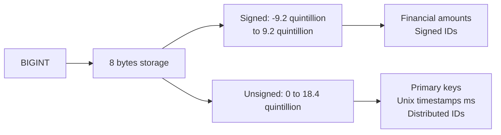
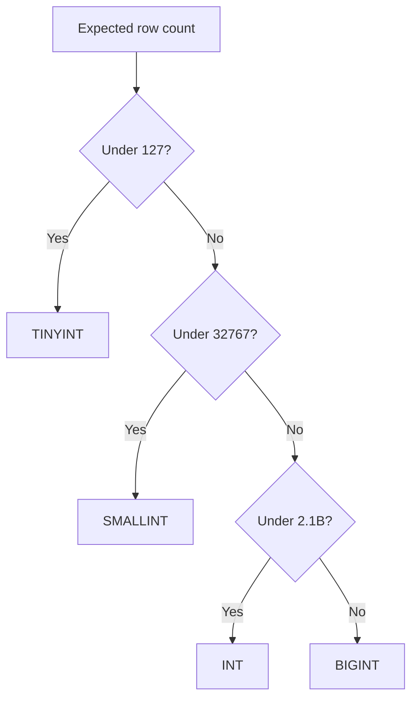

# How to Use BIGINT Data Type in MySQL

Author: [nawazdhandala](https://www.github.com/nawazdhandala)

Tags: MySQL, SQL, Data Type, Integer, Database

Description: Learn how to use the BIGINT data type in MySQL, including its 8-byte storage, signed and unsigned ranges, and best practices for large IDs, timestamps, and counters.

---

## What Is BIGINT

`BIGINT` is the largest integer type in MySQL. It uses **8 bytes** of storage and can hold numbers up to approximately 9.2 quintillion (signed) or 18.4 quintillion (unsigned). It is the standard choice for primary keys on high-volume tables, Unix epoch timestamps in milliseconds, and any counter that may grow beyond 2 billion.



## Storage and Value Range

| Type | Storage | Minimum | Maximum |
|---|---|---|---|
| `BIGINT` (signed) | 8 bytes | -9,223,372,036,854,775,808 | 9,223,372,036,854,775,807 |
| `BIGINT UNSIGNED` | 8 bytes | 0 | 18,446,744,073,709,551,615 |

## Syntax

```sql
column_name BIGINT [(display_width)] [UNSIGNED] [ZEROFILL] [NOT NULL] [DEFAULT value]
```

## Basic Usage

```sql
CREATE TABLE events (
    id           BIGINT UNSIGNED AUTO_INCREMENT PRIMARY KEY,
    user_id      BIGINT UNSIGNED NOT NULL,
    event_type   VARCHAR(50) NOT NULL,
    occurred_at  BIGINT UNSIGNED NOT NULL  -- Unix epoch milliseconds
);

INSERT INTO events (user_id, event_type, occurred_at) VALUES
(1000000001, 'login',    1741564800000),
(1000000001, 'purchase', 1741564860000),
(1000000002, 'signup',   1741564920000);
```

## Storing Unix Timestamps in Milliseconds

Applications that need sub-second precision often store timestamps as milliseconds since the Unix epoch in a `BIGINT UNSIGNED` column.

```sql
-- Convert BIGINT ms timestamp to a readable datetime
SELECT id,
       event_type,
       FROM_UNIXTIME(occurred_at / 1000) AS event_time
FROM events
ORDER BY occurred_at;
```

```text
+----+------------+---------------------+
| id | event_type | event_time          |
+----+------------+---------------------+
|  1 | login      | 2025-03-10 00:00:00 |
|  2 | purchase   | 2025-03-10 00:01:00 |
|  3 | signup     | 2025-03-10 00:02:00 |
+----+------------+---------------------+
```

## Snowflake-Style Distributed IDs

Distributed systems often use 64-bit integers as IDs (Twitter Snowflake, Sony Sonyflake). `BIGINT UNSIGNED` stores them natively.

```sql
CREATE TABLE messages (
    id          BIGINT UNSIGNED NOT NULL PRIMARY KEY,  -- 64-bit Snowflake ID
    sender_id   BIGINT UNSIGNED NOT NULL,
    content     TEXT NOT NULL,
    created_at  DATETIME NOT NULL DEFAULT CURRENT_TIMESTAMP
);

INSERT INTO messages (id, sender_id, content) VALUES
(1609459200000000000, 100000001, 'Hello world');
```

## Financial Amounts in Smallest Units

Store monetary values as `BIGINT` (representing cents, pence, or satoshis) to avoid floating-point rounding errors.

```sql
CREATE TABLE transactions (
    id              BIGINT UNSIGNED AUTO_INCREMENT PRIMARY KEY,
    account_id      BIGINT UNSIGNED NOT NULL,
    amount_cents    BIGINT NOT NULL,         -- negative for debits
    currency        CHAR(3) NOT NULL,
    created_at      DATETIME NOT NULL DEFAULT CURRENT_TIMESTAMP
);

INSERT INTO transactions (account_id, amount_cents, currency) VALUES
(1001, 100000,  'USD'),   -- $1000.00 credit
(1001, -25099,  'USD'),   -- $250.99 debit
(1002, 50000,   'EUR');

-- Display formatted amount
SELECT account_id,
       amount_cents / 100 AS amount,
       currency
FROM transactions;
```

```text
+------------+---------+----------+
| account_id | amount  | currency |
+------------+---------+----------+
|       1001 | 1000.00 | USD      |
|       1001 | -250.99 | USD      |
|       1002 |  500.00 | EUR      |
+------------+---------+----------+
```

## Arithmetic with BIGINT

```sql
SELECT
    9223372036854775807 AS max_signed_bigint,
    9223372036854775807 + 1 AS overflow_signed;
-- overflow_signed produces an out-of-range error in strict mode
```

```sql
-- Safe large arithmetic
SELECT CAST(9223372036854775807 AS UNSIGNED) + 1 AS safe_unsigned;
```

## Comparing Integer Types for Primary Keys



## Indexing Considerations

`BIGINT` primary keys double the index key size compared to `INT` (8 bytes vs 4 bytes). In InnoDB, every secondary index stores the primary key value, so large tables with many secondary indexes pay a storage cost.

```sql
-- Check index sizes
SELECT index_name,
       stat_value * @@innodb_page_size AS index_size_bytes
FROM mysql.innodb_index_stats
WHERE database_name = DATABASE()
  AND table_name = 'events'
  AND stat_name = 'size';
```

## Best Practices

- Use `BIGINT UNSIGNED AUTO_INCREMENT` for primary keys on tables expected to exceed 2 billion rows.
- Store Unix timestamps in milliseconds as `BIGINT UNSIGNED` when you need sub-second precision or need to store dates beyond the `DATETIME` range.
- Use `BIGINT` (signed) for financial amounts in smallest currency units (cents) so debits can be represented as negative values.
- Do not use `BIGINT` when `INT` is sufficient; the extra 4 bytes per row multiplies across millions of rows and secondary indexes.
- Use `UNSIGNED` when negative values are not needed to double the positive range.

## Summary

`BIGINT` provides 8 bytes of storage with a range up to 9.2 quintillion (signed) or 18.4 quintillion (unsigned). Use it for primary keys on large tables, 64-bit distributed IDs, Unix timestamps in milliseconds, and financial amounts stored as integer units. When smaller integers suffice, prefer `INT` or `MEDIUMINT` to conserve storage.
