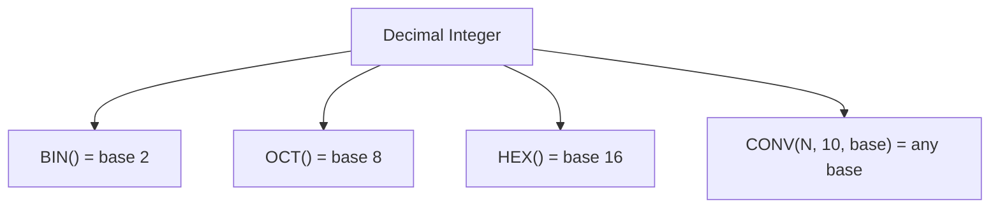

# How to Use BIN() and OCT() Functions in MySQL

Author: [nawazdhandala](https://www.github.com/nawazdhandala)

Tags: MySQL, SQL, Numeric Function, Base Conversion, Database

Description: Learn how to use MySQL BIN() to convert integers to binary strings and OCT() to convert integers to octal strings for base conversion tasks.

---

## Overview

MySQL provides `BIN()` and `OCT()` as shorthand functions for converting decimal integers to their binary (base 2) and octal (base 8) string representations respectively. They are commonly used in systems programming, permission management, and data inspection tasks.

---

## BIN() Function

`BIN()` returns a string representation of the binary value of the given integer.

**Syntax:**

```sql
BIN(N)
```

- `N` is an integer (decimal).
- Returns a string of `0` and `1` digits.
- Returns `NULL` if `N` is `NULL`.
- Equivalent to `CONV(N, 10, 2)`.

### Basic Examples

```sql
SELECT BIN(0);
-- Returns: '0'

SELECT BIN(1);
-- Returns: '1'

SELECT BIN(8);
-- Returns: '1000'

SELECT BIN(255);
-- Returns: '11111111'

SELECT BIN(1024);
-- Returns: '10000000000'

SELECT BIN(NULL);
-- Returns: NULL
```

---

## OCT() Function

`OCT()` returns a string representation of the octal value of the given integer.

**Syntax:**

```sql
OCT(N)
```

- `N` is an integer (decimal).
- Returns a string of digits `0-7`.
- Returns `NULL` if `N` is `NULL`.
- Equivalent to `CONV(N, 10, 8)`.

### Basic Examples

```sql
SELECT OCT(0);
-- Returns: '0'

SELECT OCT(7);
-- Returns: '7'

SELECT OCT(8);
-- Returns: '10'

SELECT OCT(64);
-- Returns: '100'

SELECT OCT(255);
-- Returns: '377'

SELECT OCT(511);
-- Returns: '777'
```

---

## How BIN() and OCT() Relate to Other Bases



---

## Base Conversion Reference Table

| Decimal | Binary (BIN) | Octal (OCT) | Hex (HEX) |
|---------|--------------|-------------|-----------|
| 0       | 0            | 0           | 0         |
| 8       | 1000         | 10          | 8         |
| 10      | 1010         | 12          | A         |
| 16      | 10000        | 20          | 10        |
| 64      | 1000000      | 100         | 40        |
| 255     | 11111111     | 377         | FF        |

```sql
SELECT
    n,
    BIN(n)  AS binary_val,
    OCT(n)  AS octal_val,
    HEX(n)  AS hex_val
FROM (
    SELECT 8  AS n UNION ALL
    SELECT 64 UNION ALL
    SELECT 255
) t;
```

---

## Working with Unix File Permissions (Octal)

Unix file permissions are commonly represented in octal. `OCT()` can help document or generate permission values:

```sql
-- Permission 644: owner rw, group r, other r
SELECT OCT(420);   -- Returns: '644'

-- Permission 755: owner rwx, group rx, other rx
SELECT OCT(493);   -- Returns: '755'

-- Permission 777: full access
SELECT OCT(511);   -- Returns: '777'
```

---

## Using BIN() to Visualize Bit Flags

If you store bit flags in an integer column, `BIN()` makes them readable:

```sql
CREATE TABLE user_permissions (
    user_id INT PRIMARY KEY,
    permissions INT UNSIGNED
);

INSERT INTO user_permissions VALUES (1, 7);   -- 0b111: read, write, execute
INSERT INTO user_permissions VALUES (2, 5);   -- 0b101: read and execute only
INSERT INTO user_permissions VALUES (3, 4);   -- 0b100: read only

SELECT
    user_id,
    permissions,
    BIN(permissions)  AS binary_flags,
    LPAD(BIN(permissions), 8, '0') AS padded_flags
FROM user_permissions;
```

Result:

| user_id | permissions | binary_flags | padded_flags |
|---------|-------------|--------------|--------------|
| 1       | 7           | 111          | 00000111     |
| 2       | 5           | 101          | 00000101     |
| 3       | 4           | 100          | 00000100     |

---

## Padding Binary Output with LPAD()

`BIN()` does not zero-pad its output. Use `LPAD()` for fixed-width binary representation:

```sql
SELECT LPAD(BIN(42), 8, '0');
-- Returns: '00101010'

SELECT LPAD(BIN(255), 8, '0');
-- Returns: '11111111'
```

---

## Converting Binary and Octal Strings Back to Decimal

Use `CONV()` to reverse the conversion:

```sql
-- Binary string back to decimal
SELECT CONV('11111111', 2, 10);
-- Returns: '255'

-- Octal string back to decimal
SELECT CONV('377', 8, 10);
-- Returns: '255'

-- Cross conversion: binary to hex
SELECT CONV('11111111', 2, 16);
-- Returns: 'FF'
```

---

## BIN() with Bitwise Operations

```sql
-- Show result of bitwise AND as binary
SELECT
    BIN(12 & 10)   AS bin_and,    -- 12=1100, 10=1010 -> 1000
    BIN(12 | 10)   AS bin_or,     -- 1110
    BIN(12 ^ 10)   AS bin_xor,    -- 0110
    BIN(~12 & 0xFF) AS bin_not;   -- 11110011
```

---

## Performance Notes

- `BIN()` and `OCT()` are scalar functions evaluated per row.
- They are not indexable directly; store the computed value in a generated column if frequent lookups are needed.
- Both return `VARCHAR` strings, so do not use them in arithmetic without converting back with `CONV()`.

---

## Summary

`BIN()` and `OCT()` are simple MySQL functions that convert decimal integers to their binary and octal string equivalents. `BIN()` is especially useful for visualizing bit flags and bitwise operations, while `OCT()` is handy for Unix permission representation. Both return strings, so use `LPAD()` for fixed-width output and `CONV()` when you need to convert back to decimal or another base.
