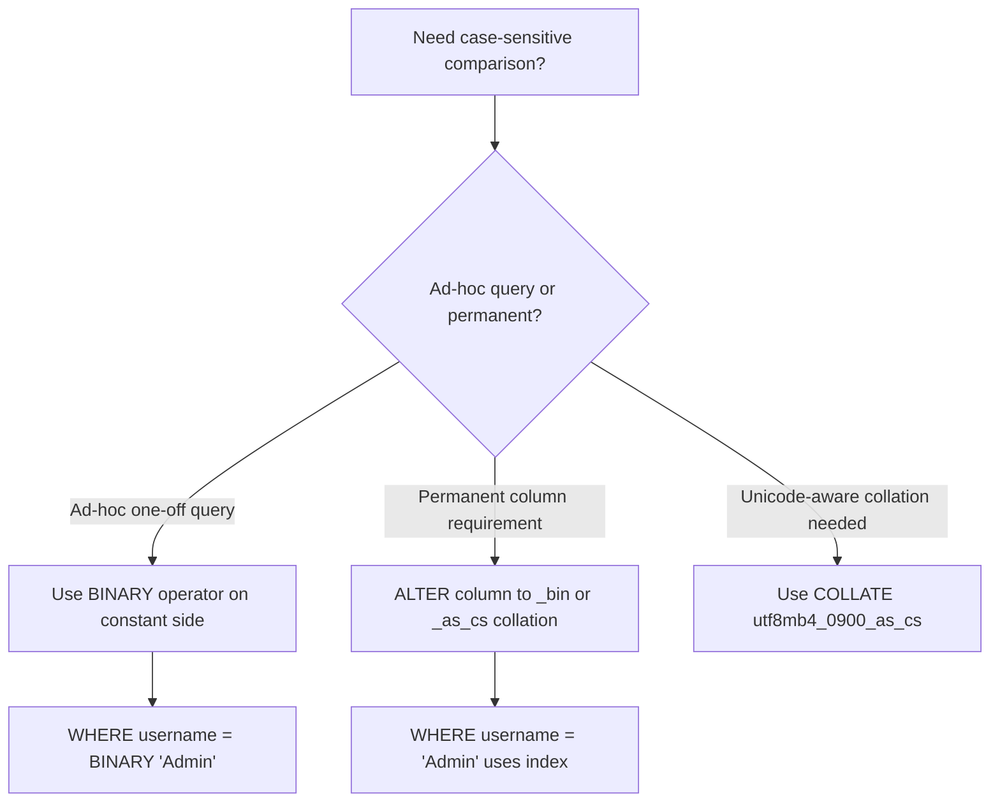

# How to Use BINARY Operator in MySQL for Case-Sensitive Comparison

Author: [OneUptime](https://oneuptime.com)

Tags: MySQL, Operator, String, Collation, Case Sensitivity

Description: Learn how to use the MySQL BINARY operator to force case-sensitive string comparisons and searches without changing table collation or column definitions.

---

## Introduction

MySQL string comparisons are case-insensitive by default when using common collations like `utf8mb4_general_ci` or `utf8mb4_unicode_ci` (the `_ci` suffix stands for case-insensitive). The `BINARY` operator casts a string to a binary string, causing the comparison to be performed byte-by-byte, which makes it case-sensitive.

`BINARY` is not a data type here -- it is a unary operator that applies to the expression that follows it.

## Basic syntax

```sql
BINARY expression
```

Or using the equivalent `CAST` form:

```sql
CAST(expression AS BINARY)
```

## Case-insensitive vs case-sensitive comparison

```sql
-- Default: case-insensitive (with _ci collation)
SELECT 'Hello' = 'hello';       -- 1 (true)
SELECT 'Hello' = 'HELLO';       -- 1 (true)

-- With BINARY operator: case-sensitive
SELECT BINARY 'Hello' = 'hello'; -- 0 (false)
SELECT BINARY 'Hello' = 'Hello'; -- 1 (true)
SELECT BINARY 'Hello' = 'HELLO'; -- 0 (false)
```

## Using BINARY in a WHERE clause

```sql
-- Find users whose username exactly matches 'Admin' (not 'admin' or 'ADMIN')
SELECT id, username, email
FROM users
WHERE BINARY username = 'Admin';

-- Same result using CAST syntax
SELECT id, username, email
FROM users
WHERE CAST(username AS BINARY) = 'Admin';
```

## Case-sensitive LIKE

Standard `LIKE` inherits the column's collation and is case-insensitive with `_ci` collations. `BINARY` makes it case-sensitive:

```sql
-- Case-insensitive LIKE (default)
SELECT * FROM products WHERE name LIKE 'widget%';
-- Matches: Widget, WIDGET, widget, wIdGeT

-- Case-sensitive LIKE with BINARY
SELECT * FROM products WHERE BINARY name LIKE 'Widget%';
-- Matches: Widget, Widgetry  (NOT widget or WIDGET)
```

## Token and password validation

```sql
-- API token comparison (tokens are case-sensitive)
SELECT user_id
FROM api_tokens
WHERE BINARY token = 'xK9mP3qRtZnB7vL2';

-- Password hash comparison (ensure exact match)
SELECT id
FROM users
WHERE BINARY password_hash = SHA2(CONCAT('secret', salt), 256)
  AND id = 42;
```

## Case-sensitive FIND_IN_SET and IN

```sql
-- Default IN: case-insensitive
SELECT * FROM tags WHERE name IN ('PHP', 'php', 'Php');
-- All three match the same rows

-- Force case-sensitive IN
SELECT * FROM tags WHERE BINARY name IN ('PHP', 'Php');
-- Only matches rows where name is exactly 'PHP' or exactly 'Php'
```

## Using BINARY in ORDER BY for case-sensitive sorting

By default, `ORDER BY` on a `_ci` column sorts `a`, `A`, `b`, `B` as `a/A`, `b/B` (case-insensitive). BINARY sorts by byte value: uppercase letters (65-90) come before lowercase (97-122):

```sql
-- Default sort (case-insensitive, mixed case intermixed)
SELECT name FROM words ORDER BY name;
-- apple, Apple, banana, Banana

-- BINARY sort (uppercase before lowercase)
SELECT name FROM words ORDER BY BINARY name;
-- Apple, Banana, apple, banana
```

## Performance considerations

The `BINARY` operator prevents the use of a regular string index because the index is built with the column's collation. This forces a full table scan or index scan with re-evaluation:

```sql
EXPLAIN SELECT * FROM users WHERE BINARY username = 'Admin'\G
-- type: ALL or index with Extra: Using where
-- No index range scan possible with the BINARY cast applied to the column side
```

### Efficient alternative: apply BINARY to the constant, not the column

```sql
-- SLOW: BINARY on column side -- disables index
SELECT * FROM users WHERE BINARY username = 'Admin';

-- FASTER: BINARY on constant side -- index is usable (partial)
SELECT * FROM users WHERE username = BINARY 'Admin';
```

Even better: use a `BINARY` or case-sensitive collation column for fields that always require case-sensitive lookups:

```sql
-- Change column to a case-sensitive collation
ALTER TABLE users
  MODIFY username VARCHAR(64) CHARACTER SET utf8mb4 COLLATE utf8mb4_bin;

-- Now all comparisons are case-sensitive by default
-- AND the index is used efficiently
SELECT * FROM users WHERE username = 'Admin';
```

## Available case-sensitive collations for utf8mb4

| Collation | Case sensitive | Accent sensitive |
|---|---|---|
| `utf8mb4_bin` | Yes (binary order) | Yes |
| `utf8mb4_0900_as_cs` | Yes | Yes |
| `utf8mb4_0900_ai_ci` | No | No |
| `utf8mb4_general_ci` | No | No |

```sql
-- Check collation of a column
SELECT COLUMN_NAME, COLLATION_NAME
FROM information_schema.COLUMNS
WHERE TABLE_SCHEMA = 'myapp'
  AND TABLE_NAME   = 'users'
  AND COLUMN_NAME  = 'username';
```

## BINARY operator vs COLLATE clause

Both achieve case-sensitive comparison but behave differently:

```sql
-- BINARY: byte-level comparison, no linguistic rules
SELECT * FROM users WHERE BINARY username = 'Admin';

-- COLLATE: uses a specific collation's rules
SELECT * FROM users WHERE username = 'Admin' COLLATE utf8mb4_bin;

-- For Unicode correctness, COLLATE utf8mb4_0900_as_cs is preferred over BINARY
SELECT * FROM users WHERE username = 'Admin' COLLATE utf8mb4_0900_as_cs;
```

## Summary



The `BINARY` operator is a quick, portable way to enforce case-sensitive comparisons on any string expression in MySQL. For columns that always require case-sensitive lookups, prefer changing the column's collation to `utf8mb4_bin` or `utf8mb4_0900_as_cs` so that indexes can be used efficiently without casting at query time.
