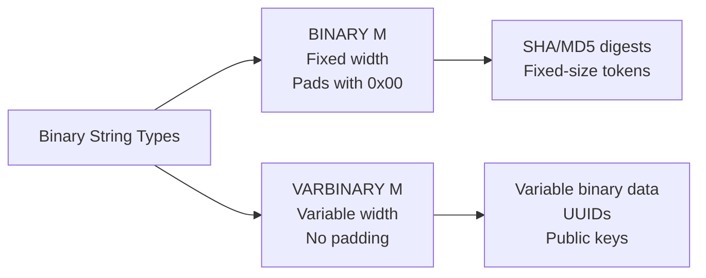

# How to Use BINARY and VARBINARY Data Types in MySQL

Author: [nawazdhandala](https://www.github.com/nawazdhandala)

Tags: MySQL, SQL, Data Type, Binary, Database

Description: Learn how to use BINARY and VARBINARY data types in MySQL to store raw binary data, hash digests, UUIDs, and other byte sequences with practical SQL examples.

---

## What Are BINARY and VARBINARY

`BINARY` and `VARBINARY` are the binary counterparts of `CHAR` and `VARCHAR`. They store raw byte strings rather than character strings, so they have no character set or collation -- comparisons and sorting are done byte-by-byte.



## Storage

| Type | Storage | Max Length |
|---|---|---|
| `BINARY(M)` | M bytes (always) | 255 bytes |
| `VARBINARY(M)` | actual length + 1 byte | 65,535 bytes |

`BINARY(M)` pads shorter values with `0x00` (zero bytes) to fill M bytes. `VARBINARY(M)` stores only the bytes provided.

## Syntax

```sql
column_name BINARY(M)          [NOT NULL] [DEFAULT value]
column_name VARBINARY(M)       [NOT NULL] [DEFAULT value]
```

## BINARY for Fixed-Width Hashes

```sql
CREATE TABLE file_checksums (
    id          INT AUTO_INCREMENT PRIMARY KEY,
    filename    VARCHAR(255) NOT NULL,
    md5_bin     BINARY(16) NOT NULL,     -- raw 16-byte MD5 digest
    sha256_bin  BINARY(32) NOT NULL,     -- raw 32-byte SHA-256 digest
    size_bytes  BIGINT UNSIGNED NOT NULL,
    checked_at  DATETIME NOT NULL DEFAULT CURRENT_TIMESTAMP
);

-- Insert using UNHEX to convert hex string to binary
INSERT INTO file_checksums (filename, md5_bin, sha256_bin, size_bytes) VALUES
(
    'report.pdf',
    UNHEX('d41d8cd98f00b204e9800998ecf8427e'),
    UNHEX('e3b0c44298fc1c149afbf4c8996fb92427ae41e4649b934ca495991b7852b855'),
    0
);

-- Read back as hex string
SELECT filename,
       HEX(md5_bin)    AS md5_hex,
       HEX(sha256_bin) AS sha256_hex
FROM file_checksums;
```

```text
+------------+----------------------------------+------------------------------------------------------------------+
| filename   | md5_hex                          | sha256_hex                                                       |
+------------+----------------------------------+------------------------------------------------------------------+
| report.pdf | D41D8CD98F00B204E9800998ECF8427E | E3B0C44298FC1C149AFBF4C8996FB924...                             |
+------------+----------------------------------+------------------------------------------------------------------+
```

## VARBINARY for UUID Storage

Storing UUIDs as `BINARY(16)` (compact) rather than `CHAR(36)` saves 20 bytes per row and improves index performance.

```sql
CREATE TABLE sessions (
    id          BINARY(16) NOT NULL PRIMARY KEY,  -- UUID as raw bytes
    user_id     INT NOT NULL,
    data        VARBINARY(4096),                   -- variable session data
    created_at  DATETIME NOT NULL DEFAULT CURRENT_TIMESTAMP,
    expires_at  DATETIME NOT NULL
);

-- Insert UUID (MySQL 8.0+)
INSERT INTO sessions (id, user_id, expires_at) VALUES
(UUID_TO_BIN(UUID()), 1001, DATE_ADD(NOW(), INTERVAL 24 HOUR));

-- Read UUID back as string
SELECT BIN_TO_UUID(id) AS session_id, user_id, expires_at
FROM sessions;
```

## VARBINARY for Public Keys and Tokens

```sql
CREATE TABLE api_keys (
    id          INT AUTO_INCREMENT PRIMARY KEY,
    user_id     INT NOT NULL,
    key_hash    BINARY(32) NOT NULL UNIQUE,   -- SHA-256 of the raw key
    prefix      CHAR(8) NOT NULL,             -- first 8 chars for display
    created_at  DATETIME NOT NULL DEFAULT CURRENT_TIMESTAMP,
    revoked_at  DATETIME
);

-- Example: store the SHA-256 hash of an API key
INSERT INTO api_keys (user_id, key_hash, prefix) VALUES
(
    42,
    UNHEX(SHA2('sk_live_some_secret_key_value', 256)),
    'sk_live_'
);
```

## Comparing BINARY Values

```sql
-- BINARY comparisons are case-sensitive and byte-exact
SELECT BINARY 'abc' = BINARY 'ABC';  -- Result: 0 (false)
SELECT BINARY 'abc' = BINARY 'abc';  -- Result: 1 (true)

-- Compare stored hash against a new hash
SELECT user_id
FROM api_keys
WHERE key_hash = UNHEX(SHA2('sk_live_some_secret_key_value', 256))
  AND revoked_at IS NULL;
```

## Padding Behavior of BINARY

```sql
CREATE TABLE binary_demo (
    val BINARY(5)
);

INSERT INTO binary_demo VALUES ('hi');
-- Stored as: 0x6869000000  (2 chars + 3 zero bytes)

SELECT HEX(val), LENGTH(val) FROM binary_demo;
```

```text
+------------+------------+
| HEX(val)   | LENGTH(val)|
+------------+------------+
| 6869000000 |          5 |
+------------+------------+
```

## BINARY vs CHAR

| Feature | BINARY(M) | CHAR(M) |
|---|---|---|
| Content | Raw bytes | Characters |
| Charset/Collation | None | Defined |
| Padding | `0x00` bytes | Spaces |
| Comparison | Byte-by-byte | Collation-aware |
| Trailing pad removal | No (keeps zeros) | Yes (strips spaces) |

## Indexing BINARY Columns

```sql
-- Full index on BINARY(16) UUID primary key
CREATE TABLE events (
    id        BINARY(16) NOT NULL PRIMARY KEY,
    type      VARCHAR(50) NOT NULL,
    payload   VARBINARY(4096),
    fired_at  DATETIME NOT NULL DEFAULT CURRENT_TIMESTAMP
);

-- Prefix index on VARBINARY
CREATE TABLE large_blobs (
    id      INT AUTO_INCREMENT PRIMARY KEY,
    data    VARBINARY(10000),
    INDEX idx_data_prefix (data(100))
);
```

## Best Practices

- Use `BINARY(16)` for compact UUID storage instead of `CHAR(36)` to save 20 bytes per row.
- Use `BINARY(32)` for SHA-256 digests and `BINARY(16)` for MD5 to store them as raw bytes rather than hex strings.
- Use `HEX()` and `UNHEX()` to convert between binary storage and human-readable hex strings.
- Use `UUID_TO_BIN()` and `BIN_TO_UUID()` (MySQL 8.0+) for UUID conversion.
- Avoid storing encrypted blobs in `VARBINARY` beyond 65,535 bytes; use `BLOB` types for larger binary data.
- Remember that `BINARY` padding with `0x00` can cause unexpected comparison results; always compare full-length binary values.

## Summary

`BINARY(M)` stores fixed-length raw byte strings, padding shorter values with zero bytes. `VARBINARY(M)` stores variable-length byte strings without padding. Both perform byte-level comparisons without any character set or collation. Common uses include storing hash digests, UUIDs, tokens, and other binary data compactly. Use `HEX()` and `UNHEX()` for conversion between binary storage and human-readable hex representations.
