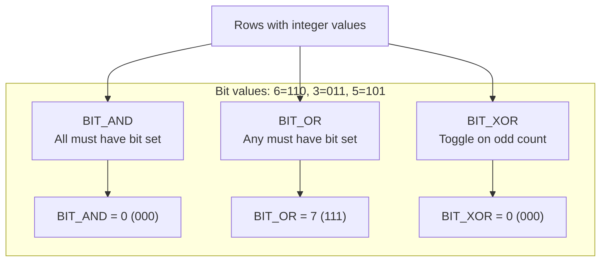

# How to Use BIT_AND(), BIT_OR(), BIT_XOR() in MySQL

Author: [nawazdhandala](https://www.github.com/nawazdhandala)

Tags: MySQL, SQL, Aggregate Function, Bitwise, Database

Description: Learn how to use MySQL BIT_AND(), BIT_OR(), and BIT_XOR() aggregate functions to perform bitwise operations across groups of rows for flag and permission analysis.

---

## What Bitwise Aggregate Functions Do

MySQL provides three aggregate functions that apply bitwise operations across all rows in a group:

- `BIT_AND()` - returns the bitwise AND of all non-NULL values (1 only where every row has a 1 in that bit position)
- `BIT_OR()` - returns the bitwise OR of all non-NULL values (1 wherever any row has a 1 in that bit position)
- `BIT_XOR()` - returns the bitwise XOR of all non-NULL values (toggles bits based on even/odd count)

These are especially useful for permission flags, feature toggles, and set-membership checks stored as bit masks.



## Syntax

```sql
BIT_AND(expression)
BIT_OR(expression)
BIT_XOR(expression)
```

All three ignore `NULL` values. They return a `BIGINT UNSIGNED` result. If no non-NULL rows exist, `BIT_AND()` returns the all-bits-set value (18446744073709551615), while `BIT_OR()` and `BIT_XOR()` return 0.

## Setup: Permission Flags Table

Bit flags are a compact way to store multiple boolean permissions in a single integer column.

```sql
-- Permission bit definitions:
-- 1 (001) = READ
-- 2 (010) = WRITE
-- 4 (100) = ADMIN

CREATE TABLE user_permissions (
    id          INT AUTO_INCREMENT PRIMARY KEY,
    user_name   VARCHAR(50),
    resource    VARCHAR(50),
    permissions TINYINT UNSIGNED  -- bitmask
);

INSERT INTO user_permissions (user_name, resource, permissions) VALUES
('alice', 'reports',   7),   -- 111 = READ + WRITE + ADMIN
('alice', 'invoices',  3),   -- 011 = READ + WRITE
('alice', 'settings',  5),   -- 101 = READ + ADMIN
('bob',   'reports',   1),   -- 001 = READ only
('bob',   'invoices',  3),   -- 011 = READ + WRITE
('carol', 'reports',   7),   -- 111 = READ + WRITE + ADMIN
('carol', 'invoices',  1),   -- 001 = READ only
('carol', 'settings',  1);   -- 001 = READ only
```

## BIT_AND(): Find Permissions Held Across All Resources

`BIT_AND()` returns only the bits that are set in every row. This answers: "what permissions does this user have on ALL resources?"

```sql
SELECT
    user_name,
    BIT_AND(permissions)                      AS common_perms,
    BIT_AND(permissions) & 1                  AS has_read_everywhere,
    BIT_AND(permissions) & 2                  AS has_write_everywhere,
    BIT_AND(permissions) & 4                  AS has_admin_everywhere
FROM user_permissions
GROUP BY user_name;
```

```text
+-----------+--------------+---------------------+----------------------+----------------------+
| user_name | common_perms | has_read_everywhere | has_write_everywhere | has_admin_everywhere |
+-----------+--------------+---------------------+----------------------+----------------------+
| alice     |            1 |                   1 |                    0 |                    0 |
| bob       |            1 |                   1 |                    0 |                    0 |
| carol     |            1 |                   1 |                    0 |                    0 |
+-----------+--------------+---------------------+----------------------+----------------------+
```

Alice has READ on all resources, but not WRITE or ADMIN on every resource (settings has no WRITE).

## BIT_OR(): Find Permissions Held on Any Resource

`BIT_OR()` returns a bit if it is set in at least one row. This answers: "what permissions does this user have on at least one resource?"

```sql
SELECT
    user_name,
    BIT_OR(permissions)       AS any_perm,
    BIT_OR(permissions) & 1   AS can_read_somewhere,
    BIT_OR(permissions) & 2   AS can_write_somewhere,
    BIT_OR(permissions) & 4   AS can_admin_somewhere
FROM user_permissions
GROUP BY user_name;
```

```text
+-----------+----------+--------------------+---------------------+---------------------+
| user_name | any_perm | can_read_somewhere | can_write_somewhere | can_admin_somewhere |
+-----------+----------+--------------------+---------------------+---------------------+
| alice     |        7 |                  1 |                   2 |                   4 |
| bob       |        3 |                  1 |                   2 |                   0 |
| carol     |        7 |                  1 |                   2 |                   4 |
+-----------+----------+--------------------+---------------------+---------------------+
```

## BIT_XOR(): Detecting Changes or Checksums

`BIT_XOR()` toggles bits based on whether a value appears an odd or even number of times. It is used for change detection and simple checksums.

```sql
CREATE TABLE sensor_readings (
    sensor_id  INT,
    reading    INT,
    recorded_at DATETIME
);

INSERT INTO sensor_readings VALUES
(1, 42,  '2026-03-31 10:00:00'),
(1, 55,  '2026-03-31 10:05:00'),
(1, 42,  '2026-03-31 10:10:00'),  -- same as first
(2, 100, '2026-03-31 10:00:00'),
(2, 200, '2026-03-31 10:05:00');

-- XOR checksum per sensor: if a value appears twice it cancels out
SELECT
    sensor_id,
    BIT_XOR(reading) AS xor_checksum
FROM sensor_readings
GROUP BY sensor_id;
```

```text
+-----------+--------------+
| sensor_id | xor_checksum |
+-----------+--------------+
|         1 |           55 |  -- 42 XOR 55 XOR 42 = 55 (42 cancelled out)
|         2 |          172 |  -- 100 XOR 200
+-----------+--------------+
```

## Using BIT_OR() to Aggregate Feature Flags

```sql
CREATE TABLE feature_flags (
    team     VARCHAR(50),
    feature  VARCHAR(50),
    flag     TINYINT UNSIGNED
);

INSERT INTO feature_flags VALUES
('team_a', 'dark_mode',    1),
('team_a', 'beta_ui',      2),
('team_a', 'new_checkout', 4),
('team_b', 'dark_mode',    1),
('team_b', 'beta_ui',      2);

-- Which feature flag bits are enabled per team?
SELECT
    team,
    BIT_OR(flag) AS enabled_flags
FROM feature_flags
GROUP BY team;
```

```text
+--------+---------------+
| team   | enabled_flags |
+--------+---------------+
| team_a |             7 |  -- all three flags
| team_b |             3 |  -- dark_mode + beta_ui
+--------+---------------+
```

## NULL Handling

All three functions ignore `NULL` values:

```sql
SELECT BIT_AND(val), BIT_OR(val), BIT_XOR(val)
FROM (
    SELECT 6 AS val UNION ALL
    SELECT NULL        UNION ALL
    SELECT 3
) t;
-- BIT_AND: 2, BIT_OR: 7, BIT_XOR: 5
```

When no non-NULL rows exist: `BIT_AND` returns the maximum BIGINT UNSIGNED value, `BIT_OR` and `BIT_XOR` return 0.

## Summary

`BIT_AND()`, `BIT_OR()`, and `BIT_XOR()` are aggregate functions that apply bitwise operations across groups of rows. `BIT_AND()` finds bits common to all rows, `BIT_OR()` finds bits present in any row, and `BIT_XOR()` is useful for checksums and duplicate detection. All three are most frequently used with bitmask columns that store multiple boolean flags in a compact integer form.
