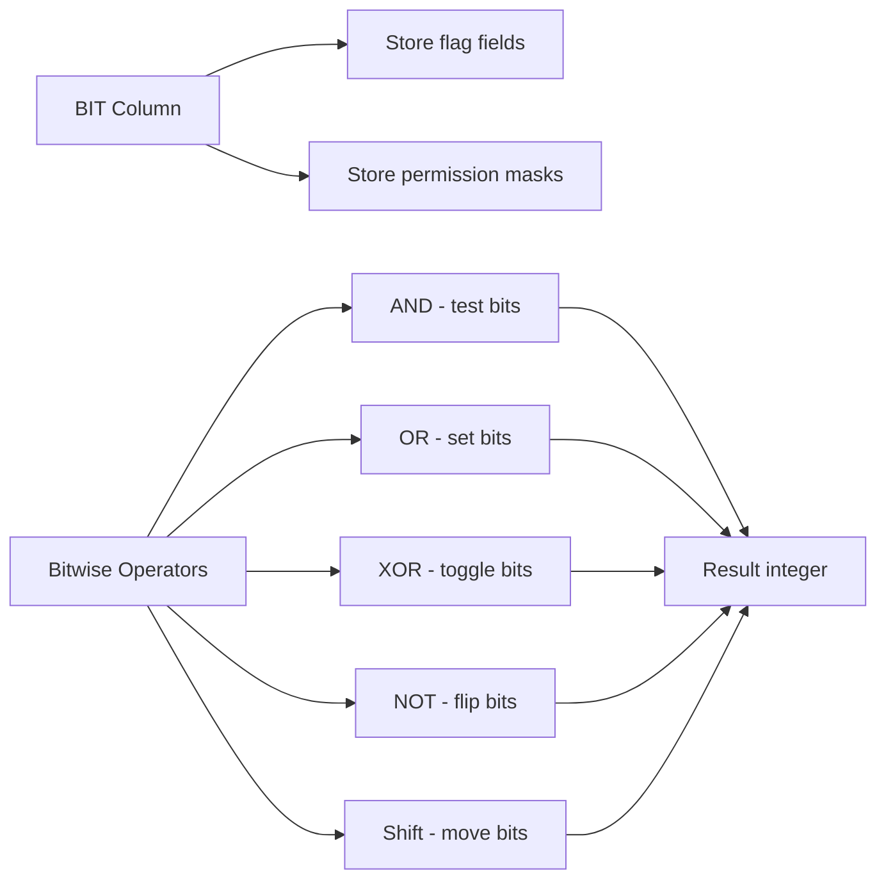

# How to Use MySQL BIT Data Type and Bit Functions

Author: [nawazdhandala](https://www.github.com/nawazdhandala)

Tags: MySQL, SQL, BIT, Bitwise Operation, Database

Description: Learn how to use the MySQL BIT data type and bitwise functions to store flags, perform bitmask operations, and work with binary values efficiently.

---

## How MySQL BIT Works

The `BIT(M)` data type stores up to M bits (1-64). It is ideal for compact storage of boolean flags, permission masks, and any data that naturally maps to binary. MySQL also provides bitwise operators and functions for manipulating individual bits in integer values.



## BIT Data Type

**Syntax:**

```sql
BIT(M)   -- M is the number of bits, 1 to 64
```

**Storage:** `BIT(M)` uses `ceil(M/8)` bytes.

**Example - store a single boolean flag:**

```sql
CREATE TABLE feature_flags (
    id      INT AUTO_INCREMENT PRIMARY KEY,
    name    VARCHAR(50),
    enabled BIT(1) NOT NULL DEFAULT 0
);

INSERT INTO feature_flags (name, enabled) VALUES
('dark_mode',       b'1'),
('beta_features',   b'0'),
('email_alerts',    b'1');

SELECT name, enabled + 0 AS enabled_int FROM feature_flags;
```

Adding 0 (`+ 0`) converts a `BIT` value to an integer for readable output.

## Storing Permission Masks with BIT

A common pattern is storing multiple boolean permissions as bits in a single integer column.

```sql
-- Permission bit positions:
-- Bit 0 (1)  = READ
-- Bit 1 (2)  = WRITE
-- Bit 2 (4)  = DELETE
-- Bit 3 (8)  = ADMIN

CREATE TABLE user_roles (
    user_id     INT PRIMARY KEY,
    username    VARCHAR(50),
    permissions INT UNSIGNED NOT NULL DEFAULT 0
);

INSERT INTO user_roles (user_id, username, permissions) VALUES
(1, 'alice',   15),   -- 1111 = read+write+delete+admin
(2, 'bob',      3),   -- 0011 = read+write
(3, 'carol',    1),   -- 0001 = read only
(4, 'dave',     9);   -- 1001 = read+admin
```

## Bitwise Operators

**AND (&)** - test if a bit is set:

```sql
SELECT username, permissions,
       (permissions & 1) AS can_read,
       (permissions & 2) AS can_write,
       (permissions & 4) AS can_delete,
       (permissions & 8) AS is_admin
FROM user_roles;
```

```text
+----------+-------------+----------+-----------+------------+----------+
| username | permissions | can_read | can_write | can_delete | is_admin |
+----------+-------------+----------+-----------+------------+----------+
| alice    | 15          | 1        | 2         | 4          | 8        |
| bob      | 3           | 1        | 2         | 0          | 0        |
| carol    | 1           | 1        | 0         | 0          | 0        |
| dave     | 9           | 1        | 0         | 0          | 8        |
+----------+-------------+----------+-----------+------------+----------+
```

**OR (|)** - set a bit:

```sql
-- Grant WRITE permission to carol:
UPDATE user_roles
SET permissions = permissions | 2
WHERE username = 'carol';
```

**XOR (^)** - toggle a bit:

```sql
-- Toggle ADMIN permission for bob:
UPDATE user_roles
SET permissions = permissions ^ 8
WHERE username = 'bob';
```

**NOT (~)** - flip all bits (use with AND to clear a specific bit):

```sql
-- Remove DELETE permission from alice (AND with complement of 4):
UPDATE user_roles
SET permissions = permissions & ~4
WHERE username = 'alice';
```

**Left shift (<<) and Right shift (>>)**:

```sql
SELECT 1 << 3;   -- Result: 8  (shift bit 0 left 3 positions)
SELECT 8 >> 2;   -- Result: 2  (shift right 2 positions)
```

## BIT_COUNT

`BIT_COUNT(n)` returns the number of bits set to 1 in the integer `n`.

```sql
SELECT username, permissions, BIT_COUNT(permissions) AS active_permissions
FROM user_roles;
```

```text
+----------+-------------+--------------------+
| username | permissions | active_permissions |
+----------+-------------+--------------------+
| alice    | 15          | 4                  |
| bob      | 3           | 2                  |
| carol    | 1           | 1                  |
| dave     | 9           | 2                  |
+----------+-------------+--------------------+
```

## BIN, OCT, HEX - Display Binary Values

```sql
SELECT
    permissions,
    BIN(permissions) AS binary_repr,
    HEX(permissions) AS hex_repr,
    OCT(permissions) AS octal_repr
FROM user_roles;
```

```text
+-------------+-------------+-----------+------------+
| permissions | binary_repr | hex_repr  | octal_repr |
+-------------+-------------+-----------+------------+
| 15          | 1111        | F         | 17         |
| 3           | 11          | 3         | 3          |
| 1           | 1           | 1         | 1          |
| 9           | 1001        | 9         | 11         |
+-------------+-------------+-----------+------------+
```

## BIT Literals in Queries

Use `b'...'` notation for bit literals:

```sql
SELECT b'1010' + 0;  -- Result: 10
SELECT b'1111' & b'1010';  -- Result: 10 (bitwise AND)
```

## Best Practices

- Use `INT UNSIGNED` (or `BIGINT UNSIGNED`) rather than `BIT(M)` for permission masks when you need bitwise arithmetic - arithmetic operators work more naturally on integer types.
- Use `BIT(1)` only as a true boolean alternative; `TINYINT(1)` is more portable across ORMs and drivers.
- Store human-readable permission definitions in a separate lookup table; keep only the bitmask value in the user table.
- Use `BIT_COUNT` to count active features/permissions without iterating in application code.
- When filtering by permission, use `(permissions & mask) = mask` to check that all required bits are set.

## Summary

MySQL's `BIT` data type stores compact binary values from 1 to 64 bits. Bitwise operators `&`, `|`, `^`, `~`, `<<`, and `>>` manipulate individual bits, making them ideal for permission masks and feature flags. `BIT_COUNT` counts set bits. `BIN`, `HEX`, and `OCT` display integer values in alternative bases. The bitmask pattern lets you store multiple boolean flags in a single integer column, reducing storage and enabling fast single-expression permission checks.
