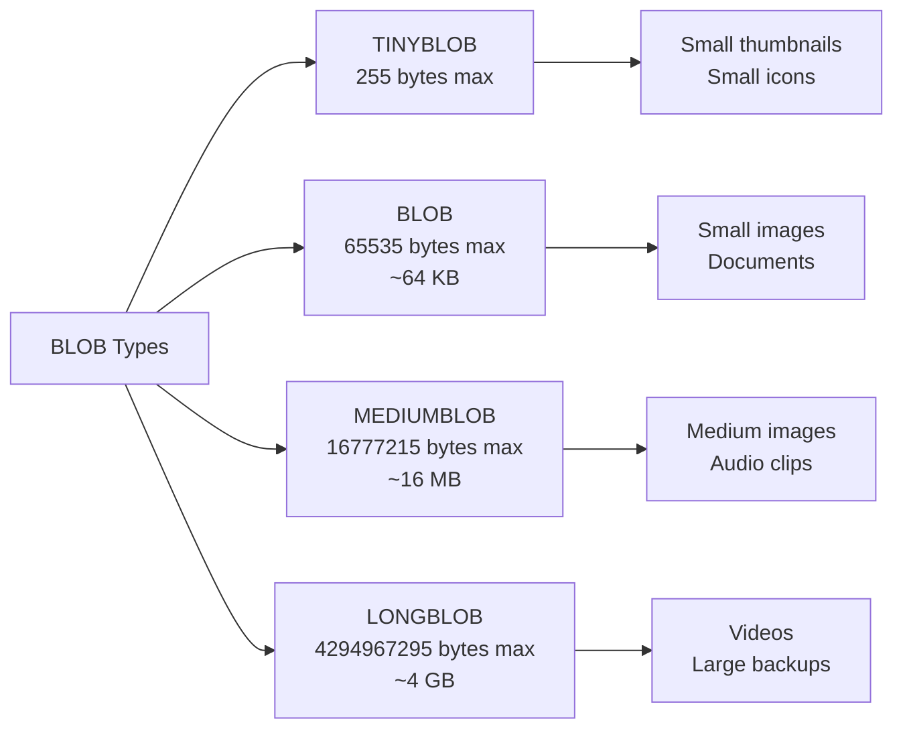
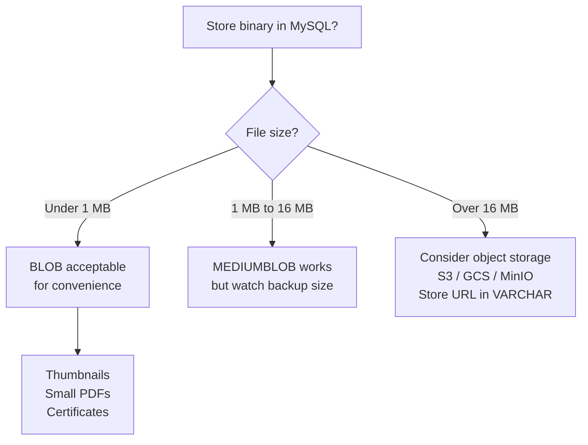

# How to Use BLOB Data Types (TINYBLOB, BLOB, MEDIUMBLOB, LONGBLOB) in MySQL

Author: [nawazdhandala](https://www.github.com/nawazdhandala)

Tags: MySQL, SQL, Data Type, BLOB, Database

Description: Learn how to use MySQL BLOB data types (TINYBLOB, BLOB, MEDIUMBLOB, LONGBLOB) for storing binary data like images, files, and encrypted content with practical examples.

---

## The BLOB Family

BLOB (Binary Large Object) types store raw binary data without any character set encoding. They are the binary equivalents of the TEXT types and use the same storage limits.



## Storage Limits

| Type | Max Length | Length Prefix |
|---|---|---|
| `TINYBLOB` | 255 bytes | 1 byte |
| `BLOB` | 65,535 bytes | 2 bytes |
| `MEDIUMBLOB` | 16,777,215 bytes | 3 bytes |
| `LONGBLOB` | 4,294,967,295 bytes | 4 bytes |

## Syntax

```sql
column_name TINYBLOB   [NOT NULL]
column_name BLOB       [NOT NULL]
column_name MEDIUMBLOB [NOT NULL]
column_name LONGBLOB   [NOT NULL]
```

BLOB columns cannot have a `DEFAULT` value other than `NULL`.

## Basic Usage: Storing Images

```sql
CREATE TABLE product_images (
    id          INT AUTO_INCREMENT PRIMARY KEY,
    product_id  INT NOT NULL,
    image_type  ENUM('thumbnail', 'main', 'gallery') NOT NULL,
    mime_type   VARCHAR(50) NOT NULL,
    image_data  MEDIUMBLOB NOT NULL,    -- up to 16 MB per image
    file_size   INT UNSIGNED NOT NULL,
    uploaded_at DATETIME NOT NULL DEFAULT CURRENT_TIMESTAMP,
    INDEX (product_id)
);
```

## Inserting Binary Data with LOAD_FILE

```sql
-- Load a file from the server filesystem (requires FILE privilege)
INSERT INTO product_images (product_id, image_type, mime_type, image_data, file_size)
VALUES (
    101,
    'main',
    'image/jpeg',
    LOAD_FILE('/var/mysql-uploads/product-101-main.jpg'),
    125000
);
```

## Inserting Binary Data with HEX Literals

For small binary data, you can use hex literals directly:

```sql
CREATE TABLE encryption_keys (
    id          INT AUTO_INCREMENT PRIMARY KEY,
    key_name    VARCHAR(100) NOT NULL UNIQUE,
    key_data    BLOB NOT NULL,            -- encrypted key material
    algorithm   VARCHAR(20) NOT NULL,
    created_at  DATETIME NOT NULL DEFAULT CURRENT_TIMESTAMP
);

-- Insert using X'...' hex literal
INSERT INTO encryption_keys (key_name, key_data, algorithm) VALUES
('aes-256-key-1', X'0102030405060708090a0b0c0d0e0f101112131415161718191a1b1c1d1e1f20', 'AES-256');
```

## Storing Encrypted Content

```sql
CREATE TABLE secure_documents (
    id              INT AUTO_INCREMENT PRIMARY KEY,
    owner_id        INT NOT NULL,
    document_name   VARCHAR(200) NOT NULL,
    encrypted_body  LONGBLOB NOT NULL,     -- AES-encrypted document bytes
    iv              BINARY(16) NOT NULL,   -- Initialization vector
    created_at      DATETIME NOT NULL DEFAULT CURRENT_TIMESTAMP
);

-- Insert with MySQL AES encryption (example only, manage keys externally in production)
INSERT INTO secure_documents (owner_id, document_name, encrypted_body, iv)
VALUES (
    1001,
    'confidential_report.pdf',
    AES_ENCRYPT('This is the document content...', 'encryption_key_here'),
    RANDOM_BYTES(16)
);

-- Decrypt
SELECT owner_id,
       document_name,
       CAST(AES_DECRYPT(encrypted_body, 'encryption_key_here') AS CHAR) AS decrypted_content
FROM secure_documents
WHERE id = 1;
```

## Storing File Metadata Alongside BLOB

```sql
CREATE TABLE uploaded_files (
    id            BIGINT UNSIGNED AUTO_INCREMENT PRIMARY KEY,
    user_id       INT NOT NULL,
    original_name VARCHAR(255) NOT NULL,
    mime_type     VARCHAR(100) NOT NULL,
    file_size     INT UNSIGNED NOT NULL,
    file_data     MEDIUMBLOB NOT NULL,
    checksum      BINARY(32) NOT NULL,    -- SHA-256 of file_data
    uploaded_at   DATETIME NOT NULL DEFAULT CURRENT_TIMESTAMP,
    INDEX (user_id)
);
```

## Reading BLOB Data

```sql
-- Check the length of stored binary data
SELECT id, original_name, LENGTH(file_data) AS bytes, mime_type
FROM uploaded_files
WHERE user_id = 1001;
```

```text
+----+-------------------+--------+-----------+
| id | original_name     | bytes  | mime_type |
+----+-------------------+--------+-----------+
|  1 | avatar.png        |  45230 | image/png |
|  2 | report.pdf        | 183421 | application/pdf|
+----+-------------------+--------+-----------+
```

## BLOB vs TEXT Comparison

| Feature | BLOB | TEXT |
|---|---|---|
| Content | Raw bytes | Characters |
| Charset/Collation | None | Defined |
| Comparison | Byte-by-byte | Collation-aware |
| Typical use | Images, files, binary data | Articles, comments, code |

## When NOT to Use BLOB in MySQL

Storing large binary files in MySQL BLOB columns is convenient but has trade-offs:



## Performance Considerations

- BLOB data is stored off-page in InnoDB for values larger than approximately half the InnoDB page size (8KB by default).
- Large BLOB columns slow down full table scans and backups; use `SELECT id, mime_type, file_size` instead of `SELECT *` when listing files.
- Consider storing large files in object storage (S3, GCS, MinIO) and saving only the URL in a `VARCHAR` column.

## Best Practices

- Choose the smallest BLOB type that fits your data to minimize storage overhead.
- Always store metadata (MIME type, file size, filename, checksum) alongside the BLOB.
- Avoid `SELECT *` on tables with BLOB columns; explicitly name non-BLOB columns for list queries.
- For files larger than a few MB, store the file in object storage and save the URL in MySQL.
- Use `LENGTH(column)` to inspect BLOB size before fetching the full value.
- Regularly run `OPTIMIZE TABLE` on BLOB-heavy tables to reclaim fragmented space.

## Summary

MySQL provides four BLOB types -- `TINYBLOB` (255 bytes), `BLOB` (64 KB), `MEDIUMBLOB` (16 MB), and `LONGBLOB` (4 GB) -- for storing raw binary data such as images, documents, encrypted content, and binary files. BLOB columns perform byte-level comparisons and have no character set. For files larger than a few MB, consider object storage solutions and storing only the URL in MySQL.
