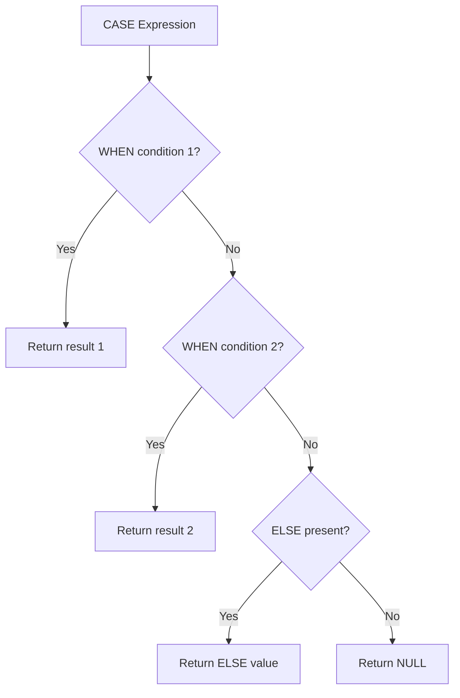

# How to Use MySQL CASE WHEN Expression

Author: [nawazdhandala](https://www.github.com/nawazdhandala)

Tags: MySQL, SQL, Conditional Expression, CASE WHEN, Database

Description: Learn how to use the MySQL CASE WHEN expression to implement multi-branch conditional logic in SELECT, WHERE, ORDER BY, and UPDATE statements.

---

## How CASE WHEN Works

`CASE WHEN` is MySQL's general-purpose conditional expression. It evaluates a list of conditions in order and returns the value from the first matching branch. If no branch matches and an `ELSE` clause is present, that value is returned; otherwise the result is NULL.

There are two forms: the simple form compares one value against multiple candidates, and the searched form evaluates independent boolean conditions.



## Syntax

**Searched form (recommended for most use cases):**

```sql
CASE
    WHEN condition1 THEN result1
    WHEN condition2 THEN result2
    ...
    ELSE default_result
END
```

**Simple form (value comparison):**

```sql
CASE expression
    WHEN value1 THEN result1
    WHEN value2 THEN result2
    ...
    ELSE default_result
END
```

## Setup: Sample Table

```sql
CREATE TABLE orders (
    id           INT AUTO_INCREMENT PRIMARY KEY,
    customer     VARCHAR(100),
    status       VARCHAR(20),
    total        DECIMAL(10,2),
    order_date   DATE,
    country_code CHAR(2)
);

INSERT INTO orders (customer, status, total, order_date, country_code) VALUES
('Alice',   'shipped',    249.99, '2026-01-10', 'US'),
('Bob',     'pending',     89.50, '2026-01-15', 'CA'),
('Charlie', 'delivered',  315.00, '2026-02-01', 'GB'),
('Diana',   'cancelled',   59.99, '2026-02-10', 'US'),
('Eve',     'processing', 799.00, '2026-03-01', 'AU'),
('Frank',   'delivered',  150.00, '2026-03-05', 'US'),
('Grace',   'pending',     42.00, '2026-03-10', 'CA');
```

## Basic CASE WHEN in SELECT

**Example - map status codes to labels:**

```sql
SELECT
    customer,
    status,
    CASE status
        WHEN 'pending'    THEN 'Awaiting Processing'
        WHEN 'processing' THEN 'In Progress'
        WHEN 'shipped'    THEN 'On the Way'
        WHEN 'delivered'  THEN 'Completed'
        WHEN 'cancelled'  THEN 'Order Cancelled'
        ELSE 'Unknown'
    END AS status_label
FROM orders;
```

```text
+---------+------------+---------------------+
| customer| status     | status_label        |
+---------+------------+---------------------+
| Alice   | shipped    | On the Way          |
| Bob     | pending    | Awaiting Processing |
| Charlie | delivered  | Completed           |
| Diana   | cancelled  | Order Cancelled     |
| Eve     | processing | In Progress         |
| Frank   | delivered  | Completed           |
| Grace   | pending    | Awaiting Processing |
+---------+------------+---------------------+
```

## Searched CASE WHEN

**Example - categorize orders by total value:**

```sql
SELECT
    customer,
    total,
    CASE
        WHEN total >= 500  THEN 'Large'
        WHEN total >= 100  THEN 'Medium'
        ELSE                    'Small'
    END AS order_size
FROM orders;
```

## CASE WHEN with Aggregates (Pivot)

`CASE WHEN` inside aggregate functions creates conditional counts, creating a pivot-style report.

**Example - count orders by status per country:**

```sql
SELECT
    country_code,
    COUNT(*) AS total_orders,
    SUM(CASE WHEN status = 'delivered' THEN 1 ELSE 0 END)  AS delivered,
    SUM(CASE WHEN status = 'pending'   THEN 1 ELSE 0 END)  AS pending,
    SUM(CASE WHEN status = 'cancelled' THEN 1 ELSE 0 END)  AS cancelled
FROM orders
GROUP BY country_code;
```

```text
+--------------+--------------+-----------+---------+-----------+
| country_code | total_orders | delivered | pending | cancelled |
+--------------+--------------+-----------+---------+-----------+
| US           | 3            | 1         | 0       | 1         |
| CA           | 2            | 0         | 2       | 0         |
| GB           | 1            | 1         | 0       | 0         |
| AU           | 1            | 0         | 0       | 0         |
+--------------+--------------+-----------+---------+-----------+
```

## CASE WHEN in ORDER BY

Sort by a custom priority rather than alphabetical order:

```sql
SELECT customer, status, total
FROM orders
ORDER BY
    CASE status
        WHEN 'processing' THEN 1
        WHEN 'pending'    THEN 2
        WHEN 'shipped'    THEN 3
        WHEN 'delivered'  THEN 4
        WHEN 'cancelled'  THEN 5
        ELSE 6
    END,
    total DESC;
```

## CASE WHEN in UPDATE

Apply different updates to different rows in a single pass:

```sql
UPDATE orders
SET total = CASE
    WHEN country_code = 'US' THEN total * 1.08   -- add US tax
    WHEN country_code = 'CA' THEN total * 1.13   -- add Canadian tax
    WHEN country_code = 'GB' THEN total * 1.20   -- add UK VAT
    ELSE total
END
WHERE status NOT IN ('cancelled', 'delivered');
```

## CASE WHEN in WHERE

```sql
SELECT customer, total, country_code
FROM orders
WHERE
    CASE country_code
        WHEN 'US' THEN total > 100
        WHEN 'CA' THEN total > 50
        ELSE total > 200
    END;
```

## Best Practices

- Always include an `ELSE` clause to handle unexpected values and avoid silent NULLs.
- All result expressions in a `CASE` should return compatible types; MySQL will implicitly cast but this can produce unexpected results.
- Use the simple form when comparing a single column against constant values; it is slightly more readable than the searched form in that scenario.
- For three or more conditions `CASE WHEN` is clearer than nested `IF` calls.
- In pivots, use `SUM(CASE WHEN ... THEN 1 ELSE 0 END)` rather than `COUNT(CASE WHEN ... THEN 1 END)` - the latter does not count the ELSE branch but can be confusing.

## Summary

The `CASE WHEN` expression is MySQL's most flexible conditional tool. The searched form evaluates independent boolean conditions one by one and returns the first match. The simple form compares a single value against a list of candidates. `CASE WHEN` can appear in any position where an expression is valid - SELECT columns, ORDER BY, WHERE, and UPDATE SET clauses. Combined with aggregate functions it enables powerful pivot-style reports without any application-layer post-processing.
