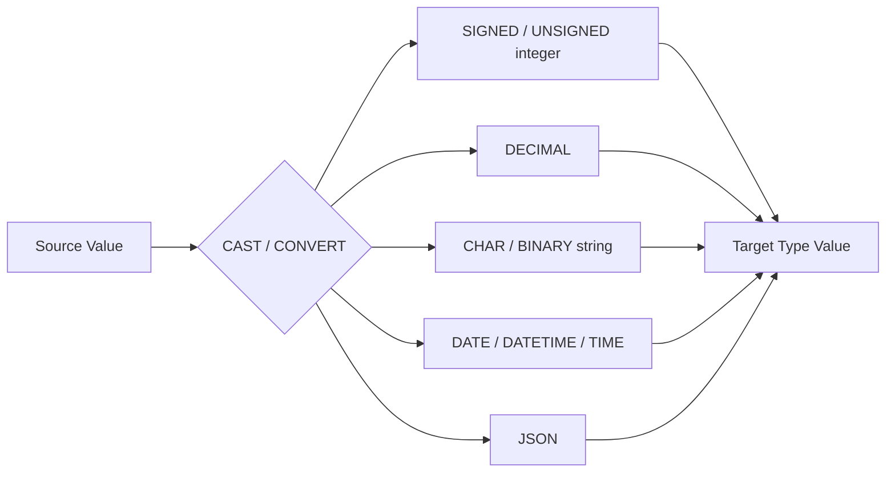

# How to Use MySQL CAST and CONVERT Functions

Author: [nawazdhandala](https://www.github.com/nawazdhandala)

Tags: MySQL, SQL, CAST, CONVERT, Data Type, Database

Description: Learn how to use MySQL CAST and CONVERT functions to safely convert values between data types including strings, integers, decimals, and dates.

---

## How CAST and CONVERT Work

MySQL performs implicit type conversion in many contexts, but relying on implicit conversion can produce surprising results. `CAST` and `CONVERT` make type conversions explicit and readable. They are functionally similar: `CAST` follows the SQL standard syntax while `CONVERT` uses a slightly different syntax and additionally supports character set conversion.



## Syntax

**CAST syntax:**

```sql
CAST(expr AS type)
```

**CONVERT syntax:**

```sql
CONVERT(expr, type)
CONVERT(expr USING charset)   -- character set conversion
```

**Available target types:**

```text
SIGNED        - signed integer (BIGINT)
UNSIGNED      - unsigned integer (BIGINT UNSIGNED)
DECIMAL(M,D)  - fixed-point number
FLOAT         - floating-point (MySQL 8.0+)
CHAR(N)       - string (optional length)
BINARY(N)     - binary string
DATE          - date only
DATETIME      - date and time
TIME          - time only
YEAR          - four-digit year
JSON          - JSON value (MySQL 8.0+)
```

## Setup: Sample Table

```sql
CREATE TABLE raw_imports (
    id          INT AUTO_INCREMENT PRIMARY KEY,
    amount_str  VARCHAR(20),
    qty_str     VARCHAR(10),
    date_str    VARCHAR(20),
    flag_str    VARCHAR(5)
);

INSERT INTO raw_imports (amount_str, qty_str, date_str, flag_str) VALUES
('1299.99', '50',   '2026-03-15',        'true'),
('89.50',   '200',  '2026/01/20',        '1'),
('  49.99', '75',   'March 10, 2026',    '0'),
('315',     '30',   '2026-02-28 09:00',  'false'),
('abc',     '-5',   '20260101',          'yes');
```

## CAST to Numeric Types

**Example - convert string amounts to DECIMAL:**

```sql
SELECT
    amount_str,
    CAST(amount_str AS DECIMAL(10,2))    AS amount_decimal,
    CAST(qty_str    AS SIGNED)            AS qty_int
FROM raw_imports;
```

```text
+------------+----------------+---------+
| amount_str | amount_decimal | qty_int |
+------------+----------------+---------+
| 1299.99    | 1299.99        | 50      |
| 89.50      | 89.50          | 200     |
|   49.99    | 49.99          | 75      |
| 315        | 315.00         | 30      |
| abc        | 0.00           | -5      |
+------------+----------------+---------+
```

Note: Non-numeric strings like `'abc'` cast to 0 with a warning. Always validate before casting.

**SIGNED vs. UNSIGNED:**

```sql
SELECT
    CAST(-42 AS UNSIGNED),       -- converts to large positive (wraps)
    CAST(-42 AS SIGNED);         -- stays -42
```

## CAST to Date Types

```sql
SELECT
    date_str,
    CAST(date_str AS DATE)     AS as_date,
    CAST(date_str AS DATETIME) AS as_datetime
FROM raw_imports;
```

```text
+---------------------+------------+---------------------+
| date_str            | as_date    | as_datetime         |
+---------------------+------------+---------------------+
| 2026-03-15          | 2026-03-15 | 2026-03-15 00:00:00 |
| 2026/01/20          | NULL       | NULL                |
| March 10, 2026      | NULL       | NULL                |
| 2026-02-28 09:00    | 2026-02-28 | 2026-02-28 09:00:00 |
| 20260101            | 2026-01-01 | 2026-01-01 00:00:00 |
+---------------------+------------+---------------------+
```

Non-standard date formats return NULL. Use `STR_TO_DATE` for custom formats.

## CAST to CHAR

```sql
SELECT
    CAST(12345     AS CHAR)       AS int_to_str,
    CAST(3.14159   AS CHAR(4))    AS float_truncated,
    CAST(CURDATE() AS CHAR)       AS date_to_str;
```

## CONVERT with Character Set

`CONVERT ... USING` converts a string's character encoding:

```sql
SELECT CONVERT('Hello' USING utf8mb4);
SELECT CONVERT(binary_col USING utf8mb4) FROM some_table;
```

This is useful when migrating data between collations or when inserting data from an external source in a different encoding.

## Practical Use Cases

**Sum a column of price strings:**

```sql
SELECT SUM(CAST(amount_str AS DECIMAL(10,2))) AS total
FROM raw_imports
WHERE amount_str REGEXP '^[0-9]+\\.?[0-9]*$';
```

**Sort a VARCHAR column numerically:**

```sql
SELECT amount_str
FROM raw_imports
ORDER BY CAST(amount_str AS DECIMAL(10,2));
```

**Compare dates stored as strings:**

```sql
SELECT *
FROM raw_imports
WHERE CAST(date_str AS DATE) > '2026-02-01';
```

**Convert boolean-like strings to integers:**

```sql
SELECT
    flag_str,
    CASE flag_str
        WHEN 'true'  THEN 1
        WHEN '1'     THEN 1
        WHEN 'yes'   THEN 1
        ELSE 0
    END AS flag_int
FROM raw_imports;
```

## Best Practices

- Always prefer `CAST` over implicit conversion - it makes the intent explicit and avoids silent data truncation.
- Use `CAST(column AS DECIMAL(M,D))` rather than `CAST(column AS FLOAT)` for monetary values to avoid floating-point rounding.
- Validate strings before casting with `REGEXP` to catch non-convertible values early and produce meaningful errors.
- Avoid using `CAST` in indexed column comparisons when possible - it prevents index use. Store data in the correct type at insert time.
- Use `CONVERT(expr USING charset)` to handle character encoding differences when ingesting external data.

## Summary

`CAST` and `CONVERT` make type conversions explicit and safe in MySQL. `CAST(expr AS type)` is the SQL-standard syntax supporting numeric, date, and string targets. `CONVERT(expr, type)` is the MySQL-specific equivalent, with the additional `CONVERT(expr USING charset)` form for encoding conversion. Both functions are essential when processing imported data, sorting mixed-type columns, or computing aggregates over string-stored numbers.
