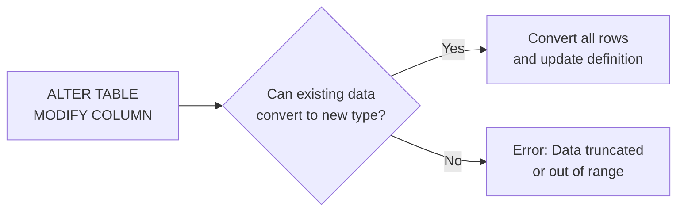

# How to Change Column Data Type in MySQL

Author: [nawazdhandala](https://www.github.com/nawazdhandala)

Tags: MySQL, SQL, DDL, ALTER TABLE, Data Type, Schema

Description: Change a MySQL column's data type using ALTER TABLE MODIFY COLUMN or CHANGE COLUMN, with safe conversion strategies and data validation tips.

---

## How It Works

Changing a column's data type in MySQL uses either `MODIFY COLUMN` (keeps the column name) or `CHANGE COLUMN` (can also rename). MySQL validates that existing data can be converted to the new type. If conversion is not possible, the statement fails with a data truncation error.



## Syntax

### MODIFY COLUMN - change definition, keep column name

```sql
ALTER TABLE table_name
    MODIFY COLUMN column_name new_data_type [new_options];
```

### CHANGE COLUMN - change definition and optionally rename

```sql
ALTER TABLE table_name
    CHANGE COLUMN old_column_name new_column_name new_data_type [new_options];
```

## Common Type Change Examples

### VARCHAR to TEXT

```sql
CREATE TABLE posts (
    id      INT UNSIGNED AUTO_INCREMENT PRIMARY KEY,
    content VARCHAR(255) NOT NULL
);

-- Content can now hold more than 255 characters
ALTER TABLE posts
    MODIFY COLUMN content TEXT NOT NULL;
```

### INT to BIGINT

```sql
ALTER TABLE events
    MODIFY COLUMN id BIGINT UNSIGNED NOT NULL AUTO_INCREMENT;
```

Widening an integer type is always safe. Narrowing (e.g., BIGINT to INT) may fail if existing values exceed the new range.

### VARCHAR Length Increase

```sql
ALTER TABLE users
    MODIFY COLUMN email VARCHAR(320) NOT NULL;
```

Increasing `VARCHAR` length is safe and fast (metadata-only in most cases).

### VARCHAR Length Decrease

```sql
-- Check max length before shrinking
SELECT MAX(CHAR_LENGTH(email)) AS max_len FROM users;

-- Only shrink if max_len <= 100
ALTER TABLE users
    MODIFY COLUMN email VARCHAR(100) NOT NULL;
```

Decreasing `VARCHAR` length will silently truncate values in non-strict mode. In strict mode (the default) it fails if any value exceeds the new length.

### TINYINT to INT

```sql
ALTER TABLE products
    MODIFY COLUMN stock_count INT UNSIGNED NOT NULL DEFAULT 0;
```

### DECIMAL Precision Change

```sql
-- Increase precision
ALTER TABLE invoices
    MODIFY COLUMN amount DECIMAL(14, 2) NOT NULL;

-- Check for values that would lose precision before decreasing
SELECT COUNT(*) FROM invoices WHERE amount > 99999999.99;
```

### String to ENUM

```sql
-- First verify all existing values are in the intended list
SELECT DISTINCT status FROM orders;

ALTER TABLE orders
    MODIFY COLUMN status
        ENUM('pending','processing','shipped','delivered','cancelled')
        NOT NULL DEFAULT 'pending';
```

## Safe Type Change Procedure

Always follow this checklist before changing a column type in production.

```sql
-- Step 1: Audit existing values
SELECT DISTINCT column_name FROM table_name;
-- or for ranges:
SELECT MIN(column_name), MAX(column_name) FROM table_name;

-- Step 2: Check maximum string length for VARCHAR changes
SELECT MAX(CHAR_LENGTH(column_name)) FROM table_name;

-- Step 3: Test the change in a staging environment first

-- Step 4: Back up before running on production
-- mysqldump -u root -p --single-transaction myapp > backup.sql

-- Step 5: Run the ALTER TABLE
ALTER TABLE table_name
    MODIFY COLUMN column_name new_type [options];

-- Step 6: Verify the change
DESCRIBE table_name;
```

## Complete Working Example

```sql
-- Start with a poorly-typed table
CREATE TABLE products (
    id          INT AUTO_INCREMENT PRIMARY KEY,
    name        VARCHAR(50),
    price       VARCHAR(20),    -- price stored as text - needs to be DECIMAL
    in_stock    VARCHAR(5),     -- 'true'/'false' string - needs to be BOOLEAN
    description VARCHAR(100)    -- too short for descriptions
);

INSERT INTO products (name, price, in_stock, description) VALUES
    ('Widget', '9.99',  'true',  'A small widget'),
    ('Gadget', '29.99', 'false', 'A useful gadget'),
    ('Doohickey', '4.99', 'true', 'Handy item');

-- Fix the data types
-- First, sanitise price column (remove any non-numeric values)
SELECT name, price FROM products WHERE price NOT REGEXP '^[0-9]+\\.?[0-9]*$';

-- Then change the types
ALTER TABLE products
    MODIFY COLUMN name        VARCHAR(255) NOT NULL,
    MODIFY COLUMN price       DECIMAL(10, 2) NOT NULL DEFAULT 0.00,
    MODIFY COLUMN description TEXT,
    MODIFY COLUMN in_stock    BOOLEAN NOT NULL DEFAULT TRUE;

-- Note: 'true'/'false' strings will be converted to 1/0 by MySQL
-- Verify
SELECT id, name, price, in_stock FROM products;
```

```text
+----+-----------+-------+----------+
| id | name      | price | in_stock |
+----+-----------+-------+----------+
|  1 | Widget    |  9.99 |        1 |
|  2 | Gadget    | 29.99 |        0 |
|  3 | Doohickey |  4.99 |        1 |
+----+-----------+-------+----------+
```

## Algorithm Considerations for Large Tables

For tables with millions of rows, type changes that require a full row rebuild can lock the table for minutes. Use `ALGORITHM=INPLACE` or `ALGORITHM=INSTANT` where supported.

```sql
-- Check if instant algorithm is available
ALTER TABLE large_table
    MODIFY COLUMN status VARCHAR(50) NOT NULL,
    ALGORITHM=INSTANT;

-- If INSTANT is not supported, use INPLACE (no table copy, some locking)
ALTER TABLE large_table
    MODIFY COLUMN status VARCHAR(50) NOT NULL,
    ALGORITHM=INPLACE, LOCK=NONE;
```

For very large tables where even INPLACE is too slow, consider pt-online-schema-change or gh-ost.

## Best Practices

- Always widen before narrowing: increasing a column's range is safe; decreasing it requires data auditing.
- Run type changes on a staging copy first.
- Use `MODIFY COLUMN` to change only the type; use `CHANGE COLUMN` only when renaming at the same time.
- When changing numeric columns, verify min/max values fit the new type.
- When changing string columns, verify max character length fits the new length.
- Batch multiple type changes in a single `ALTER TABLE` to minimise the number of table rebuilds.

## Summary

Changing a column's data type in MySQL uses `ALTER TABLE MODIFY COLUMN` (no rename) or `CHANGE COLUMN` (with optional rename). Safe widening operations (VARCHAR to TEXT, INT to BIGINT) are straightforward. Narrowing operations require auditing existing data to prevent truncation errors. Always test on staging first, take a backup, and consider the algorithm hint for large tables to minimise locking during production migrations.
