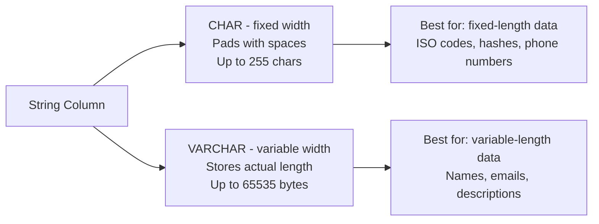

# How to Use CHAR vs VARCHAR in MySQL

Author: [nawazdhandala](https://www.github.com/nawazdhandala)

Tags: MySQL, SQL, Data Type, String, Database

Description: Understand the differences between CHAR and VARCHAR in MySQL, how each stores strings, when to choose one over the other, and their performance implications.

---

## CHAR vs VARCHAR Overview

Both `CHAR` and `VARCHAR` store character strings, but they differ in how they allocate storage and handle trailing spaces.



## CHAR

`CHAR(M)` always reserves exactly M characters. If the stored value is shorter, MySQL right-pads it with spaces. When reading, trailing spaces are stripped.

- **Length:** 0 to 255 characters.
- **Storage:** always M bytes (for single-byte charsets) or M x bytes_per_char for multi-byte charsets.
- **Retrieval:** trailing spaces removed automatically.

## VARCHAR

`VARCHAR(M)` stores only the actual characters plus a 1-byte or 2-byte length prefix.

- **Length:** 0 to 65,535 bytes (shared with the full row limit).
- **Storage:** actual string length + 1 byte (if M <= 255) or + 2 bytes (if M > 255).
- **Retrieval:** trailing spaces preserved.

## Side-by-Side Syntax

```sql
column_name CHAR(10)        -- fixed 10-character string
column_name VARCHAR(255)    -- up to 255 characters, variable length
```

## Storage Comparison

```sql
CREATE TABLE char_vs_varchar_demo (
    id          INT AUTO_INCREMENT PRIMARY KEY,
    fixed_code  CHAR(10),       -- always 10 bytes (latin1)
    variable_desc VARCHAR(100)  -- actual length + 1 byte
);

INSERT INTO char_vs_varchar_demo (fixed_code, variable_desc) VALUES
('US',  'Short'),
('GBR', 'A longer description that uses more bytes');
```

For `fixed_code`:
- `'US'` is stored as `'US        '` (8 trailing spaces added).
- `'GBR'` is stored as `'GBR       '` (7 trailing spaces added).
- Both consume 10 bytes.

For `variable_desc`:
- `'Short'` consumes 6 bytes (5 chars + 1 length byte).
- The longer string consumes 42 bytes (41 chars + 1 length byte).

## Practical Examples

### CHAR for Fixed-Length Codes

```sql
CREATE TABLE countries (
    id            INT AUTO_INCREMENT PRIMARY KEY,
    iso2_code     CHAR(2) NOT NULL UNIQUE,    -- always 2 characters
    iso3_code     CHAR(3) NOT NULL UNIQUE,    -- always 3 characters
    name          VARCHAR(100) NOT NULL,
    phone_prefix  CHAR(6)                     -- e.g., '+1', '+44'
);

INSERT INTO countries (iso2_code, iso3_code, name, phone_prefix) VALUES
('US', 'USA', 'United States', '+1'),
('GB', 'GBR', 'United Kingdom', '+44'),
('JP', 'JPN', 'Japan', '+81');
```

### VARCHAR for Names and Emails

```sql
CREATE TABLE users (
    id         INT AUTO_INCREMENT PRIMARY KEY,
    first_name VARCHAR(50) NOT NULL,
    last_name  VARCHAR(50) NOT NULL,
    email      VARCHAR(255) NOT NULL UNIQUE,
    bio        VARCHAR(500)
);

INSERT INTO users (first_name, last_name, email, bio) VALUES
('Alice', 'Smith',   'alice@example.com',  'Software engineer'),
('Bob',   'Johnson', 'bob@example.com',    NULL),
('Carol', 'Williams','carol@example.com',  'Designer and photographer with 10 years of experience');
```

### CHAR for Hash Storage

```sql
CREATE TABLE file_hashes (
    id          INT AUTO_INCREMENT PRIMARY KEY,
    filename    VARCHAR(255) NOT NULL,
    md5_hash    CHAR(32) NOT NULL,    -- MD5 is always 32 hex chars
    sha256_hash CHAR(64) NOT NULL,    -- SHA-256 is always 64 hex chars
    uploaded_at DATETIME NOT NULL DEFAULT CURRENT_TIMESTAMP
);
```

## Trailing Space Behavior

```sql
-- CHAR strips trailing spaces on retrieval
CREATE TABLE space_test (
    c CHAR(10),
    v VARCHAR(10)
);

INSERT INTO space_test VALUES ('hello     ', 'hello     ');

SELECT CONCAT('[', c, ']') AS char_value,
       CONCAT('[', v, ']') AS varchar_value
FROM space_test;
```

```text
+-------------+---------------+
| char_value  | varchar_value |
+-------------+---------------+
| [hello]     | [hello     ]  |
+-------------+---------------+
```

## Collation and Comparison

```sql
-- CHAR comparison ignores trailing spaces for equality
SELECT 'hello' = 'hello   ';   -- Result: 1 (true)

-- VARCHAR comparison also ignores trailing spaces in SQL comparisons
-- (per SQL standard, but preserved in storage)
SELECT 'hello' = 'hello   ';   -- Result: 1 (true)
```

## Choosing CHAR vs VARCHAR

| Scenario | Use |
|---|---|
| Fixed-length strings (ISO codes, hash digests) | `CHAR` |
| UUIDs stored as hex strings | `CHAR(36)` |
| Variable-length names, emails, titles | `VARCHAR` |
| Columns that are frequently NULL or empty | `VARCHAR` (saves space) |
| Columns updated frequently to different lengths | `CHAR` (avoids row fragmentation) |
| Multi-byte charsets (utf8mb4) | Consider VARCHAR; CHAR reserves M*4 bytes |

## Performance Notes

- `CHAR` columns with fixed length can be faster on full table scans because MySQL can compute row offsets without reading length bytes.
- `VARCHAR` rows can become fragmented in InnoDB when updated to longer values, requiring `OPTIMIZE TABLE` periodically.
- Indexes on `CHAR` columns have predictable sizes; indexes on `VARCHAR` columns vary.

## Best Practices

- Use `CHAR` for truly fixed-width data: country codes, currency codes, hash strings, UUIDs, and similar identifiers.
- Use `VARCHAR` for everything else: names, titles, descriptions, email addresses, URLs.
- Set `VARCHAR` length to a realistic maximum rather than defaulting to 255 everywhere; the declared length affects `MEMORY` table storage and some optimizer decisions.
- Avoid storing large text in `VARCHAR(65535)`; use `TEXT` types instead to keep the row size manageable.
- Always specify a character set (`utf8mb4`) to ensure consistent multi-byte handling.

## Summary

`CHAR(M)` reserves exactly M characters and pads shorter values with spaces, making it ideal for fixed-length strings like ISO codes and hash digests. `VARCHAR(M)` stores only the actual characters plus a length prefix, making it efficient for variable-length data like names and email addresses. Choose `CHAR` when the length is always the same; choose `VARCHAR` when it varies. For multi-byte character sets, note that `CHAR(M)` reserves M times the max bytes per character.
