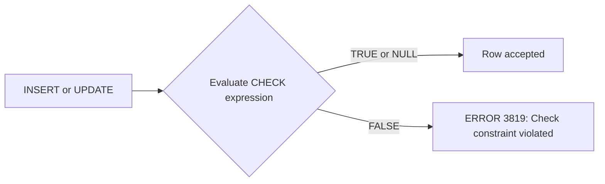

# How to Use CHECK Constraints in MySQL 8.0+

Author: [nawazdhandala](https://www.github.com/nawazdhandala)

Tags: MySQL, SQL, DDL, Constraint, CHECK, Schema

Description: Enforce data validation rules directly in the MySQL schema using CHECK constraints introduced in MySQL 8.0.16, with named constraints and complex expressions.

---

## How It Works

A `CHECK` constraint defines a boolean expression that every row must satisfy. MySQL evaluates the expression on INSERT and UPDATE. If the expression evaluates to FALSE, MySQL rejects the statement with a constraint violation error. Expressions that evaluate to NULL pass the check (MySQL follows SQL standard behaviour here).

`CHECK` constraints were accepted syntactically but silently ignored in MySQL versions before 8.0.16. They are enforced starting from 8.0.16.



## Syntax

### Inline (column-level) CHECK

```sql
column_name data_type CHECK (expression)
```

### Table-level named CHECK

```sql
[CONSTRAINT constraint_name] CHECK (expression) [NOT ENFORCED]
```

## Basic Examples

### Column-level CHECK

```sql
CREATE TABLE employees (
    id         INT UNSIGNED AUTO_INCREMENT PRIMARY KEY,
    name       VARCHAR(100) NOT NULL,
    age        TINYINT UNSIGNED NOT NULL CHECK (age >= 18),
    salary     DECIMAL(10,2)    NOT NULL CHECK (salary > 0)
);
```

### Named Table-level CHECK

```sql
CREATE TABLE products (
    id           INT UNSIGNED AUTO_INCREMENT PRIMARY KEY,
    name         VARCHAR(255)   NOT NULL,
    price        DECIMAL(10, 2) NOT NULL,
    discount_pct DECIMAL(5, 2)  NOT NULL DEFAULT 0.00,
    CONSTRAINT chk_price_positive
        CHECK (price > 0),
    CONSTRAINT chk_discount_range
        CHECK (discount_pct >= 0 AND discount_pct <= 100)
);
```

## Testing CHECK Constraints

```sql
INSERT INTO products (name, price, discount_pct) VALUES ('Widget', 9.99, 10.0);
-- Succeeds

INSERT INTO products (name, price, discount_pct) VALUES ('Gadget', -5.00, 0.0);
-- Fails
```

```text
ERROR 3819 (HY000): Check constraint 'chk_price_positive' is violated.
```

```sql
INSERT INTO products (name, price, discount_pct) VALUES ('Gadget', 5.00, 150.0);
-- Fails
```

```text
ERROR 3819 (HY000): Check constraint 'chk_discount_range' is violated.
```

## Multi-Column CHECK Expressions

CHECK constraints can reference multiple columns in the same table.

```sql
CREATE TABLE events (
    id         INT UNSIGNED AUTO_INCREMENT PRIMARY KEY,
    title      VARCHAR(255) NOT NULL,
    start_time DATETIME     NOT NULL,
    end_time   DATETIME     NOT NULL,
    CONSTRAINT chk_event_times
        CHECK (end_time > start_time)
);

INSERT INTO events (title, start_time, end_time)
VALUES ('Conference', '2024-07-01 09:00:00', '2024-07-01 08:00:00');
```

```text
ERROR 3819 (HY000): Check constraint 'chk_event_times' is violated.
```

## Complete Working Example

```sql
CREATE TABLE orders (
    id           INT UNSIGNED AUTO_INCREMENT PRIMARY KEY,
    user_id      INT UNSIGNED   NOT NULL,
    quantity     SMALLINT UNSIGNED NOT NULL,
    unit_price   DECIMAL(10, 2)    NOT NULL,
    discount_pct DECIMAL(5, 2)     NOT NULL DEFAULT 0.00,
    status       VARCHAR(20)       NOT NULL DEFAULT 'pending',
    CONSTRAINT chk_quantity_positive
        CHECK (quantity > 0),
    CONSTRAINT chk_unit_price_positive
        CHECK (unit_price > 0),
    CONSTRAINT chk_discount_valid
        CHECK (discount_pct >= 0 AND discount_pct < 100),
    CONSTRAINT chk_status_values
        CHECK (status IN ('pending', 'processing', 'shipped', 'delivered', 'cancelled'))
);

-- Valid insert
INSERT INTO orders (user_id, quantity, unit_price)
VALUES (1, 3, 29.99);

-- Invalid: quantity must be positive
INSERT INTO orders (user_id, quantity, unit_price)
VALUES (1, 0, 29.99);
```

```text
ERROR 3819 (HY000): Check constraint 'chk_quantity_positive' is violated.
```

## Adding a CHECK Constraint to an Existing Table

```sql
ALTER TABLE products
    ADD CONSTRAINT chk_stock_non_negative
        CHECK (stock_count >= 0);
```

If existing rows violate the constraint, the `ALTER TABLE` fails. Fix the data first.

```sql
UPDATE products SET stock_count = 0 WHERE stock_count < 0;
ALTER TABLE products
    ADD CONSTRAINT chk_stock_non_negative
        CHECK (stock_count >= 0);
```

## Dropping a CHECK Constraint

```sql
ALTER TABLE products
    DROP CHECK chk_stock_non_negative;
```

## Viewing CHECK Constraints

```sql
SELECT CONSTRAINT_NAME, CHECK_CLAUSE, ENFORCED
FROM information_schema.CHECK_CONSTRAINTS
WHERE CONSTRAINT_SCHEMA = DATABASE()
ORDER BY CONSTRAINT_NAME;
```

```text
+-------------------------+-------------------------------------+----------+
| CONSTRAINT_NAME         | CHECK_CLAUSE                        | ENFORCED |
+-------------------------+-------------------------------------+----------+
| chk_discount_range      | ((`discount_pct` >= 0) and ...)     | YES      |
| chk_price_positive      | (`price` > 0)                       | YES      |
+-------------------------+-------------------------------------+----------+
```

## NOT ENFORCED Option

You can define a constraint without enforcing it (for documentation purposes).

```sql
CONSTRAINT chk_legacy_field CHECK (legacy_id > 0) NOT ENFORCED;
```

## CHECK vs ENUM vs Application Validation

| Approach | Enforced at DB level | Flexible | Best For |
|---|---|---|---|
| `CHECK` | Yes | Yes | Range checks, cross-column logic |
| `ENUM` | Yes | Limited (DDL change to add) | Predefined string values |
| `NOT NULL` | Yes | No | Mandatory fields |
| Application | No (unless also in DB) | Yes | Complex business rules |

## Best Practices

- Always name CHECK constraints (`CONSTRAINT chk_...`) so error messages identify them clearly.
- Use CHECK for numeric ranges, string pattern enforcement, and cross-column consistency rules.
- Prefer `ENUM` over `CHECK (col IN (...))` for fixed string-value columns - ENUM is more efficient and self-documenting in `DESCRIBE`.
- Fix existing data before adding a new CHECK constraint to an existing table.
- Verify you are on MySQL 8.0.16+ before relying on CHECK enforcement.

## Summary

CHECK constraints in MySQL 8.0.16+ enforce data validity rules at the database level. Name your constraints with the `CONSTRAINT chk_...` syntax for clear error messages. They support complex boolean expressions including cross-column comparisons, range checks, and `IN (...)` membership tests. Add them to existing tables with `ALTER TABLE ADD CONSTRAINT` after ensuring existing data complies, and view them in `information_schema.CHECK_CONSTRAINTS`.
