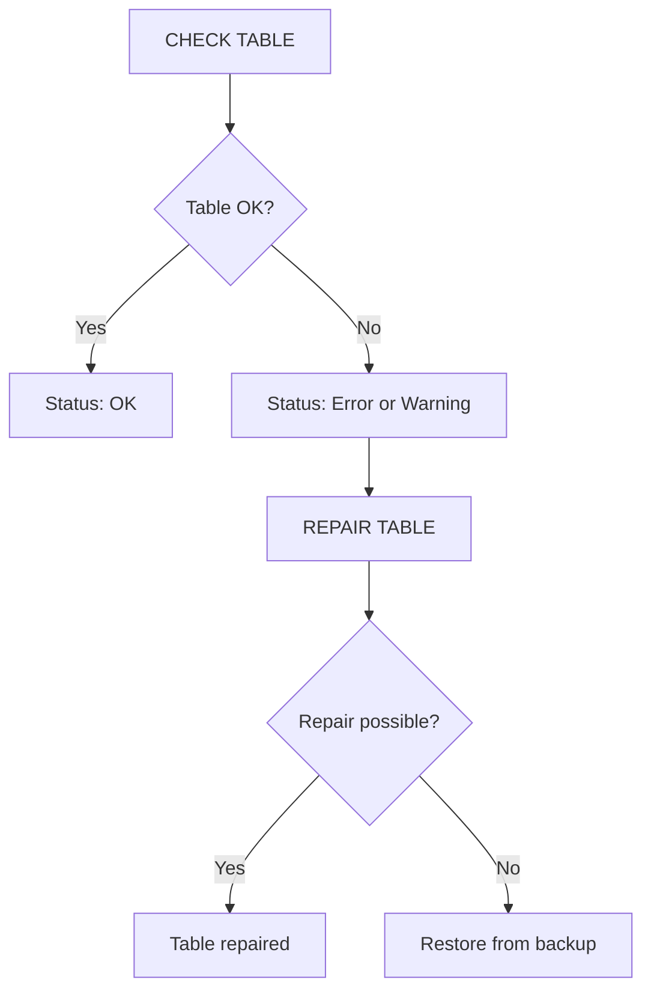

# How to Use MySQL CHECK TABLE and REPAIR TABLE

Author: [nawazdhandala](https://www.github.com/nawazdhandala)

Tags: MySQL, SQL, CHECK TABLE, REPAIR TABLE, InnoDB, Database Administration

Description: Learn how to use MySQL CHECK TABLE and REPAIR TABLE to verify table integrity, detect corruption, and recover damaged MyISAM and InnoDB tables.

---

## How CHECK TABLE and REPAIR TABLE Work

`CHECK TABLE` verifies the internal consistency of a table by reading its data pages and index structure. It reports whether the table is healthy or corrupt. `REPAIR TABLE` attempts to fix a corrupted table by rebuilding indexes and removing damaged rows. Both commands work on MyISAM, CSV, and ARCHIVE engines; InnoDB has its own crash recovery mechanism but also supports `CHECK TABLE` for basic validation.



## Syntax

```sql
CHECK TABLE table1 [, table2 ...] [option]
REPAIR TABLE table1 [, table2 ...] [option]
```

**CHECK TABLE options:**

```text
QUICK    - Skip row scan; check only index tree without reading data rows
FAST     - Check only tables not properly closed (MyISAM)
MEDIUM   - Check row data and index consistency (default)
EXTENDED - Full scan and index re-verification (slowest, most thorough)
CHANGED  - Check only tables changed since last check
```

**REPAIR TABLE options:**

```text
QUICK    - Fix index only without touching data rows
EXTENDED - Rebuild indexes row by row (slower but more thorough)
USE_FRM  - Use .frm file as reference for index structure (MyISAM only)
```

## Setup: Sample Tables

```sql
CREATE TABLE myisam_log (
    id      INT AUTO_INCREMENT PRIMARY KEY,
    message TEXT,
    logged  DATETIME NOT NULL DEFAULT NOW()
) ENGINE=MyISAM;

CREATE TABLE innodb_orders (
    id       INT AUTO_INCREMENT PRIMARY KEY,
    customer VARCHAR(100),
    total    DECIMAL(10,2)
) ENGINE=InnoDB;

INSERT INTO myisam_log (message) VALUES ('App started'), ('User logged in'), ('Order placed');
INSERT INTO innodb_orders (customer, total) VALUES ('Alice', 199.99), ('Bob', 89.50);
```

## CHECK TABLE

**Basic check:**

```sql
CHECK TABLE myisam_log;
CHECK TABLE innodb_orders;
```

```text
+-------------------+-------+----------+----------+
| Table             | Op    | Msg_type | Msg_text |
+-------------------+-------+----------+----------+
| demo.myisam_log   | check | status   | OK       |
| demo.innodb_orders| check | status   | OK       |
+-------------------+-------+----------+----------+
```

**Extended check (thorough):**

```sql
CHECK TABLE myisam_log EXTENDED;
```

**Quick check (index only):**

```sql
CHECK TABLE myisam_log QUICK;
```

**Check multiple tables at once:**

```sql
CHECK TABLE categories, products, orders;
```

## Interpreting CHECK TABLE Output

```text
Msg_type    Meaning
--------    -------
status OK   Table is healthy
warning     Minor issue detected (e.g., deleted row count mismatch)
error       Table is corrupt - needs REPAIR
note        Informational (e.g., table does not support check)
```

For InnoDB, a check returning `note: The storage engine for the table doesn't support check` in older MySQL versions means InnoDB uses its own internal crash recovery and not all check modes apply.

## REPAIR TABLE (MyISAM)

If `CHECK TABLE` reports an error:

```sql
REPAIR TABLE myisam_log;
```

```text
+-----------------+--------+----------+----------+
| Table           | Op     | Msg_type | Msg_text |
+-----------------+--------+----------+----------+
| demo.myisam_log | repair | status   | OK       |
+-----------------+--------+----------+----------+
```

**Extended repair (most thorough):**

```sql
REPAIR TABLE myisam_log EXTENDED;
```

**Quick repair (index only):**

```sql
REPAIR TABLE myisam_log QUICK;
```

## InnoDB Corruption Recovery

InnoDB does not use `REPAIR TABLE` for data recovery. Instead, use these approaches:

**1. Allow InnoDB crash recovery on restart:**

```text
# In my.cnf:
[mysqld]
innodb_force_recovery = 1
```

Values 1-6 progressively bypass more InnoDB safety checks. Use the lowest value that allows the server to start.

**2. Export and reimport with forced recovery active:**

```bash
# With innodb_force_recovery = 1 active:
mysqldump mydb corrupted_table > corrupted_table.sql

# Stop server, remove innodb_force_recovery, restart
# Then reimport:
mysql mydb < corrupted_table.sql
```

**3. Recreate from a backup** when recovery fails completely.

## Checking All Tables in a Database

```bash
# Using mysqlcheck (command-line tool):
mysqlcheck -u root -p --databases mydb

# Check and auto-repair all MyISAM tables:
mysqlcheck -u root -p --auto-repair --databases mydb

# Check all databases:
mysqlcheck -u root -p --all-databases
```

## Automating Checks with Events

```sql
CREATE EVENT weekly_table_check
ON SCHEDULE EVERY 1 WEEK
STARTS '2026-04-07 02:00:00'
DO
    CHECK TABLE myisam_log, innodb_orders;
```

## Monitoring Results Programmatically

Capture CHECK TABLE output in a stored procedure:

```sql
DELIMITER //
CREATE PROCEDURE check_all_tables(IN db_name VARCHAR(64))
BEGIN
    DECLARE done INT DEFAULT FALSE;
    DECLARE tbl  VARCHAR(64);
    DECLARE cur CURSOR FOR
        SELECT TABLE_NAME FROM information_schema.TABLES
        WHERE TABLE_SCHEMA = db_name AND TABLE_TYPE = 'BASE TABLE';
    DECLARE CONTINUE HANDLER FOR NOT FOUND SET done = TRUE;

    OPEN cur;
    read_loop: LOOP
        FETCH cur INTO tbl;
        IF done THEN LEAVE read_loop; END IF;
        SET @sql = CONCAT('CHECK TABLE `', db_name, '`.`', tbl, '`');
        PREPARE stmt FROM @sql;
        EXECUTE stmt;
        DEALLOCATE PREPARE stmt;
    END LOOP;
    CLOSE cur;
END//
DELIMITER ;

CALL check_all_tables('mydb');
```

## Best Practices

- Run `CHECK TABLE` during low-traffic periods - it acquires a read lock (or in some modes a write lock) on the table.
- For InnoDB tables, `CHECK TABLE` is non-blocking in MySQL 8.0+ for read checks; avoid using EXTENDED on large production tables.
- Use `mysqlcheck --auto-repair` for bulk checks of MyISAM databases.
- Never rely solely on `REPAIR TABLE` for critical data recovery - always have an up-to-date backup.
- Set `innodb_force_recovery` only temporarily and only as low as needed; higher values skip more integrity checks and can cause further data loss.
- Prefer InnoDB over MyISAM for production tables - InnoDB's crash recovery is automatic and far more robust.

## Summary

`CHECK TABLE` verifies table integrity and reports errors, warnings, or OK status. `REPAIR TABLE` rebuilds indexes and removes corrupt rows in MyISAM tables. For InnoDB, corruption recovery relies on `innodb_force_recovery` and database dumps rather than `REPAIR TABLE`. Use `mysqlcheck` on the command line for bulk checks across databases. Always maintain regular backups so that when repairs fail, you can restore from a known-good state.
