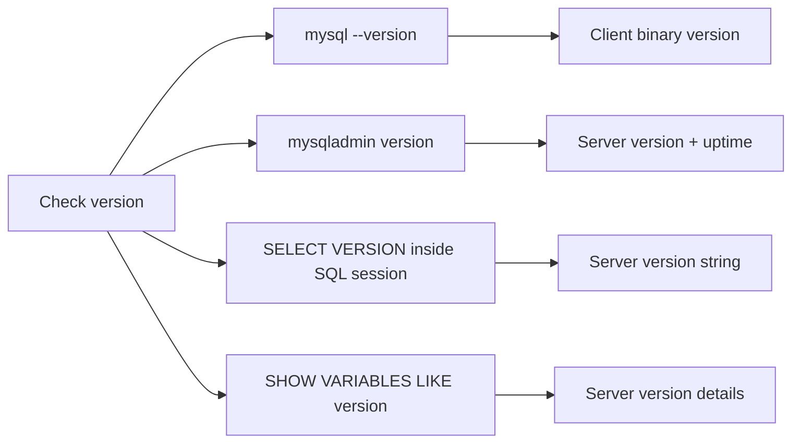

# How to Check Your MySQL Version

Author: [OneUptime](https://oneuptime.com)

Tags: MySQL, Administration, Version, CLI, Database

Description: Check the MySQL server and client version from the command line, from within a SQL session, and using mysqladmin on Linux, Windows, and macOS.

---

## How It Works

MySQL exposes its version through multiple channels: the `mysql --version` client flag, the `VERSION()` SQL function, the `@@version` system variable, and the `mysqladmin version` command. Each provides slightly different output and is useful in different contexts.



## Check the MySQL Client Version

The client binary version can differ from the server version when you connect remotely.

```bash
mysql --version
```

```text
mysql  Ver 8.0.36  Distrib 8.0.36, for Linux (x86_64) using  EditLine wrapper
```

Short form:

```bash
mysql -V
```

## Check the MySQL Server Version with mysqladmin

`mysqladmin` connects to the running server and returns runtime information.

```bash
mysqladmin -u root -p version
```

```text
mysqladmin  Ver 8.0.36 Distrib 8.0.36, for Linux (x86_64)
Copyright (c) 2000, 2024, Oracle and/or its affiliates.

Server version          8.0.36
Protocol version        10
Connection              Localhost via UNIX socket
UNIX socket             /run/mysqld/mysqld.sock
Uptime:                 1 hour 22 min 15 sec

Threads: 2  Questions: 94  Slow queries: 0  Opens: 120  Flush tables: 3  Open tables: 37  Queries per second avg: 0.019
```

## Check the Version Inside a SQL Session

Connect to MySQL and run any of the following queries.

### Using VERSION() function

```sql
SELECT VERSION();
```

```text
+-----------+
| VERSION() |
+-----------+
| 8.0.36    |
+-----------+
```

### Using the @@version system variable

```sql
SELECT @@version;
```

```text
+-----------+
| @@version |
+-----------+
| 8.0.36    |
+-----------+
```

### Detailed version information

```sql
SHOW VARIABLES LIKE 'version%';
```

```text
+-------------------------+------------------------------+
| Variable_name           | Value                        |
+-------------------------+------------------------------+
| version                 | 8.0.36                       |
| version_comment         | MySQL Community Server - GPL |
| version_compile_machine | x86_64                       |
| version_compile_os      | Linux                        |
| version_compile_zlib    | 1.2.12                       |
+-------------------------+------------------------------+
```

## Check the Version Without Connecting

On Linux, you can also query the version from system package information.

```bash
# Debian / Ubuntu
dpkg -l mysql-server | tail -1

# RHEL / Rocky / AlmaLinux
rpm -q mysql-community-server
```

```text
mysql-community-server-8.0.36-1.el9.x86_64
```

## Check the Version on Windows

Open Command Prompt or PowerShell.

```bash
mysql --version
```

```text
mysql  Ver 8.0.36 Distrib 8.0.36, for Win64 (x86_64)
```

Or check via PowerShell service information:

```bash
Get-WmiObject Win32_Product | Where-Object { $_.Name -like "MySQL*" } | Select-Object Name, Version
```

```text
Name                 Version
----                 -------
MySQL Server 8.0     8.0.36.0
```

## Check the Version on macOS (Homebrew)

```bash
mysql --version
brew info mysql
```

```text
mysql: stable 8.0.36 (bottled)
```

## One-Line Version Check Without Connecting

Avoid interactive prompts by passing the `-e` flag.

```bash
mysql -u root -p -e "SELECT VERSION();" 2>/dev/null
```

Or without a password prompt for scripting (not recommended for production):

```bash
mysql -u root -pYourPassword -e "SELECT VERSION();" 2>/dev/null
```

## Parsing the Version in a Shell Script

```bash
MYSQL_VERSION=$(mysql -u root -p"${MYSQL_PASSWORD}" -e "SELECT VERSION();" 2>/dev/null | tail -1)
echo "Running MySQL $MYSQL_VERSION"
```

```text
Running MySQL 8.0.36
```

## Summary

The quickest way to check the MySQL version is `mysql --version` for the client version or `mysqladmin -u root -p version` for the running server version. Inside a SQL session, `SELECT VERSION()` or `SHOW VARIABLES LIKE 'version%'` provide the server version and compile-time details. On Linux, the package manager (`dpkg -l` or `rpm -q`) also shows the installed package version. Always verify both client and server versions when troubleshooting compatibility issues.
