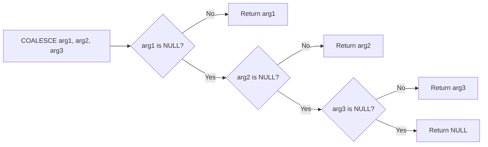

# How to Use MySQL COALESCE Function

Author: [nawazdhandala](https://www.github.com/nawazdhandala)

Tags: MySQL, SQL, COALESCE, NULL Handling, Database

Description: Learn how to use the MySQL COALESCE function to return the first non-NULL value from a list, handling missing data cleanly in queries and reports.

---

## How COALESCE Works

`COALESCE` accepts a variable number of arguments and returns the first one that is not NULL. If all arguments are NULL, it returns NULL. It is the SQL-standard way to handle missing values and is more flexible than `IFNULL`, which only accepts two arguments.



## Syntax

```sql
COALESCE(value1, value2, ..., valueN)
```

- Accepts any number of arguments.
- Returns the first non-NULL value.
- All arguments should be of compatible types.

## Setup: Sample Table

```sql
CREATE TABLE contacts (
    id            INT AUTO_INCREMENT PRIMARY KEY,
    name          VARCHAR(100),
    mobile_phone  VARCHAR(20),
    home_phone    VARCHAR(20),
    work_phone    VARCHAR(20),
    preferred_email VARCHAR(100),
    backup_email    VARCHAR(100),
    credit_limit  DECIMAL(10,2),
    discount_pct  DECIMAL(5,2)
);

INSERT INTO contacts
    (name,    mobile_phone,   home_phone,    work_phone,   preferred_email,         backup_email,            credit_limit, discount_pct)
VALUES
('Alice',  '+1-212-555-0100', NULL,          NULL,         'alice@personal.com',    'alice@work.com',        5000.00,      NULL),
('Bob',    NULL,              '312-555-0199',NULL,         NULL,                    'bob@company.com',       2500.00,      5.00),
('Carol',  NULL,              NULL,          '415-555-0133','carol@company.com',    NULL,                    NULL,         10.00),
('Dave',   NULL,              NULL,          NULL,          NULL,                   NULL,                    1000.00,      NULL),
('Eve',    '+1-800-555-0123', '503-555-0177', NULL,         'eve@home.com',         'eve@office.com',        NULL,         15.00);
```

## Basic COALESCE Usage

**Example - get the best available phone number:**

```sql
SELECT
    name,
    COALESCE(mobile_phone, home_phone, work_phone, 'No phone on file') AS best_phone
FROM contacts;
```

```text
+-------+-----------------+
| name  | best_phone      |
+-------+-----------------+
| Alice | +1-212-555-0100 |
| Bob   | 312-555-0199    |
| Carol | 415-555-0133    |
| Dave  | No phone on file|
| Eve   | +1-800-555-0123 |
+-------+-----------------+
```

**Example - get the first available email:**

```sql
SELECT
    name,
    COALESCE(preferred_email, backup_email, 'unknown@example.com') AS contact_email
FROM contacts;
```

## COALESCE with Numeric Defaults

When a nullable numeric column is used in arithmetic, NULLs propagate through calculations. Use `COALESCE` to substitute a default.

**Example - calculate total compensation with NULL-safe discount:**

```sql
SELECT
    name,
    credit_limit,
    discount_pct,
    COALESCE(credit_limit, 0) * (1 + COALESCE(discount_pct, 0) / 100) AS adjusted_credit
FROM contacts;
```

```text
+-------+--------------+--------------+-----------------+
| name  | credit_limit | discount_pct | adjusted_credit |
+-------+--------------+--------------+-----------------+
| Alice | 5000.00      | NULL         | 5000.0000       |
| Bob   | 2500.00      | 5.00         | 2625.0000       |
| Carol | NULL         | 10.00        | 0.0000          |
| Dave  | 1000.00      | NULL         | 1000.0000       |
| Eve   | NULL         | 15.00        | 0.0000          |
+-------+--------------+--------------+-----------------+
```

## COALESCE vs. IFNULL vs. CASE WHEN

```text
Function     Args  Equivalent
-----------  ----  -----------------------------------------------
IFNULL       2     COALESCE(a, b)
COALESCE     N     CASE WHEN a IS NOT NULL THEN a
                        WHEN b IS NOT NULL THEN b ... END
CASE WHEN    N     Most flexible; can use complex conditions
```

Use `IFNULL` for exactly two arguments, `COALESCE` for three or more, and `CASE WHEN` when the fallback logic involves conditions beyond NULL checks.

## COALESCE in JOIN Results

LEFT JOINs produce NULLs for non-matching rows. `COALESCE` can substitute readable defaults.

```sql
CREATE TABLE departments (id INT PRIMARY KEY, dept_name VARCHAR(50));
INSERT INTO departments VALUES (1, 'Engineering'), (2, 'Marketing');

CREATE TABLE emp (id INT PRIMARY KEY, name VARCHAR(50), dept_id INT);
INSERT INTO emp VALUES
    (1, 'Alice', 1),
    (2, 'Bob',   2),
    (3, 'Carol', NULL);

SELECT
    e.name,
    COALESCE(d.dept_name, 'Unassigned') AS department
FROM emp e
LEFT JOIN departments d ON e.dept_id = d.id;
```

```text
+-------+-------------+
| name  | department  |
+-------+-------------+
| Alice | Engineering |
| Bob   | Marketing   |
| Carol | Unassigned  |
+-------+-------------+
```

## COALESCE in ORDER BY

Sort NULLs to the end by using COALESCE to substitute a large/small sentinel value:

```sql
SELECT name, credit_limit
FROM contacts
ORDER BY COALESCE(credit_limit, 0) DESC;
```

## Best Practices

- Use `COALESCE` instead of `IFNULL` whenever checking more than two alternatives - it is SQL standard and more portable.
- Provide a meaningful literal as the final fallback argument so the result is never NULL (unless NULL is intentional).
- In arithmetic expressions always wrap nullable numeric columns in `COALESCE(col, 0)` to prevent NULL propagation.
- `COALESCE` short-circuits: evaluation stops at the first non-NULL argument, so expensive expressions placed later are not evaluated when an earlier argument is non-NULL.
- Be consistent with fallback defaults - avoid mixing string and numeric types across different calls for the same column.

## Summary

`COALESCE` is the SQL-standard function for returning the first non-NULL value from a list of arguments. It is the multi-argument counterpart to `IFNULL` and is especially useful when multiple fallback columns exist, when LEFT JOIN results contain NULLs, or when nullable numeric columns are used in calculations. By wrapping nullable columns in `COALESCE`, you prevent NULL propagation and ensure queries produce meaningful, complete result sets.
