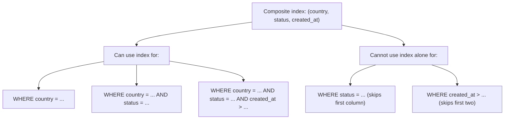

# How to Create a Composite Index in MySQL

Author: [nawazdhandala](https://www.github.com/nawazdhandala)

Tags: MySQL, SQL, Index, Composite Index, Performance, Database

Description: Learn how to create and use composite indexes in MySQL to optimize queries that filter or sort on multiple columns simultaneously.

---

## How Composite Indexes Work

A composite index (also called a multi-column index) covers two or more columns in a single index entry. MySQL sorts index entries by the first column, then by the second, and so on. This means the index is most useful when queries filter on a left-to-right prefix of the indexed columns.



This is known as the **left-prefix rule**.

## Syntax

```sql
-- CREATE INDEX
CREATE INDEX index_name ON table_name (col1, col2, col3);

-- ALTER TABLE
ALTER TABLE table_name ADD INDEX index_name (col1, col2, col3);

-- Inline during CREATE TABLE
CREATE TABLE table_name (
    ...
    INDEX idx_name (col1, col2)
);
```

## Examples

### Setup: Create Sample Table

```sql
CREATE TABLE orders (
    id INT PRIMARY KEY AUTO_INCREMENT,
    customer_id INT NOT NULL,
    country VARCHAR(50) NOT NULL,
    status VARCHAR(20) NOT NULL,
    amount DECIMAL(10, 2) NOT NULL,
    created_at DATETIME DEFAULT CURRENT_TIMESTAMP
);

-- Insert sample data
INSERT INTO orders (customer_id, country, status, amount, created_at)
VALUES
    (1, 'US', 'completed', 150.00, '2026-01-10 10:00:00'),
    (2, 'UK', 'pending',    80.00, '2026-01-11 11:00:00'),
    (3, 'US', 'completed', 200.00, '2026-01-12 09:00:00'),
    (4, 'DE', 'cancelled',  50.00, '2026-01-13 14:00:00'),
    (5, 'US', 'pending',   120.00, '2026-01-14 16:00:00'),
    (6, 'UK', 'completed', 340.00, '2026-01-15 08:00:00');
```

### Create a Composite Index

Create an index on (country, status, created_at) to optimize common queries.

```sql
CREATE INDEX idx_country_status_date
ON orders (country, status, created_at);
```

### Query Using Full Composite Prefix (Most Efficient)

This query uses all three columns in the index prefix order.

```sql
EXPLAIN SELECT id, amount
FROM orders
WHERE country = 'US'
  AND status = 'completed'
  AND created_at >= '2026-01-01';
```

```text
+----+-------------+--------+------+------------------------+...
| id | select_type | table  | type | key                    |
+----+-------------+--------+------+------------------------+...
| 1  | SIMPLE      | orders | range| idx_country_status_date|
+----+-------------+--------+------+------------------------+...
```

`type: range` means MySQL uses the index to scan only the matching range.

### Query Using Partial Prefix

Queries filtering only the first one or two columns also benefit from the index.

```sql
-- Uses index on first column only
EXPLAIN SELECT id FROM orders WHERE country = 'US';

-- Uses index on first two columns
EXPLAIN SELECT id FROM orders WHERE country = 'US' AND status = 'pending';
```

### Query Skipping the First Column (No Index Use)

A filter on status alone cannot use the composite index because the index root is country.

```sql
EXPLAIN SELECT id FROM orders WHERE status = 'completed';
```

```text
+----+...+------+------+...
|    |   | type | key  |
+----+...+------+------+...
| 1  |   | ALL  | NULL |
+----+...+------+------+...
```

`type: ALL` and `key: NULL` indicate a full table scan.

### Column Order Matters: Choose Wisely

Put the most selective (highest cardinality) column first when queries use equality on it, and range columns last.

```sql
-- If queries usually filter by customer_id first, this order is better:
CREATE INDEX idx_customer_status ON orders (customer_id, status);

-- Query that benefits:
SELECT * FROM orders WHERE customer_id = 5 AND status = 'completed';
```

### Composite Index for ORDER BY

A composite index can also speed up ORDER BY when the sort matches the index column order.

```sql
-- This ORDER BY can use the index without a filesort
SELECT id, amount FROM orders
WHERE country = 'US'
ORDER BY status, created_at;
```

```sql
EXPLAIN SELECT id, amount FROM orders WHERE country = 'US' ORDER BY status, created_at;
```

Look for `Using index` or absence of `Using filesort` in the Extra column.

### Covering Composite Index

When the SELECT columns are all covered by the index, MySQL reads the index only without touching the table rows.

```sql
-- All columns (id, amount) are not in the index - table access needed
SELECT id, amount FROM orders WHERE country = 'US' AND status = 'completed';

-- Create a covering index including amount
CREATE INDEX idx_covering ON orders (country, status, amount);

-- Now SELECT amount doesn't need to hit the table
EXPLAIN SELECT amount FROM orders WHERE country = 'US' AND status = 'completed';
-- Extra: Using index (covering index)
```

## Best Practices

- Follow the left-prefix rule: place equality-filtered columns first, range-filtered columns last.
- High-cardinality columns (many distinct values) should usually come before low-cardinality ones.
- Aim for composite indexes that cover the most common query patterns rather than creating many single-column indexes.
- Use EXPLAIN to verify the index is being used and check for `Using filesort` or `Using temporary` in the Extra column.
- Remove redundant indexes - a composite index on (a, b) already covers queries on (a) alone.
- Keep indexes to a reasonable number (3-5 per table) to avoid excessive write overhead.

## Summary

Composite indexes in MySQL cover multiple columns and are sorted by the leftmost column first. Queries must reference a left-to-right prefix of the indexed columns to benefit from the index. Placing equality-filtered columns before range-filtered columns, and higher-cardinality columns before lower-cardinality ones, maximizes index efficiency. Composite indexes can also serve as covering indexes when all queried columns are included, avoiding table row access entirely.
