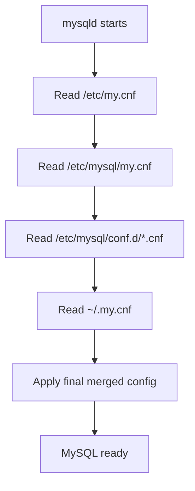

# How to Configure MySQL with my.cnf

Author: [nawazdhandala](https://www.github.com/nawazdhandala)

Tags: MySQL, Configuration, Database, Performance, Administration

Description: Learn how MySQL reads my.cnf, understand the key configuration sections, and tune important settings for performance and reliability.

---

## How It Works

MySQL reads configuration from one or more option files at startup. The main file is `my.cnf` (Unix/Linux/macOS) or `my.ini` (Windows). MySQL processes these files in a fixed order, with later files overriding earlier ones.



## Configuration File Search Order

MySQL searches for option files in the following order on Linux.

```text
/etc/my.cnf
/etc/mysql/my.cnf
/etc/mysql/conf.d/*.cnf
/etc/mysql/mysql.conf.d/*.cnf
~/.my.cnf
```

To see exactly which files MySQL reads and what values are in effect, run:

```bash
mysqld --verbose --help 2>/dev/null | grep "Default options"
```

```text
Default options are read from the following files in the given order:
/etc/my.cnf /etc/mysql/my.cnf ~/.my.cnf
```

## Configuration File Structure

The file is divided into sections. Each section applies to a specific MySQL program.

```text
[mysqld]     - Options for the MySQL server daemon
[mysql]      - Options for the mysql CLI client
[mysqldump]  - Options for mysqldump
[client]     - Options applied to all client programs
[mysqld_safe]- Options for mysqld_safe (older init systems)
```

## A Well-Commented Production my.cnf

```text
[mysqld]

# --- Networking ---
bind-address            = 0.0.0.0
port                    = 3306
max_connections         = 500
max_connect_errors      = 10000

# --- Character Set ---
character-set-server    = utf8mb4
collation-server        = utf8mb4_unicode_ci

# --- InnoDB ---
innodb_buffer_pool_size = 2G       # 50-70% of available RAM for a dedicated server
innodb_buffer_pool_instances = 4   # 1 per GB of buffer pool
innodb_log_file_size    = 512M
innodb_flush_log_at_trx_commit = 1 # 1 = full ACID; 2 = faster but risk 1s of data loss
innodb_flush_method     = O_DIRECT # Avoids double buffering with OS cache

# --- Query Cache (removed in MySQL 8.0) ---
# query_cache_type = 0              # Disabled by default in 8.0

# --- Logging ---
general_log             = 0        # Enable temporarily for debugging only
general_log_file        = /var/log/mysql/general.log
slow_query_log          = 1
slow_query_log_file     = /var/log/mysql/slow.log
long_query_time         = 1        # Log queries taking longer than 1 second
log_queries_not_using_indexes = 1
error_log               = /var/log/mysql/error.log

# --- Binary Logging (required for replication) ---
log_bin                 = /var/log/mysql/mysql-bin
binlog_format           = ROW
expire_logs_days        = 7        # Use binlog_expire_logs_seconds in MySQL 8.0+
server_id               = 1

# --- Temp Tables ---
tmp_table_size          = 64M
max_heap_table_size     = 64M

# --- Thread Cache ---
thread_cache_size       = 16

# --- Open Files ---
open_files_limit        = 65535
table_open_cache        = 4000

[mysql]
# Always show database and user in the prompt
prompt                  = "\\u@\\h [\\d]> "
no-beep

[client]
port                    = 3306
socket                  = /var/run/mysqld/mysqld.sock
```

## Applying Configuration Changes

After editing `my.cnf`, restart MySQL to apply all changes.

```bash
sudo systemctl restart mysql
```

Some variables can be changed at runtime without a restart using `SET GLOBAL`.

```sql
SET GLOBAL slow_query_log = 1;
SET GLOBAL long_query_time = 2;
SET GLOBAL max_connections = 300;
```

To see which variables are currently set:

```sql
SHOW VARIABLES LIKE 'innodb_buffer_pool%';
```

```text
+-------------------------------------+------------+
| Variable_name                       | Value      |
+-------------------------------------+------------+
| innodb_buffer_pool_chunk_size       | 134217728  |
| innodb_buffer_pool_dump_at_shutdown | ON         |
| innodb_buffer_pool_instances        | 4          |
| innodb_buffer_pool_size             | 2147483648 |
+-------------------------------------+------------+
```

## Validating Configuration Before Restart

Before restarting, validate your configuration file to catch typos.

```bash
mysqld --defaults-file=/etc/my.cnf --validate-config
```

If there are no errors, the command exits silently with code 0.

## Including Drop-In Files

Rather than editing the main `my.cnf` directly, place overrides in `/etc/mysql/conf.d/`. This keeps vendor-supplied defaults separate from your customisations.

```bash
sudo tee /etc/mysql/conf.d/tuning.cnf > /dev/null <<'EOF'
[mysqld]
innodb_buffer_pool_size = 4G
max_connections         = 1000
slow_query_log          = 1
long_query_time         = 0.5
EOF
```

## Best Practices

- Keep `my.cnf` in version control so changes are tracked and reviewable.
- Use drop-in files in `conf.d/` rather than modifying the package-provided `my.cnf`.
- Set `innodb_buffer_pool_size` to 50-70% of total RAM on a dedicated database server.
- Always run `--validate-config` before restarting MySQL in production.
- Keep binary logging enabled even if you are not replicating - it enables point-in-time recovery.
- Set `character-set-server = utf8mb4` and `collation-server = utf8mb4_unicode_ci` at the server level to avoid encoding surprises.

## Summary

The `my.cnf` file is the central configuration file for MySQL. It is divided into sections matching each MySQL program, and the server reads files from multiple locations in a defined order. The most impactful settings are `innodb_buffer_pool_size`, `max_connections`, `slow_query_log`, and binary logging parameters. Use drop-in files in `conf.d/` for clean, trackable configuration management, and validate the file with `--validate-config` before every restart.
