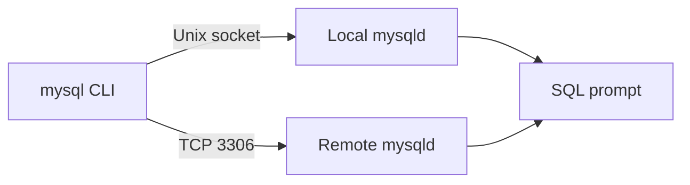

# How to Connect to MySQL with the mysql CLI Client

Author: [nawazdhandala](https://www.github.com/nawazdhandala)

Tags: MySQL, CLI, Client, Connection, Database, Administration

Description: Connect to a local or remote MySQL server using the mysql CLI client, understand connection options, and use common interactive commands.

---

## How It Works

The `mysql` command-line client is the standard tool for interacting with MySQL servers. It connects over TCP/IP or a Unix socket, authenticates, and opens an interactive SQL prompt. You can also pipe SQL files into it for non-interactive use.



## Basic Connection Syntax

```bash
mysql [OPTIONS] [database]
```

The most common flags:

```text
-h, --host       Server hostname or IP (default: localhost via socket)
-P, --port       Port number (default: 3306)
-u, --user       MySQL username
-p, --password   Prompt for password (never supply password on command line)
-D, --database   Database to select on connect
-e, --execute    Run a single SQL statement and exit
--ssl-mode       SSL connection mode (REQUIRED, DISABLED, etc.)
```

## Connecting to a Local Server

Connect to a local MySQL server using the Unix socket (faster than TCP for local connections).

```bash
mysql -u root -p
```

You will be prompted for the password. After authentication you see the MySQL prompt.

```text
Welcome to the MySQL monitor.  Commands end with ; or \g.
Your MySQL connection id is 8
Server version: 8.0.36 MySQL Community Server - GPL

mysql>
```

Select a database on connect.

```bash
mysql -u appuser -p myapp
```

## Connecting to a Remote Server

```bash
mysql -h 192.168.1.100 -P 3306 -u appuser -p myapp
```

## Using a Defaults File to Avoid Typing Credentials

Store credentials in `~/.my.cnf` so you do not need to type them each time. Make sure the file is readable only by you.

```text
[client]
user     = appuser
password = AppPass!2024
host     = localhost
```

```bash
chmod 600 ~/.my.cnf
mysql myapp
```

## Running a Single Query and Exiting

Use `-e` to run a query non-interactively. This is useful in scripts.

```bash
mysql -u root -p -e "SHOW DATABASES;"
```

```text
+--------------------+
| Database           |
+--------------------+
| information_schema |
| myapp              |
| mysql              |
| performance_schema |
| sys                |
+--------------------+
```

## Executing a SQL File

Redirect a `.sql` file into the client.

```bash
mysql -u root -p myapp < schema.sql
```

Or use the `SOURCE` command from inside the interactive prompt.

```sql
SOURCE /path/to/schema.sql;
```

## Useful Interactive Commands

Once inside the MySQL prompt, these commands are frequently used.

```sql
-- Show all databases
SHOW DATABASES;

-- Switch to a database
USE myapp;

-- Show tables in the current database
SHOW TABLES;

-- Describe a table's columns
DESCRIBE users;
-- or
SHOW COLUMNS FROM users;

-- Show create statement for a table
SHOW CREATE TABLE users\G

-- Show running queries
SHOW PROCESSLIST;

-- Show current user and host
SELECT USER(), DATABASE(), VERSION();

-- Show server status variables
SHOW STATUS LIKE 'Threads%';

-- Exit the client
EXIT;
-- or
QUIT;
-- or press Ctrl+D
```

## Customising the Prompt

The MySQL prompt can show the current user, host, and database. Set it in `~/.my.cnf`.

```text
[mysql]
prompt = "\\u@\\h [\\d]> "
```

This displays: `appuser@localhost [myapp]>`

Or set it at runtime.

```sql
PROMPT \u@\h [\d]>\_
```

## Vertical Output Format

For wide result sets, display each row as a column list using `\G` instead of `;`.

```sql
SHOW CREATE TABLE users\G
```

```text
*************************** 1. row ***************************
       Table: users
Create Table: CREATE TABLE `users` (
  `id` int unsigned NOT NULL AUTO_INCREMENT,
  `username` varchar(50) NOT NULL,
  ...
```

## Output to a File

Redirect query output to a file.

```bash
mysql -u root -p myapp -e "SELECT * FROM users;" > users.txt
```

For TSV output suitable for spreadsheets, add `--batch`.

```bash
mysql --batch -u root -p myapp -e "SELECT * FROM users;" > users.tsv
```

## Checking Connection Status

From inside the MySQL prompt, check the current connection details.

```sql
STATUS;
```

```text
--------------
mysql  Ver 8.0.36 Distrib 8.0.36, for Linux (x86_64)

Connection id:          8
Current database:       myapp
Current user:           appuser@localhost
SSL:                    Not in use
Current pager:          stdout
Using outfile:          ''
Using delimiter:        ;
Server version:         8.0.36 MySQL Community Server - GPL
Protocol version:       10
Connection:             Localhost via UNIX socket
Server characterset:    utf8mb4
Db     characterset:    utf8mb4
Client characterset:    utf8mb4
Conn.  characterset:    utf8mb4
UNIX socket:            /var/run/mysqld/mysqld.sock
Uptime:                 2 hours 14 min 7 sec
```

## Best Practices

- Never pass passwords directly on the command line (e.g., `-pMyPassword`); they appear in process listings and shell history.
- Use `~/.my.cnf` with `chmod 600` for passwordless scripting.
- Use `-h 127.0.0.1` instead of `-h localhost` when you need to force TCP/IP rather than the Unix socket.
- Add `--ssl-mode=REQUIRED` when connecting to remote servers to enforce encrypted connections.
- Prefer `--batch` and `-e` for scripting; avoid parsing interactive output.

## Summary

The `mysql` CLI client connects to local servers via the Unix socket and to remote servers via TCP/IP. Common flags are `-u`, `-p`, `-h`, and `-D`. Storing credentials in `~/.my.cnf` simplifies scripting, and using `-e` allows single-query execution in shell scripts. The `\G` output format, `DESCRIBE`, `SHOW CREATE TABLE`, and `STATUS` commands are essential for day-to-day database inspection and administration.
