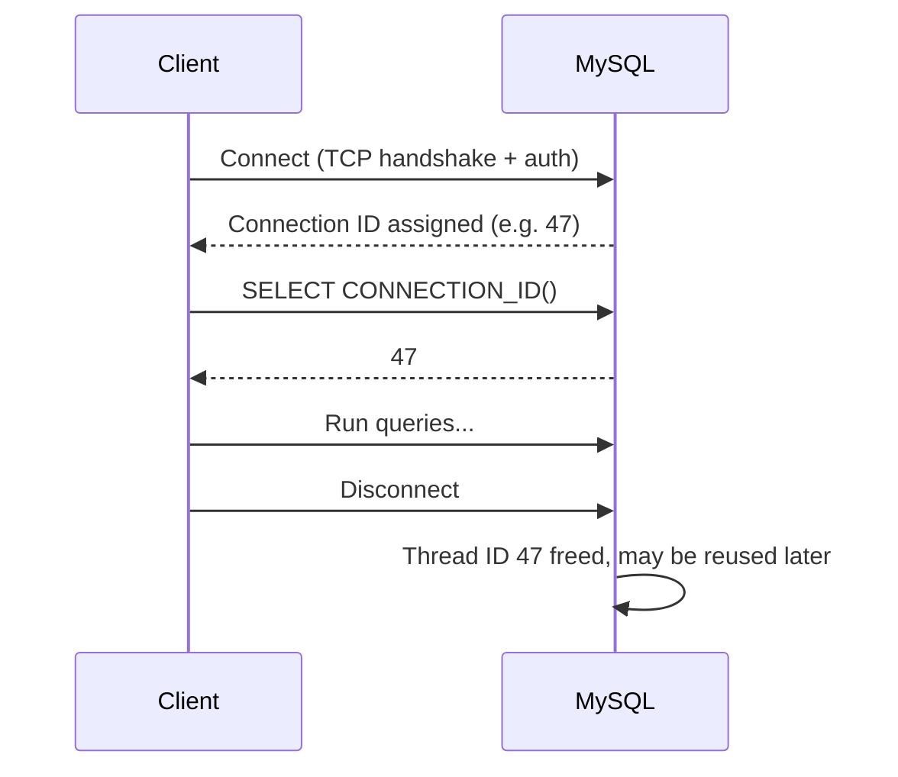
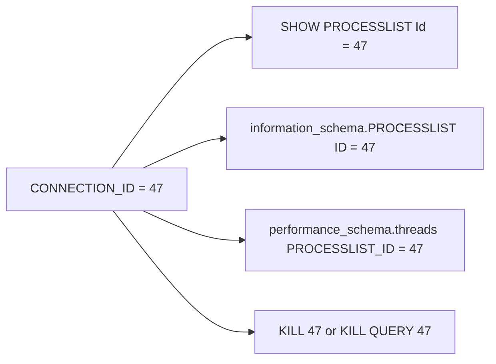

# How to Use CONNECTION_ID() in MySQL

Author: [nawazdhandala](https://www.github.com/nawazdhandala)

Tags: MySQL, Function, Connection, Session, Monitoring

Description: Learn how MySQL CONNECTION_ID() works to retrieve the unique thread ID for the current session and how to use it for debugging, auditing, and kill operations.

---

## Introduction

`CONNECTION_ID()` returns a non-null unsigned integer that uniquely identifies the current client connection (thread) within the MySQL server process. It is the same value shown in the `ID` column of `SHOW PROCESSLIST` and in the `PROCESSLIST_ID` column of the Performance Schema `threads` table.

## Basic usage

```sql
SELECT CONNECTION_ID();
-- Returns: 47  (example - your value will differ)
```

The value increments with each new connection and is reused only after the server restarts or the counter wraps around (unlikely in practice).

## Finding your own connection in SHOW PROCESSLIST

```sql
SHOW PROCESSLIST;
/*
+----+------+-----------+--------+---------+------+-------+------------------+
| Id | User | Host      | db     | Command | Time | State | Info             |
+----+------+-----------+--------+---------+------+-------+------------------+
| 47 | root | localhost | myapp  | Query   |    0 | NULL  | SHOW PROCESSLIST |
+----+------+-----------+--------+---------+------+-------+------------------+
*/

-- Filter to just your own connection
SELECT * FROM information_schema.PROCESSLIST
WHERE ID = CONNECTION_ID();
```

## Audit logging with CONNECTION_ID()

Embedding the connection ID in audit tables makes it easy to trace all activity back to a specific session:

```sql
CREATE TABLE audit_log (
  id            BIGINT UNSIGNED AUTO_INCREMENT PRIMARY KEY,
  connection_id BIGINT UNSIGNED NOT NULL,
  action        VARCHAR(128)    NOT NULL,
  db_user       VARCHAR(128)    NOT NULL DEFAULT (USER()),
  schema_name   VARCHAR(64)     NOT NULL DEFAULT (DATABASE()),
  ts            TIMESTAMP       NOT NULL DEFAULT CURRENT_TIMESTAMP
);

INSERT INTO audit_log (connection_id, action)
VALUES (CONNECTION_ID(), 'EXPORT_USER_DATA');
```

## Killing a long-running query on the same connection

In automated scripts you can save the connection ID at the start and kill the connection if it exceeds a time budget from a separate monitoring session:

```sql
-- In session A: save your own ID
SET @my_conn = CONNECTION_ID();
SELECT @my_conn;

-- In a monitoring session B: kill session A if needed
-- (replace 47 with the actual ID you captured)
KILL 47;
-- or kill just the running query without dropping the connection:
KILL QUERY 47;
```

## Using CONNECTION_ID() in the Performance Schema

```sql
-- Find your thread in the Performance Schema
SELECT
  t.THREAD_ID,
  t.PROCESSLIST_ID,
  t.PROCESSLIST_USER,
  t.PROCESSLIST_HOST,
  t.PROCESSLIST_DB,
  t.PROCESSLIST_STATE,
  t.PROCESSLIST_TIME
FROM performance_schema.threads AS t
WHERE t.PROCESSLIST_ID = CONNECTION_ID();
```

## Locking patterns using CONNECTION_ID() as a lock owner token

```sql
-- Use connection ID as part of the lock name to ensure uniqueness
SELECT GET_LOCK(CONCAT('export_job_', CONNECTION_ID()), 0) AS lock_acquired;

-- ... do work ...

SELECT RELEASE_LOCK(CONCAT('export_job_', CONNECTION_ID()));
```

## Connection lifecycle



## Relationship between IDs



## Important notes

- `CONNECTION_ID()` never changes during the lifetime of a session.
- Each connection gets a unique ID; even if two clients connect simultaneously they receive different IDs.
- After a server restart the counter resets to 1.
- `CONNECTION_ID()` requires no special privilege to call.
- The `THREAD_ID` in Performance Schema differs from `CONNECTION_ID()` - `THREAD_ID` is internal and may include background threads.

## Summary

`CONNECTION_ID()` returns the unique identifier assigned to the current client connection by the MySQL server. It maps directly to the `Id` column in `SHOW PROCESSLIST` and is useful for session-scoped audit logging, generating unique lock names, diagnosing slow queries in the processlist, and issuing targeted `KILL` commands without affecting other connections.
