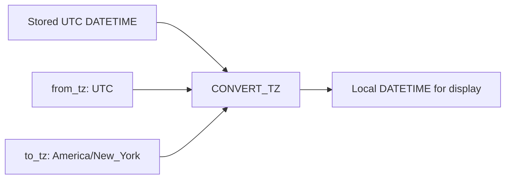

# How to Use MySQL CONVERT_TZ() for Timezone Conversion

Author: [nawazdhandala](https://www.github.com/nawazdhandala)

Tags: MySQL, SQL, Timezone, CONVERT_TZ, DATETIME, Database

Description: Learn how to use MySQL CONVERT_TZ() to convert datetime values between timezones directly in SQL queries for accurate multi-region reporting.

---

## How CONVERT_TZ Works

`CONVERT_TZ` converts a `DATETIME` value from one timezone to another. Unlike the automatic conversion that `TIMESTAMP` columns do for the session timezone, `CONVERT_TZ` lets you specify the source and target timezones explicitly in a query. This is especially useful for converting stored UTC datetimes into local time for reporting without changing the session timezone.



## Syntax

```sql
CONVERT_TZ(dt, from_tz, to_tz)
```

Parameters:

```text
dt       - A DATETIME or date expression
from_tz  - Source timezone (named zone or numeric offset like '+00:00')
to_tz    - Target timezone (named zone or numeric offset)
```

Returns NULL if any argument is NULL or if a named timezone is used but the timezone tables are not loaded.

## Setup: Sample Table

```sql
CREATE TABLE user_events (
    id          INT AUTO_INCREMENT PRIMARY KEY,
    user_id     INT,
    event_type  VARCHAR(50),
    user_region VARCHAR(50),
    occurred_utc DATETIME NOT NULL
);

INSERT INTO user_events (user_id, event_type, user_region, occurred_utc) VALUES
(1, 'login',    'US/East',   '2026-03-31 14:00:00'),
(2, 'purchase', 'UK',        '2026-03-31 09:30:00'),
(3, 'logout',   'India',     '2026-03-31 03:45:00'),
(4, 'signup',   'Australia', '2026-03-30 22:00:00'),
(5, 'login',    'US/West',   '2026-03-31 18:00:00');
```

## Basic CONVERT_TZ Examples

**Convert UTC to specific timezones:**

```sql
SELECT
    occurred_utc                                                        AS utc_time,
    CONVERT_TZ(occurred_utc, 'UTC', 'America/New_York')                AS new_york_time,
    CONVERT_TZ(occurred_utc, 'UTC', 'Europe/London')                   AS london_time,
    CONVERT_TZ(occurred_utc, 'UTC', 'Asia/Kolkata')                    AS india_time,
    CONVERT_TZ(occurred_utc, 'UTC', 'Australia/Sydney')                AS sydney_time
FROM user_events
WHERE id = 1;
```

```text
+---------------------+---------------------+---------------------+---------------------+---------------------+
| utc_time            | new_york_time       | london_time         | india_time          | sydney_time         |
+---------------------+---------------------+---------------------+---------------------+---------------------+
| 2026-03-31 14:00:00 | 2026-03-31 10:00:00 | 2026-03-31 14:00:00 | 2026-03-31 19:30:00 | 2026-04-01 01:00:00 |
+---------------------+---------------------+---------------------+---------------------+---------------------+
```

## Using Numeric Offsets Instead of Named Zones

Named timezones require the timezone tables to be loaded. Numeric offsets always work without additional setup:

```sql
SELECT
    occurred_utc,
    CONVERT_TZ(occurred_utc, '+00:00', '+05:30') AS india_time,
    CONVERT_TZ(occurred_utc, '+00:00', '-05:00') AS est_time
FROM user_events;
```

Note: Numeric offsets do not adjust for daylight saving time. Use named zones when DST accuracy is required.

## Convert Per-Row Based on User Region

```sql
SELECT
    e.user_id,
    e.event_type,
    e.user_region,
    e.occurred_utc AS utc_time,
    CASE e.user_region
        WHEN 'US/East'   THEN CONVERT_TZ(e.occurred_utc, 'UTC', 'America/New_York')
        WHEN 'US/West'   THEN CONVERT_TZ(e.occurred_utc, 'UTC', 'America/Los_Angeles')
        WHEN 'UK'        THEN CONVERT_TZ(e.occurred_utc, 'UTC', 'Europe/London')
        WHEN 'India'     THEN CONVERT_TZ(e.occurred_utc, 'UTC', 'Asia/Kolkata')
        WHEN 'Australia' THEN CONVERT_TZ(e.occurred_utc, 'UTC', 'Australia/Sydney')
        ELSE e.occurred_utc
    END AS local_time
FROM user_events e;
```

## Group by Local Hour (Not UTC Hour)

This is a common reporting scenario where UTC timestamps must be grouped by local business hours.

```sql
SELECT
    HOUR(CONVERT_TZ(occurred_utc, 'UTC', 'America/New_York')) AS local_hour_ny,
    COUNT(*) AS events_count
FROM user_events
WHERE user_region IN ('US/East', 'US/West')
GROUP BY local_hour_ny
ORDER BY local_hour_ny;
```

## Filter by Local Day Boundary

Find events that occurred on March 31 in New York local time, even though some may have different UTC dates:

```sql
SELECT user_id, event_type, occurred_utc
FROM user_events
WHERE CONVERT_TZ(occurred_utc, 'UTC', 'America/New_York')
      BETWEEN '2026-03-31 00:00:00' AND '2026-03-31 23:59:59';
```

## Converting TIMESTAMP Columns

`TIMESTAMP` columns are already stored in UTC. Use `CONVERT_TZ` to display them in a specific timezone without changing the session timezone:

```sql
CREATE TABLE logs (
    id         INT AUTO_INCREMENT PRIMARY KEY,
    message    VARCHAR(255),
    created_at TIMESTAMP NOT NULL DEFAULT NOW()
);

INSERT INTO logs (message) VALUES ('System started');

SELECT
    message,
    created_at                                           AS utc_ts,
    CONVERT_TZ(created_at, @@session.time_zone, 'UTC')  AS explicit_utc,
    CONVERT_TZ(created_at, @@session.time_zone, 'America/Chicago') AS chicago_time
FROM logs;
```

## Loading Named Timezone Tables

If `CONVERT_TZ` returns NULL for named timezones, load the timezone data:

```bash
mysql_tzinfo_to_sql /usr/share/zoneinfo | mysql -u root -p mysql
```

Verify:

```sql
SELECT COUNT(*) FROM mysql.time_zone_name;
-- Should return > 0 (typically 500+)
```

## Best Practices

- Store all datetimes in UTC (`DATETIME` columns with UTC application timezone, or `TIMESTAMP` columns).
- Use `CONVERT_TZ` in SELECT and WHERE for display and filtering; never convert stored values permanently with UPDATE unless migrating data.
- Prefer named zones over numeric offsets for DST-observing regions.
- Avoid `CONVERT_TZ` in WHERE clauses on indexed columns - it prevents index use. Instead, convert the filter value and compare: `WHERE occurred_utc BETWEEN CONVERT_TZ('2026-03-31 00:00', 'America/New_York', 'UTC') AND CONVERT_TZ('2026-03-31 23:59', 'America/New_York', 'UTC')`.
- Ensure timezone tables are populated in production; a NULL return from CONVERT_TZ silently corrupts reports.

## Summary

`CONVERT_TZ(dt, from_tz, to_tz)` converts `DATETIME` values between timezones within a SQL query. It works with both named timezone strings (requiring populated timezone tables) and numeric offset strings (always available). Common uses include displaying UTC events in local time, grouping UTC timestamps by local hour, and filtering across day boundaries in specific timezones. Keeping data stored in UTC and converting for display with `CONVERT_TZ` is the most robust pattern for multi-region applications.
