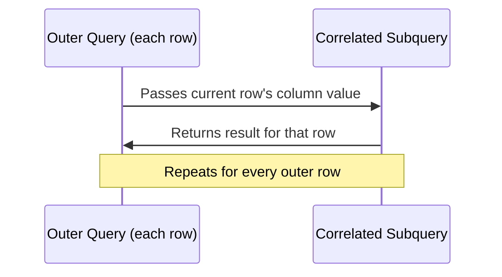

# How to Use Correlated Subqueries in MySQL

Author: [nawazdhandala](https://www.github.com/nawazdhandala)

Tags: MySQL, SQL, Subquery, Correlated Subquery, Database, Query

Description: Learn how correlated subqueries in MySQL reference the outer query's columns, re-executing for each outer row to enable row-by-row comparisons.

---

## How Correlated Subqueries Work

A correlated subquery references one or more columns from the outer query. Unlike a regular subquery that runs once and returns a static result, a correlated subquery runs once for every row processed by the outer query. This makes them flexible but potentially slow on large tables.



## Syntax

```sql
SELECT outer_column
FROM outer_table ot
WHERE some_condition = (
    SELECT aggregate(inner_column)
    FROM inner_table it
    WHERE it.column = ot.column  -- references outer query alias
);
```

The key distinction is the reference `ot.column` inside the inner SELECT - this binds the subquery to the current outer row.

## Examples

### Setup: Create Sample Tables

```sql
CREATE TABLE departments (
    id INT PRIMARY KEY AUTO_INCREMENT,
    name VARCHAR(100) NOT NULL
);

CREATE TABLE employees (
    id INT PRIMARY KEY AUTO_INCREMENT,
    name VARCHAR(100) NOT NULL,
    department_id INT,
    salary DECIMAL(10, 2),
    hire_date DATE
);

INSERT INTO departments (name) VALUES
    ('Engineering'), ('Marketing'), ('Finance');

INSERT INTO employees (name, department_id, salary, hire_date) VALUES
    ('Alice',  1, 105000.00, '2020-03-15'),
    ('Bob',    2,  72000.00, '2021-06-01'),
    ('Carol',  1,  90000.00, '2019-11-20'),
    ('Dave',   3,  88000.00, '2022-01-10'),
    ('Eve',    2,  80000.00, '2020-09-05'),
    ('Frank',  1,  98000.00, '2023-02-28'),
    ('Grace',  3,  92000.00, '2021-07-14');
```

### Find Employees Who Earn More Than Their Department Average

The correlated subquery computes the average salary for the same department as each outer row.

```sql
SELECT e.name,
       e.salary,
       d.name AS department
FROM employees e
INNER JOIN departments d ON e.department_id = d.id
WHERE e.salary > (
    SELECT AVG(e2.salary)
    FROM employees e2
    WHERE e2.department_id = e.department_id
)
ORDER BY d.name, e.salary DESC;
```

```text
+-------+-----------+-------------+
| name  | salary    | department  |
+-------+-----------+-------------+
| Alice | 105000.00 | Engineering |
| Frank |  98000.00 | Engineering |
| Eve   |  80000.00 | Marketing   |
| Grace |  92000.00 | Finance     |
+-------+-----------+-------------+
```

### Find the Most Recent Hire Per Department

The correlated subquery finds the maximum hire_date for each department.

```sql
SELECT e.name, e.hire_date, d.name AS department
FROM employees e
INNER JOIN departments d ON e.department_id = d.id
WHERE e.hire_date = (
    SELECT MAX(e2.hire_date)
    FROM employees e2
    WHERE e2.department_id = e.department_id
)
ORDER BY d.name;
```

```text
+-------+------------+-------------+
| name  | hire_date  | department  |
+-------+------------+-------------+
| Frank | 2023-02-28 | Engineering |
| Eve   | 2020-09-05 | Marketing   |
| Dave  | 2022-01-10 | Finance     |
+-------+------------+-------------+
```

### Correlated Subquery in SELECT Clause

Add a column showing each employee's salary as a percentage of their department's total salary budget.

```sql
SELECT e.name,
       e.salary,
       d.name AS department,
       ROUND(
           e.salary / (
               SELECT SUM(e2.salary)
               FROM employees e2
               WHERE e2.department_id = e.department_id
           ) * 100, 1
       ) AS pct_of_dept_budget
FROM employees e
INNER JOIN departments d ON e.department_id = d.id
ORDER BY d.name, pct_of_dept_budget DESC;
```

```text
+-------+-----------+-------------+--------------------+
| name  | salary    | department  | pct_of_dept_budget |
+-------+-----------+-------------+--------------------+
| Alice | 105000.00 | Engineering |               35.8 |
| Frank |  98000.00 | Engineering |               33.4 |
| Carol |  90000.00 | Engineering |               30.7 |
| Eve   |  80000.00 | Marketing   |               52.6 |
| Bob   |  72000.00 | Marketing   |               47.4 |
| Grace |  92000.00 | Finance     |               51.1 |
| Dave  |  88000.00 | Finance     |               48.9 |
+-------+-----------+-------------+--------------------+
```

### Rewriting as a JOIN for Better Performance

Correlated subqueries in SELECT run once per row. On large tables, rewriting as a JOIN with a derived table is much faster.

```sql
-- Equivalent to the above, but computed once per department
SELECT e.name,
       e.salary,
       d.name AS department,
       ROUND(e.salary / dept_totals.total * 100, 1) AS pct_of_dept_budget
FROM employees e
INNER JOIN departments d ON e.department_id = d.id
INNER JOIN (
    SELECT department_id, SUM(salary) AS total
    FROM employees
    GROUP BY department_id
) dept_totals ON e.department_id = dept_totals.department_id
ORDER BY d.name, pct_of_dept_budget DESC;
```

## Best Practices

- Avoid correlated subqueries in the SELECT list on large result sets - they execute once per row. Use a derived table JOIN instead.
- When using correlated subqueries in WHERE, check with EXPLAIN whether MySQL can optimize them. Modern MySQL 8.0 often transforms them into semi-joins automatically.
- Use `EXISTS` / `NOT EXISTS` rather than correlated scalar comparisons when you only need to check for the presence of a row.
- Always reference the outer query using a clear alias to make the correlation explicit.
- Benchmark correlated vs. JOIN approaches with `EXPLAIN ANALYZE` to pick the faster plan.

## Summary

Correlated subqueries reference columns from the outer query and re-execute for each row the outer query processes. They enable powerful row-level comparisons such as finding employees above their department average or the most recent record per group. However, they can be slow on large datasets because they run N times (once per outer row). When performance matters, consider rewriting correlated subqueries as JOINs with aggregated derived tables.
