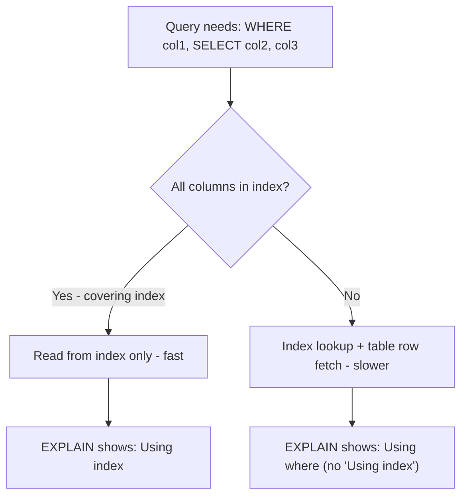

# How to Use Covering Indexes in MySQL

Author: [nawazdhandala](https://www.github.com/nawazdhandala)

Tags: MySQL, SQL, Index, Covering Index, Performance, Database

Description: Learn how covering indexes in MySQL allow queries to be satisfied entirely from the index without accessing the table rows, dramatically improving performance.

---

## How Covering Indexes Work

A covering index is an index that contains all the columns a query needs - the WHERE filter columns, the JOIN columns, and the SELECT columns. When MySQL can satisfy a query entirely from the index without touching the actual table rows, the Extra column in EXPLAIN shows `Using index`. This is the most efficient read pattern because index pages are much smaller than table rows and are more likely to be in memory.



## How to Create a Covering Index

Design the index to include all columns the query references. The column order follows the rule:
1. Equality filter columns first (WHERE col = value)
2. Range filter columns next (WHERE col BETWEEN)
3. Columns in ORDER BY or GROUP BY
4. Remaining SELECT columns last

## Syntax

```sql
CREATE INDEX idx_covering ON table_name (filter_col, sort_col, select_col);
```

## Examples

### Setup: Create Sample Table

```sql
CREATE TABLE user_events (
    id INT PRIMARY KEY AUTO_INCREMENT,
    user_id INT NOT NULL,
    event_type VARCHAR(50) NOT NULL,
    event_date DATE NOT NULL,
    duration_ms INT,
    country VARCHAR(50),
    platform VARCHAR(30),
    session_id VARCHAR(36)
);

-- Insert sample data
INSERT INTO user_events (user_id, event_type, event_date, duration_ms, country, platform, session_id)
SELECT
    1 + (n MOD 1000),
    ELT(1 + (n MOD 4), 'click', 'view', 'purchase', 'scroll'),
    DATE_SUB(CURDATE(), INTERVAL (n MOD 90) DAY),
    100 + (n MOD 5000),
    ELT(1 + (n MOD 3), 'US', 'UK', 'DE'),
    ELT(1 + (n MOD 2), 'mobile', 'desktop'),
    UUID()
FROM (
    SELECT (a.n + b.n * 10 + c.n * 100 + d.n * 1000 + 1) AS n
    FROM (SELECT 0 n UNION SELECT 1 UNION SELECT 2 UNION SELECT 3 UNION SELECT 4
          UNION SELECT 5 UNION SELECT 6 UNION SELECT 7 UNION SELECT 8 UNION SELECT 9) a
    CROSS JOIN (SELECT 0 n UNION SELECT 1 UNION SELECT 2 UNION SELECT 3 UNION SELECT 4
               UNION SELECT 5 UNION SELECT 6 UNION SELECT 7 UNION SELECT 8 UNION SELECT 9) b
    CROSS JOIN (SELECT 0 n UNION SELECT 1 UNION SELECT 2 UNION SELECT 3 UNION SELECT 4
               UNION SELECT 5 UNION SELECT 6 UNION SELECT 7 UNION SELECT 8 UNION SELECT 9) c
    CROSS JOIN (SELECT 0 n UNION SELECT 1 UNION SELECT 2 UNION SELECT 3) d
) nums
WHERE n <= 5000;
```

### Query Without Covering Index

This query filters on user_id and event_type, and selects event_date and duration_ms.

```sql
-- No covering index yet
EXPLAIN SELECT event_date, duration_ms
FROM user_events
WHERE user_id = 42 AND event_type = 'purchase'
ORDER BY event_date;
```

```text
+----+...+------+------+...+------+-----------------------------+
|    |   | type | key  |   | rows | Extra                       |
+----+...+------+------+...+------+-----------------------------+
| 1  |   | ALL  | NULL |   | 5000 | Using where; Using filesort |
+----+...+------+------+...+------+-----------------------------+
```

Full table scan + filesort. Add an index.

### Adding a Non-Covering Index First

```sql
CREATE INDEX idx_user_type ON user_events (user_id, event_type);

EXPLAIN SELECT event_date, duration_ms
FROM user_events
WHERE user_id = 42 AND event_type = 'purchase'
ORDER BY event_date;
```

```text
+----+...+------+--------------+...+------+-----------------------------+
|    |   | type | key          |   | rows | Extra                       |
+----+...+------+--------------+...+------+-----------------------------+
| 1  |   | ref  | idx_user_type|   | 5    | Using index condition;      |
|    |   |      |              |   |      | Using filesort              |
+----+...+------+--------------+...+------+-----------------------------+
```

Better - uses the index for filtering. But MySQL still needs to fetch `event_date` and `duration_ms` from the table rows, and still filesorts.

### Creating a True Covering Index

Include all queried columns: filter columns first, then ORDER BY column, then SELECT columns.

```sql
DROP INDEX idx_user_type ON user_events;

CREATE INDEX idx_covering
ON user_events (user_id, event_type, event_date, duration_ms);

EXPLAIN SELECT event_date, duration_ms
FROM user_events
WHERE user_id = 42 AND event_type = 'purchase'
ORDER BY event_date;
```

```text
+----+...+------+--------------+...+------+-------------+
|    |   | type | key          |   | rows | Extra       |
+----+...+------+--------------+...+------+-------------+
| 1  |   | ref  | idx_covering |   | 5    | Using index |
+----+...+------+--------------+...+------+-------------+
```

`Extra: Using index` - MySQL satisfies the entire query from the index without any table row access.

### Covering Index for COUNT Queries

Even COUNT(*) can benefit from a smaller covering index.

```sql
CREATE INDEX idx_type_date ON user_events (event_type, event_date);

EXPLAIN SELECT COUNT(*) FROM user_events WHERE event_type = 'click';
-- Extra: Using index (counts from index, no table rows read)
```

### Covering Index for JOIN Queries

In joins, covering indexes help when the index covers the join key and the selected columns.

```sql
CREATE TABLE users (
    id INT PRIMARY KEY AUTO_INCREMENT,
    name VARCHAR(100)
);

-- Index covers the join and select columns
CREATE INDEX idx_ue_user_type_date ON user_events (user_id, event_type, event_date);

EXPLAIN
SELECT u.name, ue.event_type, ue.event_date
FROM users u
INNER JOIN user_events ue ON u.id = ue.user_id
WHERE ue.event_type = 'purchase';
```

## Best Practices

- Design covering indexes for your most critical and frequent read queries.
- The trade-off: covering indexes are wider (more columns) and take more disk space and write time to maintain.
- Use `EXPLAIN` and look for `Using index` in the Extra column to confirm coverage.
- For reports or dashboards that run the same query frequently, a covering index can be a significant win.
- Do not blindly add all SELECT columns to every index - target only high-frequency, performance-sensitive queries.
- A primary key is automatically a covering index for any query that selects only primary key columns.

## Summary

A covering index includes all columns a query needs, allowing MySQL to serve the entire query from the index without accessing table rows. This is indicated by `Using index` in the EXPLAIN Extra column. Covering indexes are most beneficial for high-frequency read queries on large tables. The index design follows the rule: equality columns first, range/ORDER BY columns next, and remaining SELECT columns last. The trade-off is increased index size and write overhead, so apply covering indexes selectively to performance-critical queries.
