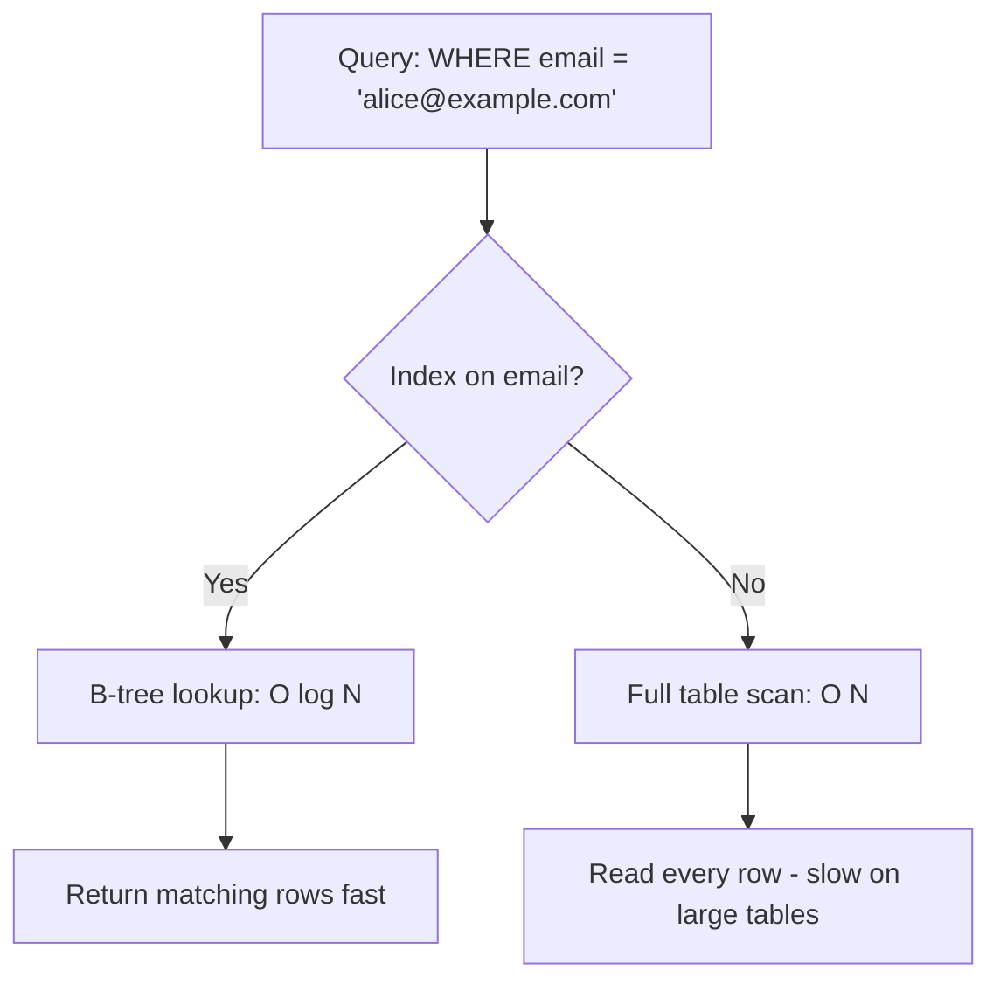

# How to Create an Index in MySQL with CREATE INDEX

Author: [nawazdhandala](https://www.github.com/nawazdhandala)

Tags: MySQL, SQL, Index, Performance, Database

Description: Learn how to create indexes in MySQL using CREATE INDEX and ALTER TABLE to speed up queries, with examples of different index types and best practices.

---

## How Indexes Work

An index is a data structure (typically a B-tree) that MySQL maintains alongside a table to speed up data retrieval. Without an index, MySQL performs a full table scan - reading every row to find matches. With an index on the searched column, MySQL can locate matching rows in O(log N) time instead of O(N).



Indexes speed up SELECT, but add overhead to INSERT, UPDATE, and DELETE because the index must be maintained.

## Syntax

There are two ways to create an index:

```sql
-- Using CREATE INDEX
CREATE [UNIQUE] INDEX index_name
ON table_name (column_name);

-- Using ALTER TABLE
ALTER TABLE table_name
ADD INDEX index_name (column_name);

-- Inline during CREATE TABLE
CREATE TABLE table_name (
    id INT PRIMARY KEY AUTO_INCREMENT,
    email VARCHAR(150),
    INDEX idx_email (email)
);
```

## Examples

### Setup: Create a Sample Table

```sql
CREATE TABLE users (
    id INT PRIMARY KEY AUTO_INCREMENT,
    username VARCHAR(50) NOT NULL,
    email VARCHAR(150) NOT NULL,
    country VARCHAR(50),
    created_at DATETIME DEFAULT CURRENT_TIMESTAMP,
    status ENUM('active', 'inactive', 'banned') DEFAULT 'active'
);

INSERT INTO users (username, email, country, status)
SELECT
    CONCAT('user_', n),
    CONCAT('user_', n, '@example.com'),
    ELT(1 + (n MOD 3), 'US', 'UK', 'DE'),
    ELT(1 + (n MOD 3), 'active', 'inactive', 'active')
FROM (
    SELECT a.N + b.N * 10 + 1 AS n
    FROM (SELECT 0 AS N UNION SELECT 1 UNION SELECT 2 UNION SELECT 3 UNION SELECT 4
          UNION SELECT 5 UNION SELECT 6 UNION SELECT 7 UNION SELECT 8 UNION SELECT 9) a
    CROSS JOIN (SELECT 0 AS N UNION SELECT 1 UNION SELECT 2 UNION SELECT 3 UNION SELECT 4
                UNION SELECT 5 UNION SELECT 6 UNION SELECT 7 UNION SELECT 8 UNION SELECT 9) b
) nums;
```

### Create a Regular Index

Add an index on the email column to speed up lookups by email.

```sql
CREATE INDEX idx_email ON users (email);
```

Now verify the index was created:

```sql
SHOW INDEX FROM users;
```

```text
+-------+...+------------+-------------+...
| Table |   | Key_name   | Column_name |
+-------+...+------------+-------------+...
| users |   | PRIMARY    | id          |
| users |   | idx_email  | email       |
+-------+...+------------+-------------+...
```

### Verify Index Usage with EXPLAIN

Check that the index is used when querying by email.

```sql
EXPLAIN SELECT id, username FROM users WHERE email = 'user_5@example.com';
```

```text
+----+...+--------+------+...+----------+
| id |   | type   | key  |   | rows     |
+----+...+--------+------+...+----------+
| 1  |   | ref    | idx_email | | 1    |
+----+...+--------+------+...+----------+
```

The `type: ref` and `key: idx_email` confirm the index is being used.

### Create a UNIQUE Index

A UNIQUE index enforces uniqueness while also improving query speed.

```sql
CREATE UNIQUE INDEX idx_unique_email ON users (email);
```

Attempting to insert a duplicate email will now return an error:

```sql
INSERT INTO users (username, email) VALUES ('duplicate', 'user_1@example.com');
-- ERROR 1062: Duplicate entry 'user_1@example.com' for key 'idx_unique_email'
```

### Drop an Index

```sql
DROP INDEX idx_email ON users;

-- Via ALTER TABLE
ALTER TABLE users DROP INDEX idx_email;
```

### Adding an Index Without Downtime (MySQL 8.0 Online DDL)

In MySQL 8.0+, adding an index uses Online DDL by default, allowing reads and writes to continue.

```sql
ALTER TABLE users ADD INDEX idx_country (country), ALGORITHM=INPLACE, LOCK=NONE;
```

### Types of Indexes in MySQL

```text
Index Type      Description
-----------     -----------
INDEX (B-tree)  Default. Good for equality and range queries.
UNIQUE          Enforces uniqueness + speeds up lookups.
PRIMARY KEY     Clustered index. Each table can have only one.
FULLTEXT        For full-text search on text columns.
SPATIAL         For geometry/spatial data types.
```

## Best Practices

- Add indexes on columns frequently used in WHERE, JOIN ON, ORDER BY, and GROUP BY clauses.
- Do not index every column - unused indexes waste storage and slow down writes.
- For columns with low cardinality (e.g., a boolean or a 3-value status enum), an index may not help because MySQL may still scan many rows.
- Use `EXPLAIN` to verify that new indexes are actually being used by the query optimizer.
- Prefer composite indexes for queries that filter on multiple columns - a single composite index can be more efficient than multiple single-column indexes.
- Use `SHOW INDEX FROM table_name` to audit existing indexes and identify duplicates or unused ones.

## Summary

Indexes in MySQL are created with `CREATE INDEX` or `ALTER TABLE ... ADD INDEX`. They speed up SELECT queries by enabling B-tree lookups instead of full table scans. UNIQUE indexes additionally enforce data uniqueness. Always verify index usage with EXPLAIN after creation and regularly audit indexes to remove unused ones that add overhead without benefit. Composite and covering indexes are covered in separate guides for more advanced scenarios.
