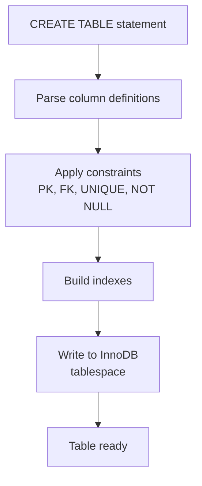

# How to Create a Table in MySQL with CREATE TABLE

Author: [nawazdhandala](https://www.github.com/nawazdhandala)

Tags: MySQL, SQL, DDL, Table, Schema

Description: Create MySQL tables with CREATE TABLE, define columns and data types, add constraints and indexes, and understand InnoDB table options.

---

## How It Works

`CREATE TABLE` defines the structure of a new table - its column names, data types, constraints, and indexes. MySQL stores the table definition in the data dictionary and creates the underlying storage file on disk when using InnoDB (the default engine).



## Basic Syntax

```sql
CREATE TABLE [IF NOT EXISTS] table_name (
    column_name data_type [column_options],
    ...
    [table_constraints]
) [table_options];
```

## Minimal Example

```sql
CREATE TABLE users (
    id       INT UNSIGNED AUTO_INCREMENT PRIMARY KEY,
    username VARCHAR(50)  NOT NULL,
    email    VARCHAR(255) NOT NULL
);
```

## Full-Featured Example

```sql
CREATE TABLE IF NOT EXISTS orders (
    id           INT UNSIGNED     AUTO_INCREMENT,
    order_number VARCHAR(20)      NOT NULL,
    user_id      INT UNSIGNED     NOT NULL,
    status       ENUM('pending','processing','shipped','delivered','cancelled')
                                  NOT NULL DEFAULT 'pending',
    total_amount DECIMAL(10, 2)   NOT NULL DEFAULT 0.00,
    notes        TEXT,
    created_at   DATETIME         NOT NULL DEFAULT CURRENT_TIMESTAMP,
    updated_at   DATETIME         NOT NULL DEFAULT CURRENT_TIMESTAMP
                                           ON UPDATE CURRENT_TIMESTAMP,

    PRIMARY KEY (id),
    UNIQUE KEY uq_order_number (order_number),
    KEY idx_user_id (user_id),
    KEY idx_status_created (status, created_at),

    CONSTRAINT fk_orders_user
        FOREIGN KEY (user_id) REFERENCES users (id)
        ON DELETE RESTRICT
        ON UPDATE CASCADE
) ENGINE=InnoDB
  DEFAULT CHARSET=utf8mb4
  COLLATE=utf8mb4_unicode_ci
  COMMENT='Customer orders';
```

## Column Options

| Option | Description |
|---|---|
| `NOT NULL` | Column must have a value |
| `DEFAULT value` | Value used when none is provided |
| `AUTO_INCREMENT` | Integer column auto-incremented on insert |
| `UNIQUE` | Enforces uniqueness on this column |
| `PRIMARY KEY` | Designates primary key (inline form) |
| `COMMENT 'text'` | Descriptive comment stored in metadata |
| `ON UPDATE CURRENT_TIMESTAMP` | Auto-updates DATETIME/TIMESTAMP on row update |

## Table Constraints

```sql
-- Composite primary key
PRIMARY KEY (col1, col2)

-- Named unique constraint
UNIQUE KEY uq_name (col1, col2)

-- Regular index (speeds up lookups)
KEY idx_name (col1)

-- Full-text index
FULLTEXT KEY ft_description (description)

-- Foreign key
CONSTRAINT fk_name FOREIGN KEY (col) REFERENCES other_table (col)
```

## Using IF NOT EXISTS

```sql
CREATE TABLE IF NOT EXISTS products (
    id    INT UNSIGNED AUTO_INCREMENT PRIMARY KEY,
    name  VARCHAR(255) NOT NULL,
    price DECIMAL(10,2) NOT NULL
);
```

`IF NOT EXISTS` prevents an error if the table already exists. The existing table is not modified.

## Complete Working Example with Sample Data

```sql
-- Create the users table
CREATE TABLE IF NOT EXISTS users (
    id         INT UNSIGNED AUTO_INCREMENT,
    username   VARCHAR(50)  NOT NULL,
    email      VARCHAR(255) NOT NULL,
    created_at DATETIME     NOT NULL DEFAULT CURRENT_TIMESTAMP,
    PRIMARY KEY (id),
    UNIQUE KEY uq_username (username),
    UNIQUE KEY uq_email (email)
) ENGINE=InnoDB DEFAULT CHARSET=utf8mb4 COLLATE=utf8mb4_unicode_ci;

-- Create the orders table with a foreign key
CREATE TABLE IF NOT EXISTS orders (
    id           INT UNSIGNED AUTO_INCREMENT,
    user_id      INT UNSIGNED     NOT NULL,
    total_amount DECIMAL(10, 2)   NOT NULL DEFAULT 0.00,
    created_at   DATETIME         NOT NULL DEFAULT CURRENT_TIMESTAMP,
    PRIMARY KEY (id),
    KEY idx_user_id (user_id),
    CONSTRAINT fk_orders_user
        FOREIGN KEY (user_id) REFERENCES users (id)
        ON DELETE CASCADE
) ENGINE=InnoDB DEFAULT CHARSET=utf8mb4 COLLATE=utf8mb4_unicode_ci;

-- Insert sample data
INSERT INTO users (username, email) VALUES
    ('alice', 'alice@example.com'),
    ('bob',   'bob@example.com');

INSERT INTO orders (user_id, total_amount) VALUES
    (1, 99.99),
    (1, 149.50),
    (2, 25.00);

-- Query the data
SELECT u.username, o.total_amount, o.created_at
FROM orders o
JOIN users u ON u.id = o.user_id
ORDER BY o.created_at DESC;
```

```text
+----------+--------------+---------------------+
| username | total_amount | created_at          |
+----------+--------------+---------------------+
| bob      |        25.00 | 2024-06-01 10:05:00 |
| alice    |       149.50 | 2024-06-01 10:04:00 |
| alice    |        99.99 | 2024-06-01 10:03:00 |
+----------+--------------+---------------------+
```

## Viewing the Table Definition

```sql
SHOW CREATE TABLE orders\G
DESCRIBE orders;
```

## Best Practices

- Always specify `ENGINE=InnoDB` - it is the default and supports transactions and foreign keys.
- Set `DEFAULT CHARSET=utf8mb4 COLLATE=utf8mb4_unicode_ci` at the table level to match the server default.
- Every table should have a primary key, preferably an `INT UNSIGNED AUTO_INCREMENT` surrogate key.
- Use `IF NOT EXISTS` in migration scripts.
- Name constraints explicitly (`CONSTRAINT fk_orders_user`) so you can reference them in `ALTER TABLE` later.
- Add indexes for columns used in `WHERE`, `JOIN`, and `ORDER BY` clauses.

## Summary

`CREATE TABLE` is the foundational DDL statement in MySQL. A well-designed table definition includes explicit data types, `NOT NULL` constraints on required columns, a primary key, unique constraints where appropriate, and foreign keys to enforce referential integrity. Always use InnoDB, set the character set at the table level, and name your constraints so they are easy to manage later.
