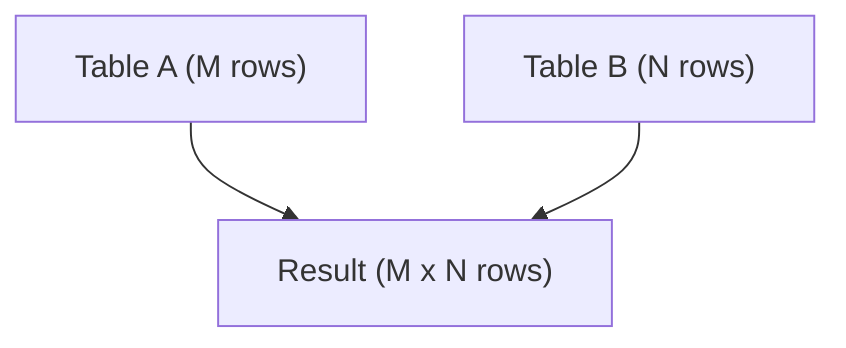

# How to Use CROSS JOIN in MySQL

Author: [nawazdhandala](https://www.github.com/nawazdhandala)

Tags: MySQL, SQL, Join, Database, Query

Description: Learn how CROSS JOIN in MySQL produces a Cartesian product of two tables, combining every row from the first table with every row from the second.

---

## How CROSS JOIN Works

A CROSS JOIN produces the Cartesian product of two tables - it pairs every row from the left table with every row from the right table. If the left table has M rows and the right table has N rows, the result contains M x N rows. Unlike other joins, CROSS JOIN has no ON condition because it matches every combination unconditionally.



## Syntax

```sql
SELECT column_list
FROM table_a
CROSS JOIN table_b;
```

An implicit CROSS JOIN can also be written as a comma-separated table list with no WHERE condition:

```sql
SELECT column_list FROM table_a, table_b;
```

## Examples

### Setup: Create Sample Tables

```sql
CREATE TABLE colors (
    id INT PRIMARY KEY AUTO_INCREMENT,
    color_name VARCHAR(50) NOT NULL
);

CREATE TABLE sizes (
    id INT PRIMARY KEY AUTO_INCREMENT,
    size_name VARCHAR(20) NOT NULL
);

INSERT INTO colors (color_name) VALUES ('Red'), ('Blue'), ('Green');
INSERT INTO sizes (size_name) VALUES ('Small'), ('Medium'), ('Large');
```

### Basic CROSS JOIN

Generate all color and size combinations for a product catalog.

```sql
SELECT c.color_name, s.size_name
FROM colors c
CROSS JOIN sizes s
ORDER BY c.color_name, s.size_name;
```

```text
+------------+-----------+
| color_name | size_name |
+------------+-----------+
| Blue       | Large     |
| Blue       | Medium    |
| Blue       | Small     |
| Green      | Large     |
| Green      | Medium    |
| Green      | Small     |
| Red        | Large     |
| Red        | Medium    |
| Red        | Small     |
+------------+-----------+
```

3 colors x 3 sizes = 9 rows.

### Generating a Date Range

Use CROSS JOIN with a numbers table to generate a series of dates without using a stored procedure.

```sql
CREATE TABLE digits (n INT);
INSERT INTO digits VALUES (0),(1),(2),(3),(4),(5),(6),(7),(8),(9);

SELECT DATE_ADD('2026-01-01', INTERVAL (d1.n * 10 + d2.n) DAY) AS calendar_date
FROM digits d1
CROSS JOIN digits d2
HAVING calendar_date <= '2026-01-31'
ORDER BY calendar_date;
```

```text
+---------------+
| calendar_date |
+---------------+
| 2026-01-01    |
| 2026-01-02    |
| ...           |
| 2026-01-31    |
+---------------+
```

### Creating a Test Data Matrix

Cross join lookup tables to create all combinations for test scenarios.

```sql
CREATE TABLE environments (env VARCHAR(20));
CREATE TABLE regions (region VARCHAR(20));

INSERT INTO environments VALUES ('development'), ('staging'), ('production');
INSERT INTO regions VALUES ('us-east-1'), ('eu-west-1'), ('ap-southeast-1');

SELECT e.env, r.region,
       CONCAT(e.env, '-', r.region) AS config_label
FROM environments e
CROSS JOIN regions r
ORDER BY e.env, r.region;
```

```text
+-------------+----------------+----------------------------+
| env         | region         | config_label               |
+-------------+----------------+----------------------------+
| development | ap-southeast-1 | development-ap-southeast-1 |
| development | eu-west-1      | development-eu-west-1      |
| development | us-east-1      | development-us-east-1      |
| production  | ap-southeast-1 | production-ap-southeast-1  |
| ...         | ...            | ...                        |
+-------------+----------------+----------------------------+
```

### Adding a Filter to Simulate INNER JOIN

When you add a WHERE or ON clause to a CROSS JOIN, it behaves like an INNER JOIN.

```sql
SELECT c.color_name, s.size_name
FROM colors c
CROSS JOIN sizes s
WHERE s.size_name = 'Large';
```

```text
+------------+-----------+
| color_name | size_name |
+------------+-----------+
| Red        | Large     |
| Blue       | Large     |
| Green      | Large     |
+------------+-----------+
```

## Best Practices

- Be cautious with large tables: a CROSS JOIN on two 10,000-row tables produces 100 million rows and can exhaust memory.
- Use CROSS JOIN intentionally for known small reference tables such as calendars, dimensions, or configuration matrices.
- Avoid implicit comma-join syntax (`FROM a, b`) - it can accidentally produce a Cartesian product if you forget a WHERE condition. Explicit `CROSS JOIN` communicates intent clearly.
- If you want a filtered combination, prefer INNER JOIN with an ON clause over CROSS JOIN with WHERE.
- Limit result size during development with `LIMIT` to avoid overwhelming output.

## Summary

CROSS JOIN produces the Cartesian product of two tables, pairing every row from one table with every row from the other. It is intentionally used for generating combinations such as product variants, date series, or test matrices. Use it carefully: on large tables the result set grows exponentially. Always prefer explicit `CROSS JOIN` syntax over implicit comma-joins to make your intent clear to other developers.
