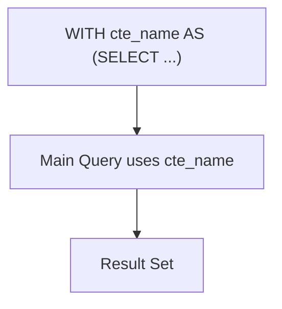

# How to Use Common Table Expressions (WITH) in MySQL 8.0

Author: [nawazdhandala](https://www.github.com/nawazdhandala)

Tags: MySQL, SQL, CTE, Common Table Expression, MySQL 8.0, Database

Description: Learn how to use Common Table Expressions (CTEs) with the WITH clause in MySQL 8.0 to write cleaner, more readable, and reusable query logic.

---

## How CTEs Work

A Common Table Expression (CTE) is a named, temporary result set defined at the beginning of a query using the `WITH` clause. The CTE exists only for the duration of the query. Unlike subqueries, CTEs can be referenced multiple times in the same query and make complex logic easier to follow by breaking it into named blocks.



CTEs were introduced in MySQL 8.0.

## Syntax

```sql
WITH cte_name AS (
    SELECT columns FROM table WHERE condition
)
SELECT columns FROM cte_name;
```

Multiple CTEs can be chained with commas:

```sql
WITH
    cte_one AS (SELECT ...),
    cte_two AS (SELECT ... FROM cte_one ...)
SELECT * FROM cte_two;
```

## Examples

### Setup: Create Sample Tables

```sql
CREATE TABLE orders (
    id INT PRIMARY KEY AUTO_INCREMENT,
    customer_id INT,
    amount DECIMAL(10, 2),
    order_date DATE,
    status VARCHAR(20)
);

CREATE TABLE customers (
    id INT PRIMARY KEY AUTO_INCREMENT,
    name VARCHAR(100) NOT NULL,
    country VARCHAR(50)
);

INSERT INTO customers (name, country) VALUES
    ('Alice', 'US'), ('Bob', 'UK'), ('Carol', 'US'),
    ('Dave', 'DE'), ('Eve', 'US');

INSERT INTO orders (customer_id, amount, order_date, status) VALUES
    (1, 150.00, '2026-01-05', 'completed'),
    (1, 220.00, '2026-02-10', 'completed'),
    (2,  80.00, '2026-01-15', 'pending'),
    (3, 500.00, '2026-01-20', 'completed'),
    (3, 120.00, '2026-02-28', 'cancelled'),
    (4, 300.00, '2026-03-05', 'completed'),
    (5,  60.00, '2026-03-10', 'completed');
```

### Basic CTE

Calculate total spend per customer, then filter for high-value customers.

```sql
WITH customer_totals AS (
    SELECT customer_id,
           SUM(amount) AS total_spent,
           COUNT(*) AS order_count
    FROM orders
    WHERE status = 'completed'
    GROUP BY customer_id
)
SELECT c.name, c.country, ct.total_spent, ct.order_count
FROM customer_totals ct
INNER JOIN customers c ON ct.customer_id = c.id
WHERE ct.total_spent > 200
ORDER BY ct.total_spent DESC;
```

```text
+-------+---------+-------------+-------------+
| name  | country | total_spent | order_count |
+-------+---------+-------------+-------------+
| Carol | US      |      500.00 |           1 |
| Dave  | DE      |      300.00 |           1 |
| Alice | US      |      370.00 |           2 |
+-------+---------+-------------+-------------+
```

### Multiple CTEs

Chain two CTEs: the first aggregates orders, the second ranks customers by spending.

```sql
WITH
order_summary AS (
    SELECT customer_id,
           SUM(amount) AS total_spent
    FROM orders
    WHERE status = 'completed'
    GROUP BY customer_id
),
ranked_customers AS (
    SELECT c.name,
           c.country,
           os.total_spent,
           RANK() OVER (ORDER BY os.total_spent DESC) AS spend_rank
    FROM order_summary os
    INNER JOIN customers c ON os.customer_id = c.id
)
SELECT name, country, total_spent, spend_rank
FROM ranked_customers
WHERE spend_rank <= 3;
```

```text
+-------+---------+-------------+------------+
| name  | country | total_spent | spend_rank |
+-------+---------+-------------+------------+
| Carol | US      |      500.00 |          1 |
| Alice | US      |      370.00 |          2 |
| Dave  | DE      |      300.00 |          3 |
+-------+---------+-------------+------------+
```

### CTE Referenced Multiple Times

A CTE can be referenced more than once in the main query, avoiding redundant subquery repetition.

```sql
WITH monthly_revenue AS (
    SELECT DATE_FORMAT(order_date, '%Y-%m') AS month,
           SUM(amount) AS revenue
    FROM orders
    WHERE status = 'completed'
    GROUP BY DATE_FORMAT(order_date, '%Y-%m')
)
SELECT
    current_month.month,
    current_month.revenue AS current_revenue,
    prev_month.revenue AS prev_revenue,
    ROUND(
        (current_month.revenue - prev_month.revenue) / prev_month.revenue * 100,
        1
    ) AS pct_change
FROM monthly_revenue current_month
LEFT JOIN monthly_revenue prev_month
    ON prev_month.month = DATE_FORMAT(
        DATE_SUB(STR_TO_DATE(CONCAT(current_month.month, '-01'), '%Y-%m-%d'),
                 INTERVAL 1 MONTH), '%Y-%m')
ORDER BY current_month.month;
```

### CTE with UPDATE

CTEs can also be used in UPDATE and DELETE statements (MySQL 8.0+).

```sql
WITH high_value_orders AS (
    SELECT id FROM orders WHERE amount > 200 AND status = 'pending'
)
UPDATE orders
SET status = 'priority'
WHERE id IN (SELECT id FROM high_value_orders);
```

## Best Practices

- Name CTEs clearly to describe what they represent (e.g., `order_summary`, `active_customers`).
- Use multiple CTEs to break complex queries into logical stages rather than nesting multiple subqueries.
- CTEs are not materialized by default in MySQL 8.0 - the optimizer may inline them. Add `NO_MERGE` optimizer hint if you need materialization.
- Avoid referencing CTEs outside the query they are defined in - they do not persist across statements.
- For performance-critical queries, compare CTE execution plans with equivalent subquery or JOIN plans using EXPLAIN.

## Summary

Common Table Expressions (CTEs) using the `WITH` clause in MySQL 8.0 make complex queries easier to write and understand. They define named temporary result sets that can be reused multiple times within the same query. CTEs enable a clean top-down reading structure - define the building blocks first, then compose them in the main query. They also work in INSERT, UPDATE, and DELETE statements, making them versatile for data transformation tasks.
