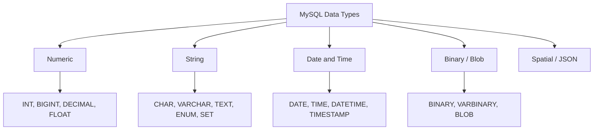

# How to Use Data Types in MySQL (INT, VARCHAR, TEXT, DATETIME, etc.)

Author: [nawazdhandala](https://www.github.com/nawazdhandala)

Tags: MySQL, SQL, DDL, Data Type, Schema

Description: Understand MySQL's numeric, string, date/time, and binary data types and learn how to choose the right type for each column.

---

## How It Works

Every column in a MySQL table has a data type that determines what values it can store, how much storage it uses, and what operations are available on it. Choosing the correct type avoids wasted storage, prevents invalid data, and enables efficient indexing.



## Numeric Types

### Integer Types

| Type | Storage | Signed Range | Unsigned Range |
|---|---|---|---|
| `TINYINT` | 1 byte | -128 to 127 | 0 to 255 |
| `SMALLINT` | 2 bytes | -32768 to 32767 | 0 to 65535 |
| `MEDIUMINT` | 3 bytes | -8M to 8M | 0 to 16M |
| `INT` | 4 bytes | -2.1B to 2.1B | 0 to 4.3B |
| `BIGINT` | 8 bytes | -9.2E18 to 9.2E18 | 0 to 1.8E19 |

Use `UNSIGNED` when values are never negative (IDs, counts, ages).

```sql
CREATE TABLE products (
    id           INT UNSIGNED AUTO_INCREMENT PRIMARY KEY,
    stock_count  SMALLINT UNSIGNED NOT NULL DEFAULT 0,
    view_count   BIGINT UNSIGNED   NOT NULL DEFAULT 0
);
```

### Fixed-Point Numeric (DECIMAL)

`DECIMAL(M, D)` stores exact decimal values. Use it for money.

- `M` = total digits (precision)
- `D` = digits after the decimal point (scale)

```sql
CREATE TABLE invoices (
    id           INT UNSIGNED AUTO_INCREMENT PRIMARY KEY,
    subtotal     DECIMAL(10, 2) NOT NULL,
    tax_rate     DECIMAL(5, 4)  NOT NULL,
    total        DECIMAL(10, 2) NOT NULL
);

INSERT INTO invoices (subtotal, tax_rate, total)
VALUES (100.00, 0.0825, 108.25);
```

### Floating-Point (FLOAT, DOUBLE)

`FLOAT` (4 bytes) and `DOUBLE` (8 bytes) are approximate types. Avoid them for financial calculations.

```sql
latitude  DOUBLE NOT NULL,
longitude DOUBLE NOT NULL
```

## String Types

### CHAR vs VARCHAR

| Type | Storage | Use case |
|---|---|---|
| `CHAR(n)` | Always n bytes | Fixed-length strings (ISO country codes, MD5 hashes) |
| `VARCHAR(n)` | 1-2 bytes + actual length | Variable-length strings |

```sql
CREATE TABLE countries (
    code    CHAR(2)       NOT NULL,   -- Always 2 chars: 'US', 'GB'
    name    VARCHAR(100)  NOT NULL    -- Variable length
);
```

### TEXT Types

| Type | Max Length |
|---|---|
| `TINYTEXT` | 255 bytes |
| `TEXT` | 65,535 bytes (~64 KB) |
| `MEDIUMTEXT` | 16,777,215 bytes (~16 MB) |
| `LONGTEXT` | 4,294,967,295 bytes (~4 GB) |

```sql
CREATE TABLE articles (
    id      INT UNSIGNED AUTO_INCREMENT PRIMARY KEY,
    title   VARCHAR(255) NOT NULL,
    body    TEXT         NOT NULL,
    summary TINYTEXT
);
```

Use `VARCHAR` for short strings and `TEXT` for long prose content.

## Date and Time Types

| Type | Format | Storage | Range |
|---|---|---|---|
| `DATE` | YYYY-MM-DD | 3 bytes | 1000-01-01 to 9999-12-31 |
| `TIME` | HH:MM:SS | 3 bytes | -838:59:59 to 838:59:59 |
| `DATETIME` | YYYY-MM-DD HH:MM:SS | 8 bytes | 1000-01-01 to 9999-12-31 |
| `TIMESTAMP` | YYYY-MM-DD HH:MM:SS | 4 bytes | 1970-01-01 to 2038-01-19 |
| `YEAR` | YYYY | 1 byte | 1901 to 2155 |

Key difference: `TIMESTAMP` stores UTC and converts to the session time zone on retrieval. `DATETIME` stores the literal value with no time zone conversion.

```sql
CREATE TABLE events (
    id          INT UNSIGNED AUTO_INCREMENT PRIMARY KEY,
    title       VARCHAR(255) NOT NULL,
    event_date  DATE         NOT NULL,
    start_time  TIME         NOT NULL,
    created_at  DATETIME     NOT NULL DEFAULT CURRENT_TIMESTAMP,
    updated_at  DATETIME     NOT NULL DEFAULT CURRENT_TIMESTAMP
                                      ON UPDATE CURRENT_TIMESTAMP
);

INSERT INTO events (title, event_date, start_time)
VALUES ('Team Meeting', '2024-07-15', '14:00:00');

SELECT * FROM events;
```

```text
+----+--------------+------------+------------+---------------------+---------------------+
| id | title        | event_date | start_time | created_at          | updated_at          |
+----+--------------+------------+------------+---------------------+---------------------+
|  1 | Team Meeting | 2024-07-15 | 14:00:00   | 2024-06-01 10:00:00 | 2024-06-01 10:00:00 |
+----+--------------+------------+------------+---------------------+---------------------+
```

## BOOLEAN (TINYINT)

MySQL has no native boolean type. `BOOLEAN` is an alias for `TINYINT(1)`. Use `TRUE`/`FALSE` or `1`/`0`.

```sql
CREATE TABLE feature_flags (
    id        INT UNSIGNED AUTO_INCREMENT PRIMARY KEY,
    flag_name VARCHAR(100) NOT NULL UNIQUE,
    is_active BOOLEAN      NOT NULL DEFAULT FALSE
);

INSERT INTO feature_flags (flag_name, is_active)
VALUES ('dark_mode', TRUE), ('beta_ui', FALSE);
```

## BINARY and BLOB Types

Use `BINARY`/`VARBINARY` for fixed/variable binary strings (e.g., UUIDs stored as bytes) and `BLOB` types for binary objects.

```sql
CREATE TABLE files (
    id        INT UNSIGNED AUTO_INCREMENT PRIMARY KEY,
    filename  VARCHAR(255) NOT NULL,
    mime_type VARCHAR(100) NOT NULL,
    content   LONGBLOB     NOT NULL
);
```

## Choosing the Right Type

```sql
CREATE TABLE users (
    id            INT UNSIGNED   AUTO_INCREMENT PRIMARY KEY,  -- surrogate key
    username      VARCHAR(50)    NOT NULL UNIQUE,             -- variable string
    email         VARCHAR(255)   NOT NULL UNIQUE,             -- variable string
    country_code  CHAR(2)        NOT NULL,                    -- fixed-length
    age           TINYINT UNSIGNED,                           -- small int
    balance       DECIMAL(10, 2) NOT NULL DEFAULT 0.00,       -- exact decimal
    is_active     BOOLEAN        NOT NULL DEFAULT TRUE,        -- flag
    bio           TEXT,                                        -- long text
    created_at    DATETIME       NOT NULL DEFAULT CURRENT_TIMESTAMP
);
```

## Best Practices

- Use `INT UNSIGNED AUTO_INCREMENT` for surrogate primary keys unless you expect more than 4 billion rows, in which case use `BIGINT UNSIGNED`.
- Use `DECIMAL` not `FLOAT` or `DOUBLE` for money, prices, and tax rates.
- Use `DATETIME` over `TIMESTAMP` for dates beyond 2038 or when you want to store literal local times.
- Use `VARCHAR(191)` instead of `VARCHAR(255)` for indexed columns with `utf8mb4` if you hit the index prefix limit (older MySQL versions).
- Prefer `TEXT` over `VARCHAR` for user-generated content that could exceed a few hundred characters.

## Summary

MySQL provides a rich set of data types spanning integers, exact and approximate decimals, fixed and variable strings, date/time, and binary. The most common choices are `INT UNSIGNED` for IDs, `VARCHAR` for short strings, `TEXT` for long content, `DECIMAL(10,2)` for money, and `DATETIME` for timestamps. Choosing the right type from the start prevents costly `ALTER TABLE` operations later and keeps your schema expressive and self-documenting.
