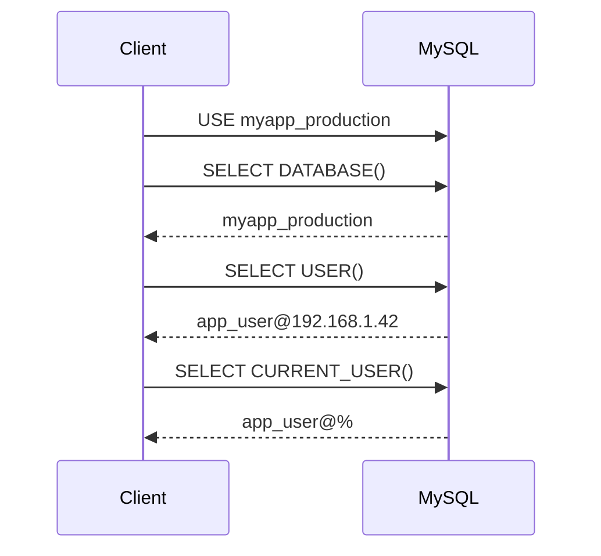
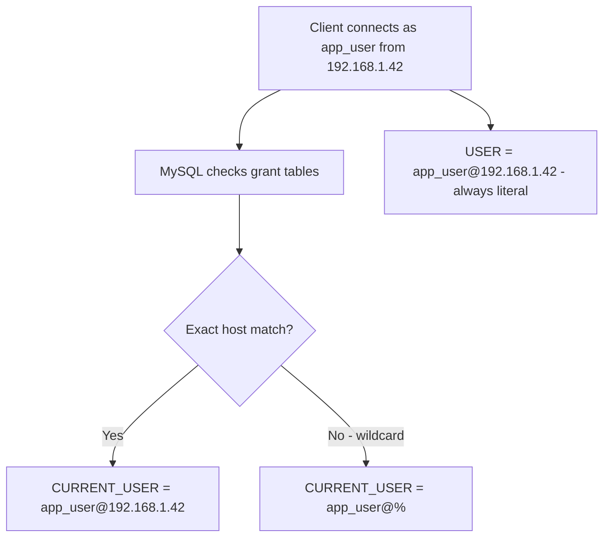

# How to Use DATABASE() and USER() Functions in MySQL

Author: [OneUptime](https://oneuptime.com)

Tags: MySQL, Function, Database, User, Administration

Description: Learn how to use MySQL DATABASE() and USER() information functions to retrieve the current schema and authenticated user session details at runtime.

---

## Introduction

MySQL provides a set of information functions that return metadata about the current session. Two of the most frequently used are `DATABASE()` and `USER()`. They are handy for debugging, writing portable stored procedures, auditing, and building dynamic SQL that adapts to the current context.

## DATABASE()

`DATABASE()` returns the name of the default (currently selected) schema for the session. If no database has been selected with `USE`, it returns `NULL`.

```sql
SELECT DATABASE();
-- Returns: myapp_production
```

### Checking the current schema in a stored procedure

```sql
DELIMITER $$

CREATE PROCEDURE log_current_schema()
BEGIN
  DECLARE current_db VARCHAR(64);
  SET current_db = DATABASE();

  IF current_db IS NULL THEN
    SIGNAL SQLSTATE '45000'
      SET MESSAGE_TEXT = 'No database selected';
  END IF;

  SELECT CONCAT('Active schema: ', current_db) AS info;
END$$

DELIMITER ;

CALL log_current_schema();
```

### Portable DDL that avoids hardcoded schema names

```sql
-- Dynamically reference the current database in queries
SELECT
  TABLE_NAME,
  TABLE_ROWS,
  DATA_LENGTH
FROM information_schema.TABLES
WHERE TABLE_SCHEMA = DATABASE()
ORDER BY DATA_LENGTH DESC;
```

## USER()

`USER()` returns a string of the form `username@host` that represents the account used by the client to authenticate to the server.

```sql
SELECT USER();
-- Returns: app_user@192.168.1.42
```

`CURRENT_USER()` is closely related but returns the account that matched in the grant tables, which may differ from `USER()` when the `--skip-name-resolve` option is active or when a wildcard host is used.

```sql
SELECT USER(),        -- connecting account: app_user@192.168.1.42
       CURRENT_USER();-- matched grant: app_user@%
```

### Practical comparison

| Function | Returns |
|---|---|
| `USER()` | Client-supplied username and host |
| `CURRENT_USER()` | Matched MySQL grant entry |
| `SESSION_USER()` | Synonym for `USER()` |
| `SYSTEM_USER()` | Synonym for `USER()` |

## Common use cases

### Audit logging with USER()

```sql
CREATE TABLE audit_log (
  id        BIGINT UNSIGNED AUTO_INCREMENT PRIMARY KEY,
  action    VARCHAR(64)   NOT NULL,
  performed_by VARCHAR(128) NOT NULL DEFAULT (USER()),
  schema_name  VARCHAR(64)  NOT NULL DEFAULT (DATABASE()),
  created_at   TIMESTAMP     NOT NULL DEFAULT CURRENT_TIMESTAMP
);

INSERT INTO audit_log (action) VALUES ('EXPORT_DATA');

SELECT * FROM audit_log;
```

### Conditional logic based on the current user

```sql
DELIMITER $$

CREATE PROCEDURE sensitive_operation()
BEGIN
  IF LEFT(USER(), LOCATE('@', USER()) - 1) NOT IN ('admin', 'dba_user') THEN
    SIGNAL SQLSTATE '45000'
      SET MESSAGE_TEXT = 'Permission denied: admin account required';
  END IF;

  -- proceed with privileged work
  SELECT 'Operation complete' AS result;
END$$

DELIMITER ;
```

### Session information dashboard

```sql
SELECT
  USER()                             AS session_user,
  CURRENT_USER()                     AS matched_grant,
  DATABASE()                         AS current_schema,
  CONNECTION_ID()                    AS connection_id,
  @@hostname                         AS server_host,
  @@version                          AS mysql_version;
```

## Data flow for a typical session



## How MySQL resolves USER() vs CURRENT_USER()



## Important notes

- `DATABASE()` returns `NULL` inside a stored routine that was defined without a default schema if none is set at call time.
- `USER()` includes the host portion, so string comparisons should account for the `@host` part.
- Neither function requires any special privilege.

## Summary

`DATABASE()` returns the name of the currently selected schema and is useful for portable queries, stored procedure guards, and audit tables. `USER()` returns the connecting client's username and host, while `CURRENT_USER()` returns the matched grant entry. Together they provide essential session context for dynamic SQL, security checks, and audit logging without requiring additional queries to the metadata tables.
